# 🧭 Code Guide — Warehouse Automation Suite

This document explains **every file in this project, piece by piece**, in plain language. It's written for someone with only basic coding knowledge (you understand variables, loops, `if`/`else`, and functions, but you don't need to remember Flask, Excel-automation, or PDF-library details — they're explained here).

> **Note on diagrams:** This file uses [Mermaid](https://mermaid.js.org/) diagrams (the ` ```mermaid ` code blocks). They render automatically on GitHub/GitLab. In VS Code, install the **"Markdown Preview Mermaid Support"** extension and open Preview (`Ctrl+Shift+V`) to see them as pictures instead of code.

---

## Table of Contents

1. [The Big Picture](#1-the-big-picture)
2. [Key Vocabulary](#2-key-vocabulary)
3. [File Map & Folder Structure](#3-file-map--folder-structure)
4. [`app.py` — The Web Server](#4-apppy--the-web-server)
5. [`core_math.py` — Shared Math & Formatting](#5-core_mathpy--shared-math--formatting)
6. [`matrix_engine.py` — The Matrix Engine](#6-matrix_enginepy--the-matrix-engine)
7. [`subgroup_engine.py` — The Sub-Group Engine](#7-subgroup_enginepy--the-sub-group-engine)
8. [`pdf_engine.py` — The Label Shuffler](#8-pdf_enginepy--the-label-shuffler)
9. [`templates/*.html` — The Web Pages](#9-templateshtml--the-web-pages)
10. [`static/script.js` — The Frontend Brain](#10-staticscriptjs--the-frontend-brain)
11. [`static/styles.css` — The Look & Feel](#11-staticstylescss--the-look--feel)
12. [End-to-End Journeys](#12-end-to-end-journeys)
13. [Quick Reference: "I Want to Change X"](#13-quick-reference-i-want-to-change-x)

---

## 1. The Big Picture

This app is a **Flask web application** — a Python program that runs a small local web server. You open a browser, go to `http://127.0.0.1:5000`, and click buttons; behind the scenes, Python code reads/writes real Excel and PDF files on your hard drive.

There is no database. Everything the app "remembers" is stored as **actual files on disk**, inside a `projects/` folder — Excel files, PDF files, and small `.json` text files that act as the app's memory of what it did.

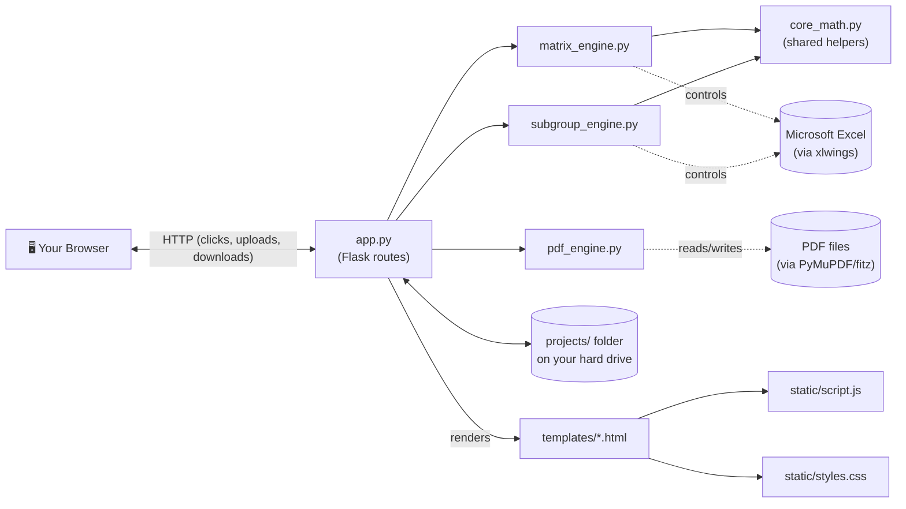

Three independent "engines" do the heavy lifting, and `app.py` is the traffic cop that receives clicks from the browser and calls the right engine at the right time:

| Engine | File | What it does |
|---|---|---|
| **Matrix Engine** | `matrix_engine.py` | Turns a raw distribution Excel file into a "Packing Sheet" with calculated signature codes. |
| **Sub-Group Engine** | `subgroup_engine.py` | Takes an existing Packing Sheet and breaks a pack into smaller item-number ranges (repeatable — Stage 1, Stage 2, Stage 3...). |
| **PDF Label Shuffler** | `pdf_engine.py` | Takes raw PDF shipping labels and re-orders/re-stacks their pages to match the signature codes calculated above. |

`core_math.py` is a toolbox of small functions (cleaning text, calculating "signatures", formatting Excel cells) that both the Matrix Engine and the Sub-Group Engine call, so the same logic isn't written twice.

---

## 2. Key Vocabulary

These words appear everywhere in the code. If you're ever confused reading a function, come back to this table.

| Term | Meaning |
|---|---|
| **Tab** | A sheet inside an Excel workbook (e.g., "Store A", "Store B"). The app processes one or more tabs independently. |
| **Pack** | A group of columns in a tab that represents one "package type" (e.g., "Banner Pack", "Signage Pack"). Detected either from a merged header cell, or a single column with a header. |
| **Store** | A row in a tab — one retail location receiving an allocation. |
| **Signature / Signature Code** | A short letter code (`A`, `B`, ... `Z`, `AA`, `AB`...) assigned to a **unique combination of quantities** across a pack's columns. Two stores with the exact same order quantities get the same letter. This is the core trick of the whole app — instead of printing every store's exact numbers, you print one letter, and a lookup table tells the warehouse floor what that letter means. |
| **Item Number** | A number identifying one column/item inside a pack (used only by the Sub-Group Engine to slice a pack into smaller ranges, e.g. items 1–5 vs 6–10). |
| **Stage** | A version of the output Excel file. `Stage - 1 - ...xlsx` is the first sub-grouped version, `Stage - 2 - ...xlsx` the next, etc. Each stage builds on the previous one without destroying it. |
| **Blueprint** | The in-memory map the Matrix Engine builds after scanning a tab: where the stores are, where the packs are, where the Job ID is. Shown to the user as a "preview" before generating anything. |
| **Metadata (`project_metadata.json` / `Stage - N - ....json`)** | A JSON file that remembers exact column numbers for every pack/sub-group in a project, so the app can find its own past work later (e.g. when you come back to sub-group a project a second time). |
| **Project Folder** | One folder per job, named like `CampaignName_Job-12345_260803_1430`, holding every file (Excel, PDF, JSON) generated for that job. |
| **`xlwings`** | A Python library that remote-controls a real, invisible copy of Microsoft Excel. Used because it can insert/merge columns and preserve formatting exactly like a human using Excel would — something the faster libraries (openpyxl/pandas) can't do well. |
| **`fitz` (PyMuPDF)** | A Python library for reading and rewriting PDF files page-by-page — used to detect text on a label, and to cut/paste/reorder pages. |

---

## 3. File Map & Folder Structure

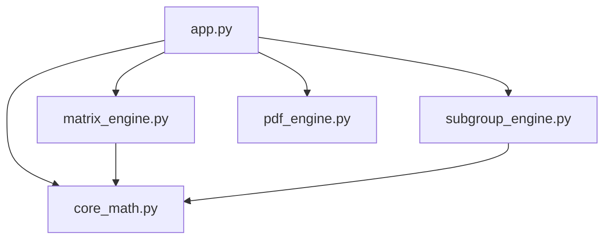

Only `app.py` talks to Flask/the browser. The three engines never render a web page themselves — they take plain Python data in, and return plain Python data (or files on disk) out. This separation means you could, in theory, delete the entire website and still call `generate_all_outputs()` from a Python script.

### What's on disk after you use the app

```
Warehouse_app/
├── app.py, core_math.py, matrix_engine.py, pdf_engine.py, subgroup_engine.py
├── templates/            → the 4 HTML pages Flask renders
├── static/               → script.js + styles.css (shared by all pages)
├── temp_pdf_engine/       → scratch space, wiped after every PDF run
└── projects/              → EVERY job you've ever created lives here
    └── MyCampaign_Job-12345_260804_1000/
        ├── OriginalUpload.xlsx              ← your original file (matrix flow)
        ├── Final OriginalUpload.xlsx        ← "File 1": working copy with signature columns
        ├── Packing Sheet_12345.xlsx         ← "File 2": master summary book (this is what floor staff read)
        ├── Signature links_12345.xlsx       ← "File 3": clean store→code lookup table (used by the PDF shuffler)
        ├── Final OriginalUpload.json        ← metadata memory for this project
        ├── Stage - 1 - Final OriginalUpload.xlsx   ← after your 1st sub-group run
        ├── Stage - 1 - Final OriginalUpload.json
        └── SomeLabelFile_Shuffled.pdf       ← output of the PDF shuffler
```

Notice the **three-file pattern** from the Matrix Engine: **File 1** (working copy, has the new signature columns baked in), **File 2** (the human-readable Packing Sheet, columns removed/summarized), **File 3** (a clean, minimal store→code table meant to feed the PDF engine). All three are built from the same uploaded Excel, at the same time, inside `generate_all_outputs()` (see [Section 6](#6-matrix_enginepy--the-matrix-engine)).

---

## 4. `app.py` — The Web Server

**What Flask is, in one paragraph:** Flask lets you write a normal Python function and attach it to a URL with `@app.route('/some/url')`. When a browser visits that URL, Flask calls your function and sends whatever it `return`s back as the web page. `methods=['GET', 'POST']` means the function handles both "just looking at the page" (GET) and "submitting a form" (POST) — you check `request.method` inside the function to tell which one happened.

### 4.1 Startup (lines 1–59)

```python
if getattr(sys, 'frozen', False):
    BASE_DIR = os.path.dirname(sys.executable)
else:
    BASE_DIR = os.path.dirname(os.path.abspath(__file__))
```
This figures out "where am I actually running from." `sys.frozen` is `True` only when the app has been bundled into a standalone `.exe` by PyInstaller (see the README's `pyinstaller --onefile` step) — in that case, the base folder is wherever the `.exe` sits, not wherever the raw `.py` source happens to be.

```python
def clean_old_projects():
    ...
clean_old_projects()
```
Runs **once, immediately, the moment the file is imported** (note it's called at module level, not inside a route). It loops through every folder in `projects/`, checks its creation timestamp, and deletes anything older than 7 days with `shutil.rmtree`. This is the "Zombie Sweeper" mentioned in the README — it keeps old test jobs from piling up forever.

The rest of this section just creates the Flask `app` object and tells it where `templates/` and `static/` live, plus creates the `projects/` and `temp_pdf_engine/` folders if they don't exist yet.

### 4.2 The Matrix Engine routes: `/matrix` → `/preview` → `/generate` → `/download`

This is a **3-step wizard**, and each step is its own route because each one is a full page reload (the form `POST`s to the next URL).

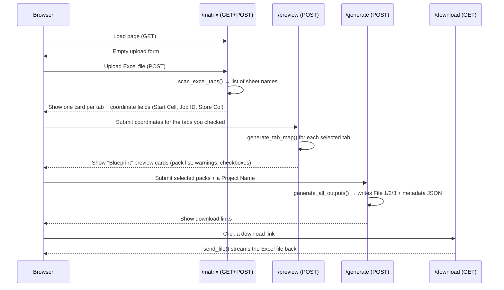

**`/matrix` (lines 62–80).** On GET, does nothing but render the empty upload form. On POST:
```python
if 'file' not in request.files:
    return "No file part"
file = request.files['file']
if file.filename != '':
    filename = secure_filename(file.filename)
    filepath = os.path.join(app.config['UPLOAD_FOLDER'], filename)
    file.save(filepath)
    tabs = scan_excel_tabs(filepath)
return render_template('matrix.html', tabs=tabs, filename=filename)
```
`request.files['file']` is the uploaded file object (from the `<input type="file" name="file">` in `matrix.html`). `secure_filename()` strips out anything dangerous from the filename (e.g. `../../etc/passwd` style path tricks) before it's used to build a path on disk. The file is saved straight into `projects/` (not into a project sub-folder yet — that only happens at `/generate`, once we know the Job ID). `scan_excel_tabs()` (from `matrix_engine.py`) just opens the file and returns the list of sheet names, e.g. `["Store A", "Store B"]`. `render_template` hands the list of tab names to `matrix.html`, which then draws one card per tab (see [Section 9](#9-templateshtml--the-web-pages)).

**`/preview` (lines 82–122).** The user has now typed a Start Cell / Job ID Cell / Store Column for every tab they checked. For **every** tab that exists (not just the checked ones — so unchecked tabs still remember their typed values if the user re-visits), this route:
1. Reads the 3 coordinate fields from the form, defaulting to `B8`, `E1`, `A` if blank.
2. Stores them in `user_inputs[tab]` (this dict gets round-tripped back into hidden form fields, so if the user clicks "Update Previews" again, their typed values survive).
3. **Only for checked tabs**, calls `generate_tab_map()` (see [Section 6.2](#62-generate_tab_map--reading-blueprint-from-a-tab)) inside a `try/except`. If the coordinates are wrong (e.g. "E1" isn't actually where the Job ID lives), `openpyxl` throws an exception, which gets caught and turned into a friendly `{"error": "..."}` dictionary instead of crashing the whole page.
4. All the successfully-mapped blueprints get serialized to JSON (`blueprints_json`) and stuffed into a **hidden form field** — this is important: Flask does not remember anything between requests by itself (no session used here), so the *entire* blueprint has to be smuggled through the HTML back to the browser and then submitted right back to the server at `/generate`.

**`/generate` (lines 124–182).** This is where a **Project Folder actually gets created**:
```python
raw_project_name = request.form.get('project_name', 'Untitled_Project')
safe_project_name = clean_file_name(raw_project_name)
job_id = clean_file_name(blueprints[first_tab].get("raw_job_id", "UNKNOWN"))
time_stamp = datetime.now().strftime("%y%m%d_%H%M")
final_folder_name = f"{safe_project_name}_Job-{job_id}_{time_stamp}"
```
So a folder like `SummerCampaign_Job-12345_260804_1430` is born. The originally-uploaded file is then `shutil.move()`d from the loose `projects/` folder into this new sub-folder, and `generate_all_outputs()` (the real engine, [Section 6.3](#63-generate_all_outputs--the-core-generator)) is called to build File 1/2/3. The three resulting filenames are filtered to drop any that are `None` (File 1 and File 3 are only created if at least one pack was selected for signature-code generation — see the `any_packs_selected` logic below) and shown to the user as download buttons.

**`/download/<folder_name>/<filename>` (lines 184–195).** A very small, security-conscious route: `os.path.basename()` is applied to both URL parts so a mischievous URL like `/download/../../secrets/file.txt` can't escape the `projects/` folder. If the file exists, `send_file(..., as_attachment=True)` streams it to the browser as a download.

### 4.3 The Dashboard: `/` (lines 198–255)

This route has no form to process — it just **scans the filesystem** every time it's loaded and builds a list of "project" dictionaries to show on the homepage.

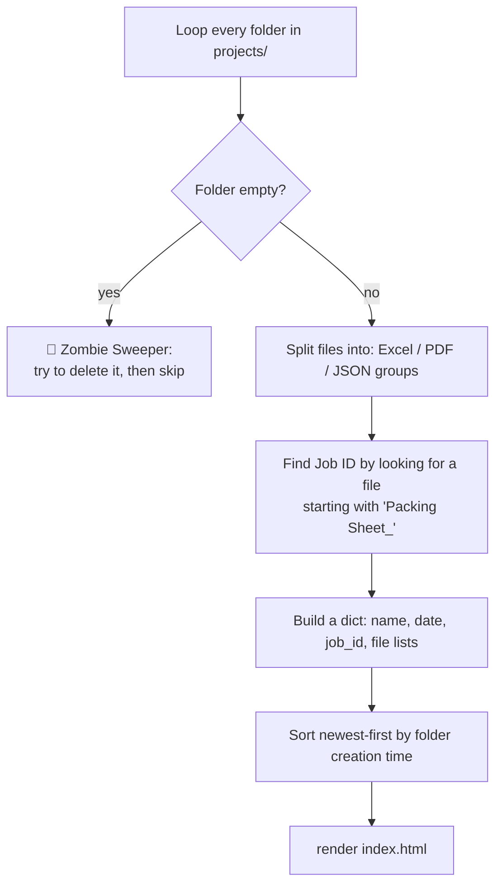

The "Zombie Sweeper" comment refers to folders that are empty because Windows/OneDrive sometimes holds a file lock a few seconds after Excel closes, so a delete attempt made moments earlier (e.g. in `/delete`) can silently fail, leaving an empty ghost folder. Every dashboard load gives it another chance to clean itself up via `shutil.rmdir`.

`json_files` are **sorted newest-first by creation time** (`os.path.getctime`) — this feeds the "Create Sub-Group" popup dropdown in `index.html`, so the most recent Stage is offered first as the baseline.

### 4.4 Project & File Management: `/delete`, `/delete_file`, `/open_local`

- **`/delete/<folder_name>`** — deletes an entire project. Before calling `shutil.rmtree`, it manually walks every file with `os.walk` and calls `os.chmod(file_path, stat.S_IWRITE)` to strip any read-only flag first. This matters because files that were just closed by Excel/xlwings can briefly retain a read-only attribute that would otherwise make `rmtree` fail.
- **`/delete_file/<folder_name>/<filename>`** — same idea, but for a single file (used by the little 🗑️ Delete button next to each file row in the dashboard).
- **`/open_local/<folder_name>/<filename>`** — calls Windows' own `os.startfile(file_path)`, which is the exact same as double-clicking the file in File Explorer — it opens in whatever program Windows has associated with that extension (Excel, Adobe Reader, etc.). Returns an empty `204 No Content` response so the browser's JavaScript `fetch()` call (see [Section 10.2.D](#10-staticscriptjs--the-frontend-brain)) doesn't navigate away from the dashboard.

### 4.5 The Sub-Group route: `/subgroup/<project_name>` (lines 315–384)

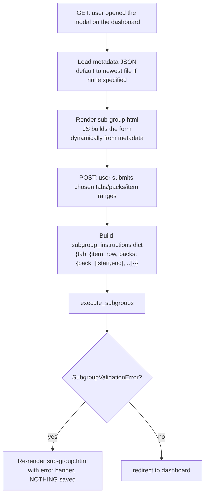

The `target_json` query parameter (set by the dropdown in the dashboard's "Create Sub-Group" modal — see `index.html`) tells this route **which metadata file to treat as the baseline** — e.g. the original `project_metadata.json`, or an existing `Stage - 1 - ...json` if you're layering a second round of sub-grouping on top of the first. If none is specified, it just grabs the first `.json` file it finds in the folder.

On POST, the form data is parsed into a nested dictionary shaped exactly like what `subgroup_engine.execute_subgroups()` expects:
```python
subgroup_instructions = {
    "Store A": {
        "item_row": 9,
        "packs": {
            "Banner Pack": [[1, 5], [6, 10]]   # two sub-groups: items 1-5, and 6-10
        }
    }
}
```
This is exactly the *very same shape* used inside `subgroup_engine.py` — worth remembering if you ever need to trace a bug between the two files.

```python
try:
    execute_subgroups(project_dir, metadata, subgroup_instructions)
except SubgroupValidationError as e:
    return render_template('sub-group.html', ..., error=str(e))
return redirect(url_for('dashboard'))
```
This `try/except` is the fix we added recently: if the item numbers the user typed don't actually exist in the sheet (a typo, or duplicate item numbers), `execute_subgroups` raises `SubgroupValidationError` **before saving anything**, and the route shows the error message right there on the page instead of silently redirecting to the dashboard as if it had worked. See [Section 7](#7-subgroup_enginepy--the-sub-group-engine) for the full mechanics.

### 4.6 The PDF Label Shuffler route: `/pdf` (lines 386–588)

This is the biggest single route in the file because it handles **three different steps of one wizard inside one function**, distinguished by a hidden `step` form field.

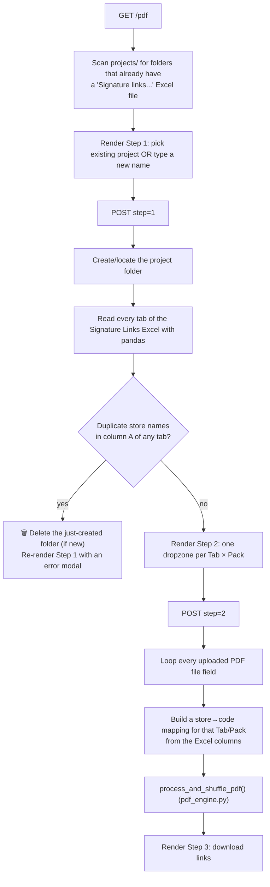

**Step 1 (lines 394–483).** Two ways to pick a project: the `existing_project` dropdown, or typing a `new_project` name (a timestamp gets appended to new names to keep them unique). Whichever Excel file is in play — either freshly uploaded, or an existing `"Signature Links..."` file already sitting in that project's folder (found by `.startswith("signature links")`, case-insensitive) — gets opened with `pd.ExcelFile`. For **every sheet**, `df.columns[1:]` (everything except the first column, which holds store names) becomes the list of "Packs" shown in Step 2.

The duplicate-store check here matters a lot for the PDF engine: `process_and_shuffle_pdf` matches a label to a store purely by **searching for the store's name inside the label's text** — if two stores in the same tab share a name, the shuffler can't reliably tell them apart, so this route refuses to continue and shows exactly which tab/names collided (`⚠️ Duplicate Store Names Found` dialog — see [Section 9.3](#93-pdfhtml)).

**Step 2 (lines 486–571).** The form field names carry structured information inside their *name attribute itself*, using `---` as a separator (chosen specifically because pack/tab names might contain underscores):
```html
<input type="file" name="pdf---{{ tab }}---{{ pack }}">
<input type="checkbox" name="divider---{{ tab }}---{{ pack }}">
```
So the Python side loops `request.files.items()`, and for every key that starts with `pdf---`, splits it back apart:
```python
parts = key.split('---')            # ["pdf", "Store A", "Banner Pack"]
tab_name, pack_name = parts[1], parts[2]
```
For that Tab/Pack, it rebuilds a `store_mapping` dict (`{"Store 12": "A", "Store 47": "B", ...}`) straight from the Excel columns using `df.iterrows()`, then calls `process_and_shuffle_pdf()` — the actual PDF engine ([Section 8](#8-pdf_enginepy--the-label-shuffler)) — once per uploaded PDF. Every processed file is renamed with a `_Shuffled` suffix and saved directly into the project folder.

**Step 3** is just a static "success" screen listing the generated filenames as download links.

**GET (no step, lines 573–588)** is what runs when you first land on `/pdf` (or click "Reset") — it rebuilds the `existing_projects` dropdown by scanning `projects/` for folders that already contain a Signature Links file.

---

## 5. `core_math.py` — Shared Math & Formatting

This file has **no Flask, no Excel-opening code, no file I/O for the workbooks themselves** — it's pure logic, which is exactly why both `matrix_engine.py` and `subgroup_engine.py` import from it instead of duplicating this code.

### `clean_file_name(raw_string)`
Turns messy free-text (a Job ID cell value, a user-typed project name) into something safe to use as a filename or folder name: collapses repeated whitespace, then strips out every character except letters, digits, spaces, underscores and hyphens.
```python
clean_file_name("Job #12345 / Campaign!!") → "Job 12345  Campaign"
```

### `sanitize_cell(val)`
Reads one raw Excel cell value and decides what it "really" means for signature-matching purposes:
- `None` → `0`
- already a number → returned as-is
- text like `"-"`, `"."`, `"0"`, `""` → treated as `0` (these are common "nothing ordered" placeholders in warehouse spreadsheets)
- text that *looks* like a number (`"12.0"`) → converted to `int`/`float`
- anything else (e.g. `"J468791-01"`) → kept as the raw text string

This function is the reason the README says *"Dashes (-) and periods (.) are safely ignored as zero."*

### `sort_key(sig)`
A **signature** is a tuple of cell values across one store's row, e.g. `(5, 0, "Banners")`. To sort a list of these consistently (numbers before text, zeros last) without Python crashing on "can't compare `int` to `str`," every value is converted into a 3-part tuple:
```python
0        → (3, 0, "")            # zeros always sort last
5        → (1, 5, "")            # numbers sort by their value
"Banner" → (2, 0, "banner")      # text sorts alphabetically, after numbers
```
`unique_sigs.sort(key=sort_key)` then works because Python can always compare tuples of the same shape.

### `generate_pack_signatures(raw_values, store_rows, p_start, p_end)` — the heart of the whole app
This is what turns raw quantities into letter codes. Given a 2D grid of cell values (`raw_values`, straight from Excel), a range of rows (`store_rows`), and a column range (`p_start` to `p_end`):

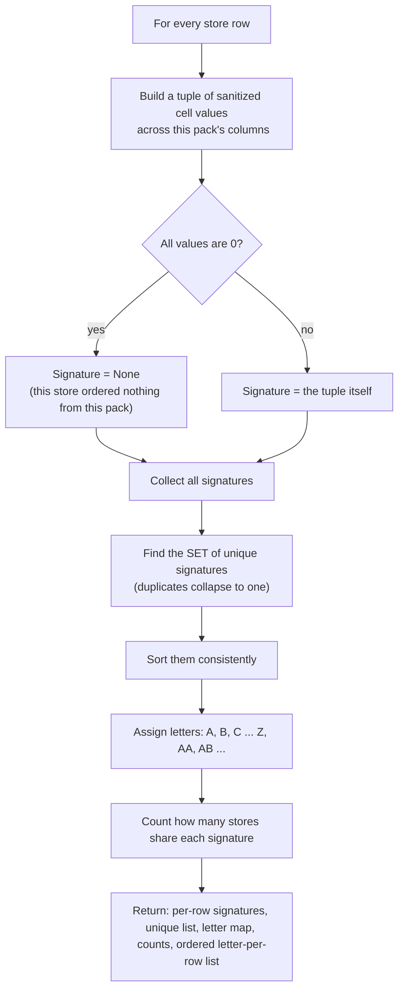

The letter-assignment line is worth reading closely:
```python
letter = chr(65 + index) if index < 26 else chr(65 + (index // 26) - 1) + chr(65 + (index % 26))
```
`chr(65)` is `'A'`. For the first 26 unique signatures (`index` 0–25) it's a single letter `A`...`Z`. Past that, it builds a two-letter code the same way spreadsheet columns go `Z, AA, AB, ...` — `index=26` gives `AA`, `index=27` gives `AB`, and so on.

The function returns **five things at once** (Python lets a function return a tuple and the caller unpacks it):
1. `row_signatures` — `[(row_number, signature_or_None), ...]` for every store
2. `unique_sigs` — the sorted list of distinct signatures found
3. `sig_to_letter` — `{signature: "A", ...}`
4. `summary_counts` — `{signature: how_many_stores_have_it, ...}`
5. `ordered_codes` — just the letters, in store order (`""` where a store ordered nothing) — this list is exactly what later gets exported into "File 3" for the PDF engine to consume.

### `format_file1(...)` / `format_file2(...)`
Pure Excel-styling helpers using `xlwings` range objects. They don't calculate anything — they set colors, borders, fonts, and alignment on cells that have *already* been written. `format_file1` styles the single newly-inserted signature column inside the working copy; `format_file2` styles the whole summary block (quantities + count + letter) with alternating row-band colors (`r_offset % 2 == 1` → light blue) in the Packing Sheet. `-4108` is not a typo — it's the literal integer value of Excel's `xlCenter` constant, used because `xlwings` calls straight into Excel's underlying COM API, which doesn't know Python's friendlier constant names.

### `build_initial_metadata(...)`
Builds the **very first** metadata block for one tab, right after the Matrix Engine runs. Its trickiest part is tracking column shift as it scans packs left-to-right:
```python
current_shift = 0
for pack in tab_info["pack_ranges"]:
    if any_packs_selected and is_selected:
        final_start = pack["start"] + current_shift + 1   # +1 for the new code column about to be inserted
        current_shift += 1
    else:
        final_start = pack["start"] + current_shift        # unaffected packs still drift right if an earlier pack got a column inserted
```
Every time a pack to the *left* gets a new signature column inserted, every pack to its *right* shifts one column further right in the real spreadsheet — this loop keeps the metadata's column numbers in sync with that shift so future code (like the Sub-Group Engine) can trust the numbers.

### `update_metadata_for_subgroup(...)`
The same shifting idea, but triggered by the *Sub-Group Engine* inserting a column. It walks every existing pack (and every sub-group already nested inside a pack) and nudges anything that sits at-or-after the insertion point one column to the right, then registers the brand-new sub-group's own coordinates under its parent pack's `"sub_groups"` dictionary. This is what makes sub-grouping **infinitely repeatable** — the metadata always reflects the spreadsheet's true current shape.

### `get_next_stage_filenames(...)` / `get_available_project_files(...)`
Small filesystem helpers. The first parses a filename like `"Stage - 2 - Final Book1.xlsx"` with a regex to produce `"Stage - 3 - Final Book1.xlsx"` — note that `subgroup_engine.py` actually contains its own (near-identical) inline version of this numbering logic and doesn't end up calling this particular function; it's kept here as a small reusable utility. The second just lists `.json` files in a project folder, sorted alphabetically (which conveniently also sorts them "Stage 1, Stage 2, Stage 3..." since that's how the filenames are constructed).

---

## 6. `matrix_engine.py` — The Matrix Engine

### 6.1 `scan_excel_tabs(file_path)`
Three lines. Opens the file with pandas just long enough to read `.sheet_names`, then closes it immediately. This is deliberately the *cheapest possible* way to answer "what tabs does this file have?" — no cell data is read at all.

### 6.2 `generate_tab_map(...)` — reading a "Blueprint" from a tab

This function is what the `/preview` route calls. Given a tab and the 3 coordinates the user typed (Start Cell, Job ID Cell, Store Column), it has to **reverse-engineer the entire layout** of a spreadsheet it's never seen before, using only those 3 anchor points.

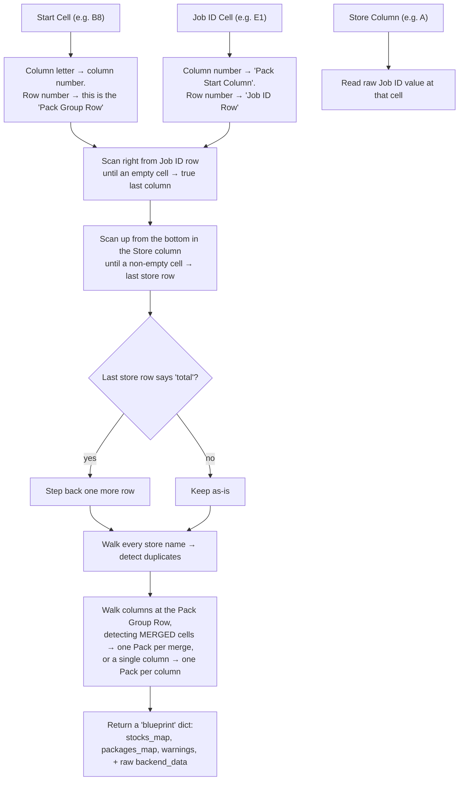

A few specific tricks worth calling out:
- **Finding the true last column** doesn't trust `sheet.max_column` (Excel/openpyxl can report phantom extra columns from old formatting) — it walks backward from the reported max column until it finds one with an actual value in the Job ID row.
- **Detecting "Total" rows:** if the very last non-blank cell in the Store column contains the word "total" (case-insensitive), that row is excluded from the store count — it's a summary row, not a real store.
- **Detecting packs** checks `sheet.merged_cells.ranges` first. If the current column falls inside a merged range at the pack-group row, that whole merged block becomes one pack (its name comes from the merge's top-left cell) and the scan jumps past it. If it's *not* merged, it falls back to treating a single non-empty header cell as a one-column pack.
- **Duplicate store detection** here is purely informational (shown as a yellow warning banner in `matrix.html`) — unlike the harder duplicate check in the `/pdf` route (Step 1), it does **not** block generation. It's a heads-up, not a hard stop.

### 6.3 `generate_all_outputs(...)` — the core generator

This is the single most important function in the Matrix Engine — the one that actually writes files to disk. It happens in three phases.

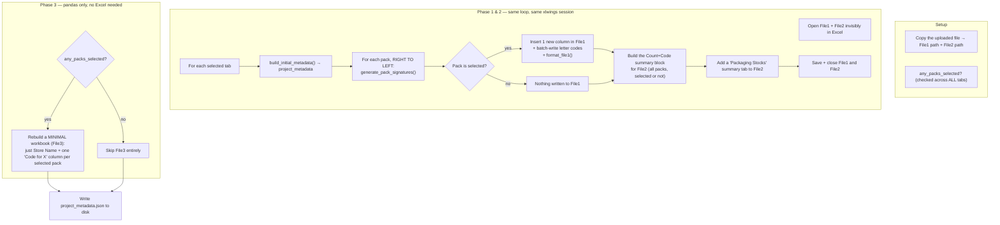

**Why right-to-left?** (`for pack in reversed(tab_info["pack_ranges"])`) Inserting a new column shifts every column *after* it one position to the right. If you inserted left-to-right, every subsequent pack's remembered column numbers would instantly go stale. Processing packs from the rightmost one backward means each insertion only ever affects columns you've *already finished with* — nothing still-to-be-processed ever moves.

**Why `any_packs_selected` matters so much:** if the user didn't check *any* pack checkboxes in the preview screen, there's nothing to calculate signatures for — File 1 (the working copy with new signature columns) and File 3 (the signature lookup table) become pointless, so both are skipped (`file1_name = None`, `file3_path = None`). Only File 2, the plain Packing Sheet, still gets produced in that case — that's a legitimate use case (someone who just wants a cleaned-up copy of their distribution list).

**The "batch write" pattern**, seen here and repeated in `subgroup_engine.py`, is a deliberate performance choice:
```python
batch_data = []
for r, sig in row_signatures:
    batch_data.append([sig_to_letter[sig]] if sig is not None else [None])
sheet1_xw.range(f"{col_letter_start}{start_r}").value = batch_data
```
Writing to Excel cell-by-cell through `xlwings` is slow (each write is a round-trip to the real Excel application). Building the whole column as a Python list first, then writing it in **one** `.value = batch_data` assignment, can turn thousands of slow round-trips into a single fast one.

**File 2's "delete rows below the data" step** (`sheet2.range(f"{start_del}:1048576").api.EntireRow.Delete()`) clears out anything left below the actual store list (old totals, stray notes) before the new Count/Code summary columns get written — otherwise leftover junk rows could visually collide with the new summary block.

**Phase 3's "reversed" pack summaries** — `for p_sum in reversed(tab_summaries.get(tab_name, []))` — exists purely so the resulting Signature Links columns appear in the same left-to-right pack order as the original sheet (since the summaries list itself was built during the reversed right-to-left insertion loop in Phase 1/2, reversing it a second time un-does that and restores original order).

Finally, `project_metadata` — built up tab-by-tab across this whole function — gets written once at the very end as `<File1 name>.json` inside the project folder. This is the file that `subgroup_engine.py` will later read back in.

---

## 7. `subgroup_engine.py` — The Sub-Group Engine

**Purpose:** take an *existing* Packing Sheet + working file (already produced by the Matrix Engine, or by a previous sub-group run) and slice one pack into smaller **item-number ranges**, e.g. turn "Banner Pack (items 1–20)" into "items 1–5" and "items 6–20" as two separately-coded sub-groups — without destroying the original file (it always writes a **new** `Stage - N -` file).

### 7.1 The validation guard (this is the bug fix from earlier in this project)

Before this existed, the code silently trusted whatever "Item Number Row" and Start/End item numbers the user typed. If a typo meant an item number didn't exist in that row, the old code just printed a `[WARNING]` to the terminal and quietly skipped that sub-group — the tool would report success even though part of the work never happened. Two small pieces fix that:

```python
class SubgroupValidationError(Exception):
    """Raised when the user-provided item row/numbers can't be safely resolved against the sheet."""
```
A **custom exception type**. This matters because `app.py` needs to tell the difference between *"the user's input was bad, show a friendly message"* and *"something genuinely broke, let it crash with a real error."* Catching a specific class (`except SubgroupValidationError`) instead of a generic `Exception` means only the deliberate validation failures get the friendly treatment.

```python
def _map_item_columns(row_data, tab_name, item_row):
    col_map = {}
    duplicates = {}
    for c_idx, val in enumerate(row_data):
        ...
        if item_num in col_map:
            duplicates.setdefault(item_num, [col_map[item_num]]).append(col)
        else:
            col_map[item_num] = col
    if not col_map:
        raise SubgroupValidationError(f"...no item numbers were found in row {item_row}...")
    if duplicates:
        raise SubgroupValidationError(f"...duplicate item numbers found...")
    return col_map
```
This function replaces the old plain dictionary-building loop. Two things now stop the whole process cold, with a message that reaches the browser:
1. **The row has zero item numbers at all** — almost certainly means the user pointed at the wrong row entirely.
2. **The same item number appears twice** in that row — item numbers are supposed to be unique per column, so a duplicate is a strong signal of a typo somewhere in the sheet. `duplicates.setdefault(item_num, [first_col]).append(second_col)` is a compact way to build `{105: [col_3, col_7]}` the first time a repeat is spotted.

### 7.2 The three stages

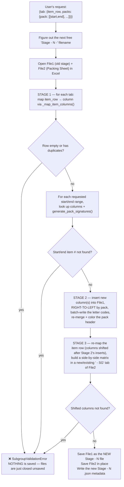

**Why re-map the item row a second time in Stage 3?** Stage 2 just inserted brand-new columns into File1 (the sub-group's code columns). Every item number that used to sit at, say, column 10 might now be at column 12 if two new columns were inserted to its left. The Stage-1 `item_col_map` is now stale, so Stage 3 re-reads the item row fresh off the *already-modified* worksheet before it can correctly locate where each sub-group's data actually lives for building the File 2 matrix.

**Why nothing gets corrupted when validation fails:** look at the very end of the function —
```python
try:
    ...all three stages...
    wb1.save(new_file1_path)   # ← the ONLY place File1 is saved
    wb2.save()                  # ← the ONLY place File2 is saved
except Exception as e:
    ...
    raise e
finally:
    app.quit()   # closes Excel WITHOUT saving whatever's still open
```
Both `.save()` calls sit at the very bottom of the `try` block, *after* every stage of every tab has finished successfully. If a `SubgroupValidationError` (or anything else) is raised partway through — even mid-way through tab 3 of 5 — execution jumps straight to `except`, which re-raises, and `finally` quits the invisible Excel instance **without ever calling `.save()`**. Whatever partial edits existed only in that temporary Excel session simply vanish; the real files on disk are untouched. This is exactly what makes it safe for `app.py` to say "abort the whole thing" on any validation error.

---

## 8. `pdf_engine.py` — The Label Shuffler

**Purpose:** take a raw PDF full of shipping labels (one per store, in whatever random order they were printed) and rebuild it so labels are grouped by their **signature code**, in the same letter-order the Packing Sheet uses — so a warehouse worker holding the printed stack for "Code C" can hand out labels in the exact sequence the packing sheet lists them.

### 8.1 Layout detection — the entry point

```python
first_page = doc[0]
is_split_layout = page_width < page_height  # taller than wide?
```
The whole engine branches on one measurement: is the PDF page **portrait** (taller than wide)? If yes, it assumes this is a "2 labels stacked on one sheet, meant to be cut in half" layout (`process_split_layout`). If the page is wider than tall, it assumes **one full label per page** (`process_standard_layout`).

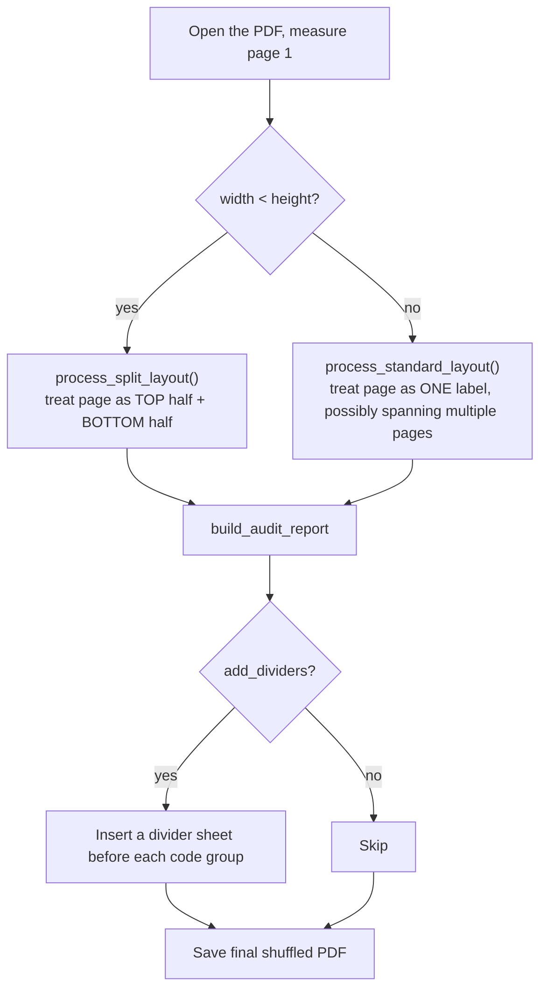

### 8.2 `process_standard_layout(...)`
For each page, it reads the text inside a specific rectangle (`fitz.Rect(0, 0, 317.5, page_height)` — roughly the left portion of the page, where a store name typically sits) and checks whether **any** known store name appears inside that text (case-insensitive substring search). If a page has *no* text at all, it's filed as "blank." If it has text but no store name matched, it's "unmatched."

The trickiest bit handles **multi-page labels** — a single shipping label that spans, say, "Page 2 / 3":
```python
page_info = re.search(r"page\s+(\d+)\s*/\s*(\d+)", text)
if page_info:
    expected_extra_pages = int(page_info.group(2)) - int(page_info.group(1))
elif expected_extra_pages > 0 and current_store:
    expected_extra_pages -= 1   # this page belongs to the store from the previous page
```
When a matched page also contains text like `"Page 1/3"`, the code knows 2 more pages are coming that *won't* have the store name printed on them again, but should still count as belonging to that same store — so it keeps assigning the current store to pages until that countdown reaches zero.

Pages are then bucketed by their signature code (`code_buckets[sig_code].append(page_num)`), sorted `by (length of code, code)` — this ordering, `sorted(code_buckets.keys(), key=lambda x: (len(x), x))`, is what makes single letters come before double letters (`A, B, ... Z, AA, AB...`) instead of plain alphabetical sort putting `AA` before `B`. Finally everything is stitched together in this fixed order: **audit report → matched pages (grouped by code, dividers optional) → unmatched pages → blank pages.**

### 8.3 `process_split_layout(...)`
Same idea, but every physical page is treated as **two independent halves** (top/bottom), each matched against store names independently, since two different stores' labels might be stacked on one printed sheet. The stitching step at the end is the more complex part: it builds a `master_stack` of "halves" (some real, some from the audit report, some blank divider pages) and then re-pairs them two-at-a-time into brand new output pages:
```python
halfway_point = math.ceil(total_halves / 2)
top_stack = master_stack[:halfway_point]
bottom_stack = master_stack[halfway_point:]
```
i.e. the first half of the master list becomes everyone's *top* half, the second half of the list becomes everyone's *bottom* half — so pairing `top_stack[i]` with `bottom_stack[i]` for each new page reconstitutes full sheets, but now filled with re-ordered content instead of the original random order. `new_page.show_pdf_page(top_rect, doc, ..., clip=src_clip)` is the actual "paste this rectangle of content from the source PDF onto this rectangle of the new page" operation — the workhorse of the whole rebuilding process.

### 8.4 `build_audit_report(...)` and `build_divider_sheet(...)`
Two small "report generator" functions that draw a brand-new PDF page from scratch using `fitz`'s drawing primitives (`draw_rect`, `insert_text`, `draw_line`, `draw_circle`) — no source PDF involved. `build_audit_report` is always inserted as the very first page(s) of the output, and turns red if any stores were missing/unmatched/blank, or green if everything matched perfectly — a floor worker can glance at just page 1 to know if the batch is trustworthy. `build_divider_sheet` draws a page with a thick yellow border and the signature code in giant text, used as a physical separator sheet between code groups when `add_dividers=True` is checked in the UI.

### 8.5 `process_and_shuffle_pdf(...)` — the master orchestrator
The only function `app.py` actually calls. It measures the page, decides which of the two engines above to run, then does a final cleanup: `final_shuffled_doc.set_page_labels([])` strips any leftover page-numbering metadata from the source PDF (so the new document doesn't confusingly display the *original* file's page numbers), then saves to `output_pdf_path`.

---

## 9. `templates/*.html` — The Web Pages

**Jinja2 primer, in three rules**, since every template leans on this:
- `{{ some_python_variable }}` prints a value.
- ` ... ` / ` ... ` are control structures — indistinguishable in spirit from Python's own `if`/`for`, just wrapped in `` instead of a colon+indent.
- `{{ url_for('route_function_name', arg=value) }}` asks Flask to build the correct URL for a given route function — so if a route's URL pattern ever changes in `app.py`, every template using `url_for` updates automatically; nothing is hard-coded.

### 9.1 `index.html` — the Dashboard
Renders the `projects` list built in `app.py`'s `/` route as a list of collapsible "accordion" cards (the actual expand/collapse behavior lives in JS, [Section 10.2.B](#10-staticscriptjs--the-frontend-brain) — this template just marks up the structure with `.accordion-header` / `.accordion-content` classes and lets CSS start them hidden `style="display: none;"`).

The most interesting piece is the **Create Sub-Group modal**, one per project, using the native HTML `<dialog>` element:
```html
<a onclick="event.preventDefault(); document.getElementById('modal-{{ project.name }}').showModal()">✂️ Create Sub-Group</a>
<dialog id="modal-{{ project.name }}">
    <form action="{{ url_for('setup_subgroup', project_name=project.name) }}" method="GET">
        <select name="target_json">
            
                <option value="{{ j_file }}">{{ j_file | replace('.json', '.xlsx') }}</option>
            
        </select>
        ...
```
`<dialog>.showModal()` is a **built-in browser API** — no JavaScript library needed to pop up a proper modal dialog with its own backdrop. The dropdown lets the user choose *which* metadata JSON to treat as the sub-grouping baseline (displayed with a `.xlsx` extension via the `replace` filter purely for readability, even though the actual value sent to the server is the real `.json` filename) — this becomes the `target_json` GET parameter that `app.py`'s `/subgroup` route reads.

### 9.2 `matrix.html`
One template, four possible states, controlled entirely by which Jinja variables `app.py` decided to pass in:

| Passed in from `app.py` | What's shown |
|---|---|
| nothing (`tabs` is `None`) | The instructions box + upload dropzone |
| `tabs` (list of sheet names) | One card per tab with 3 coordinate inputs |
| `previews` (blueprint list) | The blueprint cards + pack checkboxes + "Generate" button |
| `generation_complete=True` | Download links |

The upload dropzone (added when we made drag-and-drop work) is worth re-reading here since it's a pattern reused three times across the app:
```html
<div class="dropzone">
    <div class="dropzone-content"> ...icon, text, a blank <p class="dropzone-filename"> ... </div>
    <input type="file" name="file" class="dropzone-input" accept=".xlsx, .xls" required>
</div>
```
The `<input>` is positioned (via CSS, see [Section 11](#11-staticstylescss--the-look--feel)) as an **invisible layer covering the entire box**. That's the whole trick — there's no custom drag-and-drop JavaScript logic needed at all, because the browser already knows how to drag-and-drop a file directly onto a file input; making that input physically as big as the box just makes the *whole box* a valid drop target. `script.js` only adds the cosmetic touches (border highlight while dragging, showing the chosen filename) — see [Section 10.2.H](#10-staticscriptjs--the-frontend-brain).

The **hard-block logic** near the bottom is worth understanding since it silently disables the biggest button on the page:
```jinja


    


    <button disabled>Cannot Generate</button>

    <button type="submit">Generate Packing Sheet</button>

```
Plain Jinja variables set inside a `` loop don't survive past the loop (a Jinja quirk, similar to variable scoping oddities in some templating languages) — `namespace()` is Jinja's workaround: it creates a small mutable object whose attributes *do* persist outside the loop, which is why `lock.has_dupes` can be read correctly afterward.

### 9.3 `pdf.html`
Three step blocks, gated the same way (``). The `duplicate-modal` `<dialog>` in Step 1 is auto-opened without any click, purely by `script.js`'s Section 9 (`dupeModal.showModal()` fires automatically on page load if the element exists) — because the server only renders that `<dialog>` into the page at all when `duplicate_errors` is non-empty, its mere *presence* in the HTML is the signal to pop it open immediately.

Step 2's per-pack layout is the "2-column grid, grouped per tab" structure:
```html

<div class="tab-card">
    <div class="pack-grid">
        
        <div class="project-name-group"> ...one compact dropzone per pack... </div>
        
    </div>
</div>

```
The **outer loop** (`tab_card`) keeps packs visually grouped under their own tab; the **`pack-grid`** CSS class (a `display: grid; grid-template-columns: repeat(2, 1fr)`) only affects layout *inside* that group, so packs from different tabs are never mixed into the same row.

### 9.4 `sub-group.html`
The shortest template by far — because almost the entire form is **built dynamically by JavaScript**, not by Jinja. The template only renders:
1. A checkbox per tab (from `metadata.tabs.keys()`).
2. An empty `<div id="tab-blocks-container">` — JS fills this in the moment a tab checkbox is checked.
3. A hidden `<script id="meta-data" type="application/json">{{ metadata_json | safe }}</script>` — this is how the *entire* metadata dictionary (which packs exist, which were previously selected, etc.) gets from Python into JavaScript's hands: it's dumped as a JSON string and just sits inertly in the page's HTML until `script.js` reads and `JSON.parse()`s it.

The `error` banner at the top (added for the item-number validation fix) is the one piece of genuinely server-rendered feedback on this page — everything else here is either static structure or JS-generated.

---

## 10. `static/script.js` — The Frontend Brain

### 10.1 The pattern used almost everywhere: **event delegation**

Instead of finding a specific button and attaching a listener to it directly, nearly every handler in this file is attached once to `document.body`, and then checks *what was actually clicked* using `e.target.matches(...)`:
```js
document.body.addEventListener('click', function(e) {
    const header = e.target.closest('.accordion-header');
    if (header) { /* ...do the accordion toggle... */ }
});
```
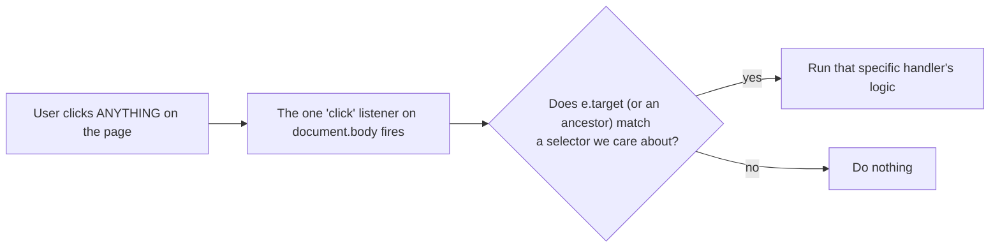
**Why this matters:** many elements on these pages (pack checkboxes, "Remove" buttons, tab cards) don't exist yet when the page first loads — they're created later by JavaScript itself (e.g. when a tab checkbox is checked in `sub-group.html`). A listener attached directly to an element that doesn't exist yet would simply never fire. A listener on `document.body` is always there from page-load, and `e.target.closest(...)` / `.matches(...)` correctly catches clicks on elements added at any point afterward — no need to re-attach listeners every time new HTML is injected.

### 10.2 Section-by-section walkthrough

**1. Global Utilities.** Intercepts clicks on any `<a href="#something">` link and smooth-scrolls to that element instead of the browser's default instant jump.

**2. Dashboard Logic (`index.html`).**
- **A. Scroll Spy** — toggles the `.active` class between the "Home" and "Dashboard" nav links based on scroll position, so the nav bar reflects which section you're currently looking at.
- **B. Accordion Toggle** — the project-card expand/collapse. Reads the clicked header's very-next-sibling element (`header.nextElementSibling`) and flips its `display` between `none` and `block`, also flipping the ▼/▲ icon.
- **C. Preserve State After Deletions** — a UX nicety: normally, deleting a file causes a full page reload, which would snap the scroll position back to the top and collapse whichever project card you had open. Just before a delete form submits, the current scroll position and the currently-open project's ID are written into `sessionStorage` (a small key-value store the browser keeps per-tab, surviving a page reload but not a tab close). On the *next* page load, this saved state is read back and the page immediately re-scrolls and re-opens that same card, and then the saved values are deleted — so the illusion is "the delete happened in place."
- **D. "Open Locally" Fetch Requests** — clicking "📂 Open" doesn't navigate the browser at all; it fires a background `fetch()` to `/open_local/...` (which just tells *your Windows machine* to open the file) and shows an `alert()` only if that request failed.

**3. Sub-Group Engine (Dynamic UI).** The most complex section — it manually builds HTML strings and injects them with `insertAdjacentHTML` in response to checkbox changes, mirroring what a template engine would normally do, but at runtime in the browser instead of on the server:
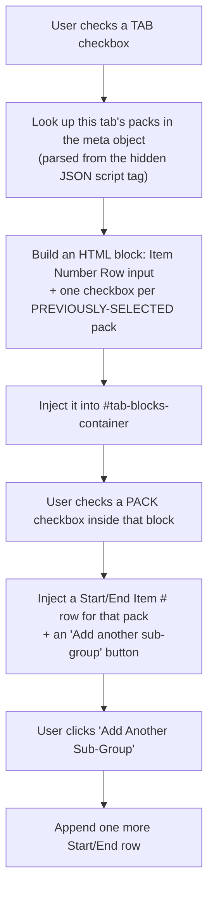
Only packs where `packData.is_selected` is `true` are offered here — i.e., only packs that already have a signature code column from the original Matrix Engine run can be sub-grouped; a pack nobody selected the first time around has nothing to slice further.

**4. Upload Form (Step 1 of `pdf.html`).** A `validateForm()` function re-run on every relevant keystroke/change, encoding these rules:
- Typing in the "new project" text box **disables** the dropdown (and vice-versa) — you can't do both at once.
- If an existing project is picked and it already has a Signature Links file on disk (`projectData[dropdown.value]` truthy — this data came from the `projects_json` script tag, same trick as the sub-group metadata), uploading a new file becomes optional and the submit button enables immediately.
- Otherwise (new project, or existing project with no file yet), a file **must** be attached before the button enables.

**5. PDF Label Shuffler (Step 2).** Two small independent-but-linked behaviors: each per-pack file input shows/hides its own "add divider sheets" checkbox the moment a PDF is attached (and un-checks it if the file is removed), while a single master checkbox at the bottom can check/uncheck every *currently visible* per-pack checkbox at once (only ones whose container is actually showing, i.e. only packs that have a PDF attached).

**6. Matrix Anchor Points Memory.** Pure convenience: the very first tab's Start Cell / Job ID Cell / Store Column values are saved to `localStorage` (this one persists forever, across browser restarts, unlike `sessionStorage`) every time the `/preview` form is submitted, and used to override the hard-coded defaults (`B8`, `E1`, `A`) the *next* time you upload a brand-new file — so if your Excel files always use the same layout, you stop having to retype the same coordinates every single job.

**7. Auto-Scroll to Previews.** After generating blueprint previews, a `setTimeout(..., 150)` waits briefly for the page to finish rendering, then smooth-scrolls down to the `#preview-section` anchor — otherwise the user would submit the coordinate form and land back at the top of a long page, with no visual cue that anything happened below the fold.

**8b. Drag & Drop File Inputs.** As explained in [Section 9.2](#92-matrixhtml), the actual drop behavior is native/free. This code only adds:
```js
input.addEventListener('dragenter', () => zone.classList.add('dropzone-active'));
input.addEventListener('dragleave', () => zone.classList.remove('dropzone-active'));
```
...for the blue-highlight-while-dragging effect, and a `change` listener that writes the selected file's name into the little `<p class="dropzone-filename">` placeholder — run once immediately (`showFilename()` called right after being defined) in case a browser ever pre-fills a file input on page restore.

**8. Loading Overlays.** A catch-all: any form submission on the page shows the full-screen spinner overlay, **except** deletions and the `/preview` submission (both of those are meant to feel instant, not like a long background job — showing a spinner would be misleading since they usually resolve in well under a second).

**9. Duplicate Store Name Alert.** Notably declared **outside** the main `DOMContentLoaded` listener that wraps sections 1–8 — a small inconsistency in the file's history, but harmless since `DOMContentLoaded` listeners can be registered as many times as you like and all of them still fire. Its only job is calling `.showModal()` on the duplicate-store dialog the instant the page loads, if that dialog exists in the HTML at all.

---

## 11. `static/styles.css` — The Look & Feel

Rather than walking every single CSS rule (CSS has no "logic" to trace — it's declarative styling, one selector at a time), here's what each named block of the stylesheet is *for*, grouped by the UI component it styles:

| CSS section | Powers |
|---|---|
| **Global Styles** | Base font, page background, the white rounded `.container` card every page sits inside. |
| **Navigation** | The dark sticky top bar (`.sticky-nav`) present on every page, and its active-link underline. |
| **Index/Dashboard** | The two big home-page "portal" cards (Create Packing Sheets / Label Shuffler). |
| **Projects List** | The dashboard's project cards, the auto-wrapping button grid (`.actions-grid` — `repeat(auto-fit, minmax(180px, 1fr))` means "as many equal-width columns as fit, each at least 180px, wrapping automatically on narrow screens"), and the color-coded action buttons (blue=download, red=delete, green=PDF). |
| **Matrix Engine Styles** | `.dropzone` / `.dropzone-compact` / `.dropzone-active` (the drag-and-drop boxes), `.pack-grid` (the 2-column PDF-pack layout), `.tab-card`, `.input-field`, `.blueprint-card` / `.blueprint-error` (preview cards, green vs. red left border), `.metrics-bar`, `.project-name-group`. |
| **Loading Overlay** | The full-screen dark spinner shown during long operations; `@keyframes spin` is what makes the spinner ring actually rotate. |
| **Tooltips** | The `.tooltip-btn::before`/`::after` pair — pure-CSS hover tooltips (a little triangle + a label bubble) with no JavaScript at all, using the `content: attr(data-title)` trick to pull the tooltip text straight from an HTML attribute. |
| **Instructions & Info Boxes** | The blue "Required Spreadsheet Formatting" box on `matrix.html`, and the red `.warning-box` used for duplicate-store warnings. |
| **Accordion & File List** | The dashboard's expandable project sections and the individual file rows (with their Open/Download/Delete button trio). |
| **Sub-group Tab Selection** | The responsive checkbox grid (`.tab-checkbox-grid`) in `sub-group.html`. |
| **Duplicate Store Error Modal** | Styles the `<dialog>` popup shown in `pdf.html` Step 1. |

**A pattern worth noticing:** almost every "card" component in this app (`.tab-card`, `.blueprint-card`, `.project-card`) shares the same visual recipe — white/light background, `border-radius: 6-8px`, and a thick colored **left border** (`border-left: 5px solid <color>`) used as a quick color-coded status signal (blue = neutral/info, green = success, red = error) — rather than one shared CSS class, this recipe is just repeated per-component, so if you ever want to change "the card look" everywhere, you'd currently need to update several rules instead of one.

---

## 12. End-to-End Journeys

### Journey A: Creating a Packing Sheet from scratch

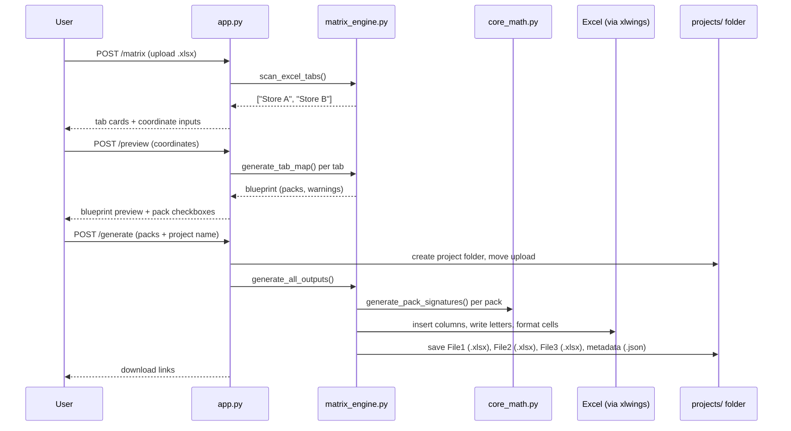

### Journey B: Sub-grouping an existing project

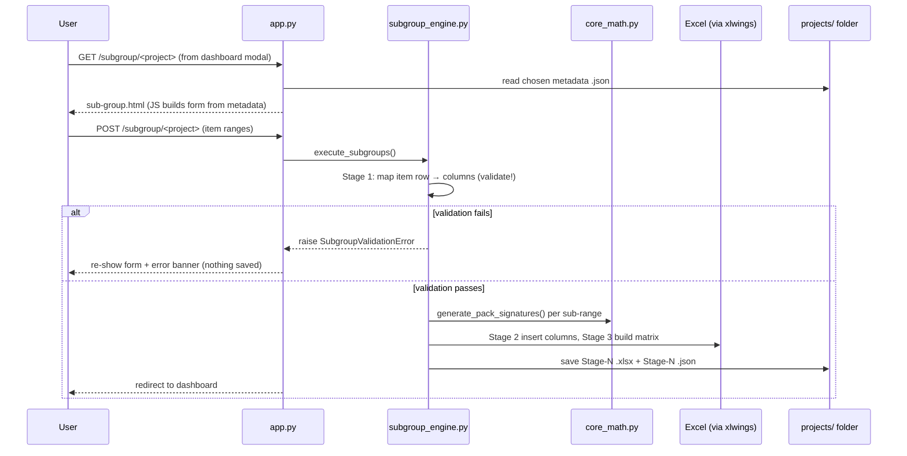

### Journey C: Shuffling PDF labels

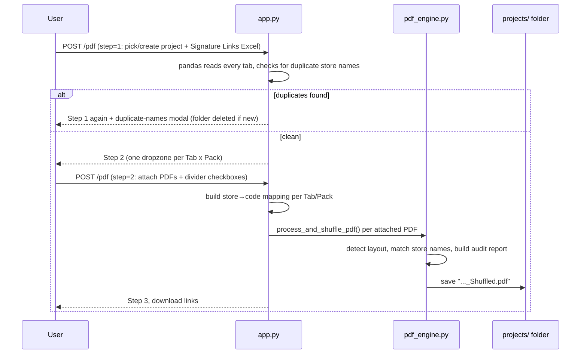

---

## 13. Quick Reference: "I Want to Change X"

| I want to... | Look here |
|---|---|
| Change what counts as "zero" in a quantity cell | `core_math.py` → `sanitize_cell()` |
| Change how signature letters are assigned (e.g. numbers instead of letters) | `core_math.py` → `generate_pack_signatures()` |
| Change the default Start Cell / Job ID / Store Column | `templates/matrix.html` (the `value="B8"` etc. defaults) and `static/script.js` Section 6 (localStorage memory) |
| Change how packs are detected (merged cells vs single column) | `matrix_engine.py` → `generate_tab_map()` |
| Change what makes File 1 / File 3 skip generation | `matrix_engine.py` → the `any_packs_selected` flag in `generate_all_outputs()` |
| Change the sub-group item-number validation messages | `subgroup_engine.py` → `_map_item_columns()` and the two `raise SubgroupValidationError(...)` call sites |
| Change how long until old projects auto-delete | `app.py` → `clean_old_projects()` (`seven_days_in_seconds`) |
| Change the duplicate-store-name check for the PDF shuffler | `app.py` → `/pdf` route, Step 1 (`dupes = store_col[store_col.duplicated()]...`) |
| Change how a PDF page is matched to a store (the text region it reads) | `pdf_engine.py` → the `fitz.Rect(...)` clip rectangles in `process_standard_layout` / `process_split_layout` |
| Change whether/how divider sheets look | `pdf_engine.py` → `build_divider_sheet()` |
| Change the audit report's colors/text | `pdf_engine.py` → `build_audit_report()` |
| Change any button/card color or spacing | `static/styles.css` (grouped by component — see [Section 11](#11-staticstylescss--the-look--feel) table) |
| Change what happens when a form is submitted (spinner, validation) | `static/script.js` (find the relevant numbered section — see [Section 10](#10-staticscriptjs--the-frontend-brain)) |
| Add a brand-new page/route | Add a `@app.route(...)` function in `app.py`, a matching file in `templates/`, and link to it from `templates/index.html`'s nav bar |
