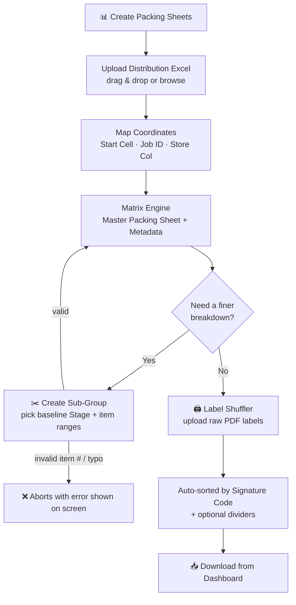

# 📦 Packaging Automation Suite

The **Warehouse Automation Suite** is a robust, local Flask-based web application designed to automate complex warehouse packaging and distribution workflows. It streamlines the process of calculating item allocations, generating iterative packing sheets, and sorting PDF shipping labels based on dynamic signature codes.

---

## ✨ Key Features & Modules

### 1. 📊 Matrix Engine (Create Packing Sheets)
*   **Automated Allocation:** Upload raw Excel distribution lists and dynamically scan for active tabs.
*   **Custom Coordinate Mapping:** Visually map start cells, job IDs, and store columns via the frontend.
*   **Signature Generation:** Mathematically calculates unique packing signatures and outputs a clean, side-by-side Matrix layout alongside the original data.

### 2. ✂️ Sub-Group Engine (Iterative Processing)
*   **Targeted Sub-divisions:** Break down parent packing groups into smaller, specific item ranges (e.g., items 1-5, 6-10).
*   **Stackable Stages:** Fully iterative workflow. Generate `Stage 1`, and then use `Stage 1` as the baseline to seamlessly generate `Stage 2` without overwriting historical data.
*   **Smart Layouts:** Automatically handles Right-to-Left column insertions in source files and Side-by-Side matrix layouts in master packing sheets using `xlwings`.

### 3. 🖨️ PDF Label Shuffler
*   **Signature Matching:** Upload raw PDF store labels and automatically sort them to perfectly match the Excel Signature Code groups.
*   **Divider Injection:** Optional toggle to insert visual divider pages between different packing groups to assist floor workers.
*   **Safe Duplicate Handling:** If the Signature Links file has duplicate store names, nothing is deleted — open the file, fix it, and click "Recheck File" to continue instantly, without re-uploading.
*   **Audit Report:** Every shuffled PDF starts with a report page listing any missing/unmatched stores (grouped by code, auto-laid-out into columns) and flagging any code group where a store name repeated unexpectedly, so a mis-sorted batch is never silently trusted.

### 4. 🗂️ Project Dashboard & File Management
*   **Persistent Sessions:** Jobs are organized into dedicated, timestamped project folders (e.g., `ProjectName_Job-123_260803_1430`).
*   **Native Integration:** Open generated Excel or PDF files directly in their native Windows applications from the browser.
*   **Auto-Cleanup:** A built-in "Zombie Sweeper" automatically clears out empty directories and deletes projects older than 7 days to preserve disk space.

---

## 🛠️ Technology Stack

*   **Backend:** Python 3, Flask, Werkzeug
*   **Data Processing:** Pandas, OpenPyxl
*   **Excel Automation:** xlwings (Runs Excel invisibly in the background for advanced formatting)
*   **Frontend:** HTML5, CSS3, Vanilla JavaScript, Jinja2 Templating

---

## 🚀 Workflow Overview



---


## ⚠️ Important System Requirements & Best Practices

* **Microsoft Excel:** Local installation of Microsoft Excel is strictly required because `xlwings` uses Excel's native engine to render complex grid modifications.
* **Local Directory:** Run this application strictly from a local directory (e.g., `C:\Warehouse_app`). **Do not run inside cloud-synced folders** (OneDrive, SharePoint, Dropbox), as cloud engines lock newly created Excel files and crash cleanup routines.
* **Data Hygiene:** The application is built to automatically detect true sheet boundaries. However, keeping input files trimmed of unused rows/columns is recommended for maximum processing speed.
* **Save before generating:** If you used an "Open Excel File" link to inspect or fix a spreadsheet and left it open, the app will automatically force-close that copy (discarding any unsaved changes in it) the moment it needs to take over that file — so make sure you've saved before clicking Generate/Recheck.

---


## 🚀 Installation & Setup

### Using VSCode

### 1. Clone the Repository
```bash
git clone https://github.com/nesubat/Warehouse_app.git
cd Warehouse_app 
```
### 2. Create and activate a virtual environment
```bash
python -m venv venv 
venv\Scripts\activate
```
### 3. Install dependencies
```bash
pip install flask pandas openpyxl xlwings werkzeug xlsxwriter pymupdf pyinstaller 
```
> Note: install `pymupdf`, not `fitz` — `fitz` on PyPI is an unrelated placeholder package. `pdf_engine.py` imports it as `import pymupdf as fitz` (`fitz` is just PyMuPDF's legacy import alias), so the code still reads `fitz.` everywhere even though the installed package is `pymupdf`.
### 4.Run application
```bash
python app.py 
```
The app will be available in your browser at http://127.0.0.1:5000

### create .exec file
```bash
pyinstaller --onefile --name "WarehouseApp" app.py
```


