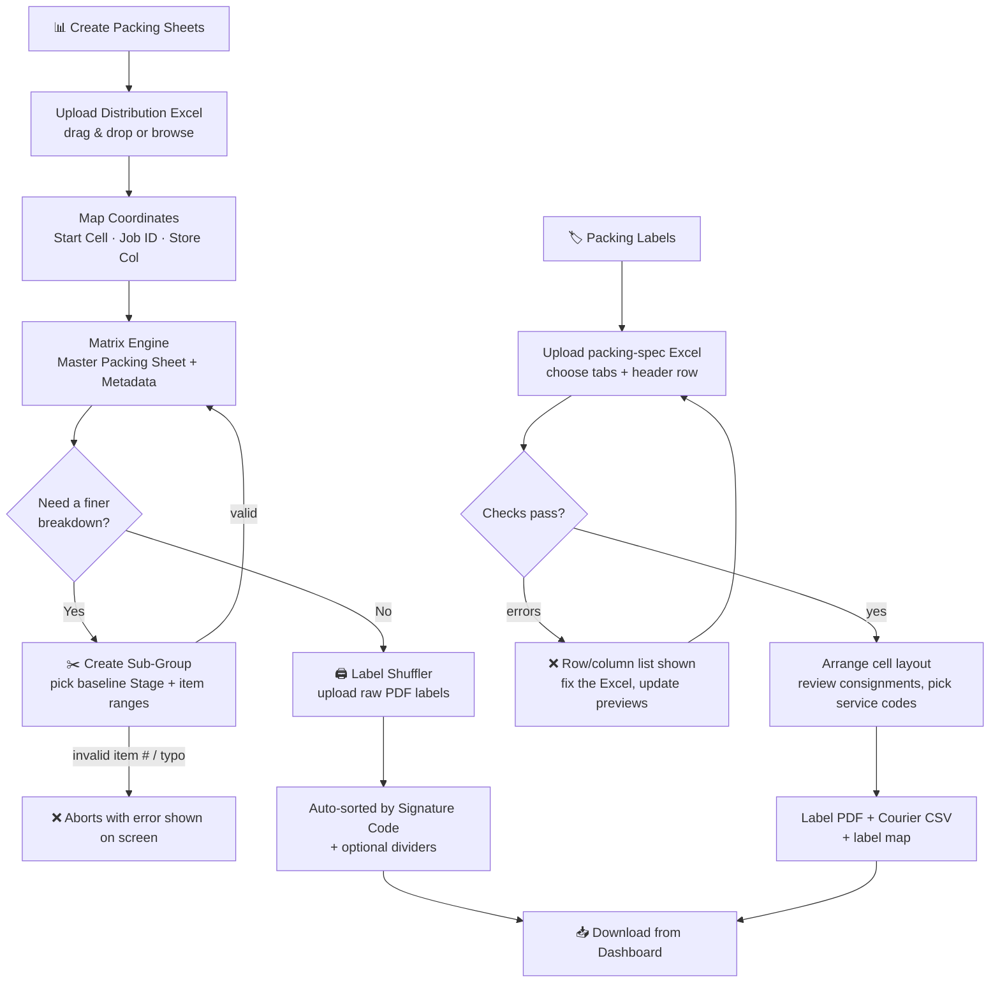

# 📦 Packaging Automation Suite

The **Warehouse Automation Suite** is a robust, local Flask-based web application designed to automate complex warehouse packaging and distribution workflows. It streamlines the process of calculating item allocations, generating iterative packing sheets, sorting PDF shipping labels based on dynamic signature codes, and producing printable packing labels with a ready-to-import courier consignment file.

📖 **How the code works:** see the [Code Guide](docs/CODE_GUIDE.md) — every file explained in plain language, plus the full rules the Packing Labels tool applies.

---

## ✨ Key Features & Modules

### 1. 📊 Matrix Engine (Create Packing Sheets)
*   **Automated Allocation:** Upload raw Excel distribution lists and dynamically scan for active tabs.
*   **Custom Coordinate Mapping:** Visually map start cells, job IDs, and store columns via the frontend.
*   **Signature Generation:** Mathematically calculates unique packing signatures and outputs a clean, side-by-side Matrix layout alongside the original data.

### 2. ✂️ Sub-Group Engine (Iterative Processing)
*   **Targeted Sub-divisions:** Break down parent packing groups into smaller, specific item ranges (e.g., items 1-5, 6-10).
*   **Stackable Stages:** Fully iterative workflow. Generate `Stage 1`, and then use `Stage 1` as the baseline to seamlessly generate `Stage 2` without overwriting historical data.
*   **Smart Layouts:** Automatically handles Right-to-Left column insertions in source files and Side-by-Side matrix layouts in master packing sheets using `xlwings`.

### 3. 🖨️ PDF Label Shuffler
*   **Signature Matching:** Upload raw PDF store labels and automatically sort them to perfectly match the Excel Signature Code groups.
*   **Divider Injection:** Optional toggle to insert visual divider pages between different packing groups to assist floor workers.
*   **Installer Barcodes:** Tick "This campaign is being sent to an installer" on a tab in the Distribution Mapper, and every divider sheet for that tab carries a Code 128 barcode for each job number in that code's bag, captioned with its kind and quantity (e.g. `J476699-09 K1 x 1`).
*   **Safe Duplicate Handling:** If the Signature Links file has duplicate store names, nothing is deleted — open the file, fix it, and click "Recheck File" to continue instantly, without re-uploading.
*   **Audit Report:** Every shuffled PDF starts with a report page listing any missing/unmatched stores (grouped by code, auto-laid-out into columns) and flagging any code group where a store name repeated unexpectedly, so a mis-sorted batch is never silently trusted.

### 4. 🏷️ Packing Labels & Courier CSV (Label Maker for Vertical Distribution)
*   **One Label per Box:** Each merged **Packing Spec** cell becomes one A4-landscape packing label: a 107 × 150 mm space for the courier label, the Packing Spec in a bold black panel, the store and address, `LABEL X OF Y` / `PAGE X OF Y` counters, and one rounded box per item.
*   **Barcodes:** Every item box carries a Code 128 barcode of its job number. A job number used on several rows gets one kind per row — `J477161-26 K1`, `K2`, `K3`… in reading order, K1 being its first row in the first tab — the same idea as the Distribution Mapper's divider barcodes.
*   **Drag-and-Drop Cell Layout:** Choose the order of image, description, dimensions, job number, quantity, material, install and notes inside each box. Each block keeps its own style wherever it's placed, and text wraps and shrinks so nothing ever spills outside the box.
*   **Thorough Checks Before Printing:** Missing job numbers or packing specs, a pack with mixed addresses, store names or Install flags, a store with conflicting addresses, missing images — each reported with its Excel row and column. Errors lock Generate until fixed; warnings don't. Spelling differences such as capitals, punctuation and Street/St are ignored.
*   **Messy Addresses Made Standard:** Installer addresses typed into one cell (e.g. `Steven Priestley - Wilson Storage, 68 Ricketts Road, Mount Waverley, Vic, 3149 - ATL`) are split into receiver, contact, address lines, suburb, state, postcode and Authority To Leave.
*   **Courier Consignment CSV:** Packs going to the same address — even for different stores — are combined into one consignment. Carton size, cubic, weight and item type come from the Packing Spec (`OB1370170170` → 137 × 17 × 17 cm). Ready for import into the courier portal.
*   **Review Before Generating:** A consignment table lets you fix any address (✏️), pick a courier service per consignment from a dropdown (most-used first), and filter by state to apply a service to many at once.
*   **Address Book:** Every address sent to the courier is saved automatically, along with how it was spelled in Excel, so the next file with the same spelling gets the clean (or corrected) address filled in. Search, add, edit and delete on the 📇 Address Book page; suggestions appear as you type in the consignment edit form. Stored locally in `data/address_book.db` and built to stay instant at 50,000+ addresses.
*   **Verified Addresses:** After uploading a consignment CSV to the courier portal, download the verified addresses (CSV or Excel, any column layout — only the address columns are read) and add them with **⬆ Update in bulk** on the Address Book page. Each row is matched to the address it corrects (by item reference across all projects, or receiver name), every change is shown for review (old → new, highlighted) before it's saved, and applied addresses are marked ✓ Verified.
*   **Packing Specs:** The 📐 Packing Specs page holds the size, weight and item type the courier CSV uses for each Packing Spec. OB, CS, Pallet and FP codes carry their size in millimetres (OB1701701200 → 17 × 17 × 120 cm; FP120170 → 12 × 17 × 5 cm, the third size set on the page). Named specs (A4 box, SRA3, P7 jiffy bag…) use the values entered on the page, and new specs found in a file are listed there to fill in. Every carton's weight (a pallet starts at 200 kg) can be changed in its box in the consignment preview.
*   **Export details (OpenFreight, outside Australia):** commercial value, descriptions, origin, contents qty and $AUD, and tariff code (HS 4911.10 by default) are filled in for international deliveries; edited per job in the preview, with Save as default / Reset to default.
*   **Courier CSV choice:** Open360, OpenFreight (the older courier CSV) or both, chosen above the project name for every job (Generate refuses without one); both carry the same Item References, so labels from either stitch by code. Each consignment can have its own service; the report lists them all, and merging keeps the kept address's service (asking first when they differ).
*   **TIG Open360 CSV:** Generate also writes the consignments in TIG Open360's 46-column bulk-upload format (`… - Open360.csv`), one row per label in the distribution file's order, with the Consignment Reference as its Shipment Reference and an Item Reference `01T1QWXK Store`: the label's serial (count in its tab, T + tab, also printed on the packing label as `01T1. Store`), one code for the whole job, then the store. Serial + job code is what Stitch Labels matches, so labels of another job or an earlier Generate never land on the wrong packing label. All selected tabs go into one CSV, and the packing labels PDF has a divider page between tabs.
*   **Stitch Labels:** From the dashboard, upload the courier portal's label PDF and every courier label is placed on its packing label's courier region, matched by the unique code in its Item Ref, as a sharp 600 dpi image so barcodes still scan; portrait, landscape and sideways labels all come out upright. Output: `Complete Labels <n> - <job> - <project> - <time>.pdf` (packing labels alone: `Packing Labels Only <n> - …`).
*   **Packs of several boxes:** a Packing Spec like `2 x OB170170170` (also `2x`, `2 xOB`, `2 OB`) makes one packing label per box, each with a diagonal "BOX 1 OF 2" watermark; the Open360 row has Item Quantity 2, and stitching puts each box's courier label on its own box.
*   **Stitch in two steps:** every courier label is read and matched first (a fraction of a second). All matched: the Complete Labels PDF is made at once, with Download and Open file. Otherwise straight to matching by hand, where Save changes only saves and Finalise stitches once. One Complete Labels file per project (a new one replaces the old).
*   **Column mapping in the preview:** fields the rules found are green chips (hover: the Excel header and cell; click: pick another column), ones set by hand blue; only the fields still to map are listed, the required ones in red. Remembered per file and tab in the browser.
*   **Project names:** at most 50 characters on every project page, so every file of a project still opens in Excel (the name is in the folder and every file name).
*   **Refresh-proof pages:** every upload page reopens where it was after a refresh (no resending the form), the upload isn't deleted by it, and files picked but not sent yet stay in the upload box.
*   **One receiver at different addresses:** a store's (or installer's) consignments at different addresses sit next to each other in the preview, across all tabs, marked "look like one place" or "really differ": pick the address to keep and Merge into one.
*   **Matching by hand:** Courier labels the codes didn't match are paired from the address printed on them and shown side by side with their packing labels (full addresses), grouped by receiver; equal counts at an address are matched in order. ✓ each pair (it joins into one box and the next ✓ comes under the pointer), ✕ to split, ↶ Undo on hover, Match all 100% for the sure ones; labels still to match sit beside their closest packing label with a ✓ (or Other… to pick one), and dragging still works; Save re-stitches in the background and remembers the matches. Labels still unmatched can be added 4-up at the end in cut-and-stack order, or left out; page 1 of every PDF is a job report with the job number and what needs a look.
*   **Label Map:** A hidden JSON file records which PDF page each label (and each box of a multi-box pack) is on, where it's headed and its code (serial + job code), so Stitch Labels can place each courier label onto its packing label.

### 5. 🗂️ Project Dashboard & File Management
*   **Persistent Sessions:** Jobs are organized into dedicated, timestamped project folders (e.g., `ProjectName_Job-123_260803_1430`).
*   **Native Integration:** Open generated Excel, PDF or CSV files directly in their native Windows applications from the browser.
*   **Courier Projects:** Projects with a courier CSV list it in its own group and show a **🧵 Stitch Labels** button in place of "Create Sub-Group".
*   **Auto-Cleanup:** A built-in "Zombie Sweeper" automatically clears out empty directories and deletes projects older than 7 days to preserve disk space.
*   **No Leftover Uploads:** Leaving a page after scanning a file but before generating deletes that upload (closing it in Excel first if it's open). Anything missed is swept up the next time the app starts, once it's a day old.

---

## 🛠️ Technology Stack

*   **Backend:** Python 3, Flask, Werkzeug
*   **Data Processing:** Pandas, OpenPyxl
*   **Excel Automation:** xlwings (Runs Excel invisibly in the background for advanced formatting)
*   **PDF:** PyMuPDF (reading and re-ordering label PDFs, drawing packing labels)
*   **Address Book:** SQLite with FTS5 full-text search (built into Python, no server)
*   **Frontend:** HTML5, CSS3, Vanilla JavaScript, Jinja2 Templating

---

## 🚀 Workflow Overview


```mermaid
flowchart TD
    A[📊 Create Packing Sheets] --> B[Upload Distribution Excel<br/>drag & drop or browse]
    B --> C[Map Coordinates<br/>Start Cell · Job ID · Store Col]
    C --> D[Matrix Engine<br/>Master Packing Sheet + Metadata]
    D --> E{Need a finer<br/>breakdown?}
    E -- Yes --> F[✂️ Create Sub-Group<br/>pick baseline Stage + item ranges]
    F -- invalid item # / typo --> F2[❌ Aborts with error shown on screen]
    F -- valid --> D
    E -- No --> G[🖨️ Label Shuffler<br/>upload raw PDF labels]
    G --> H[Auto-sorted by Signature Code<br/>+ optional dividers]
    H --> I[📥 Download from Dashboard]

    P[🏷️ Packing Labels] --> Q[Upload packing-spec Excel<br/>choose tabs + header row]
    Q --> R{Checks pass?}
    R -- errors --> R2[❌ Row/column list shown<br/>fix the Excel, update previews]
    R2 --> Q
    R -- yes --> S[Arrange cell layout<br/>review consignments, pick service codes]
    S --> T[Label PDF + Courier CSV<br/>+ label map]
    T --> I
```

---


## ⚠️ Important System Requirements & Best Practices

* **Microsoft Excel:** Local installation of Microsoft Excel is strictly required because `xlwings` uses Excel's native engine to render complex grid modifications.
* **Local Directory:** Run this application strictly from a local directory (e.g., `C:\Warehouse_app`). **Do not run inside cloud-synced folders** (OneDrive, SharePoint, Dropbox), as cloud engines lock newly created Excel files and crash cleanup routines.
* **Data Hygiene:** The application is built to automatically detect true sheet boundaries. However, keeping input files trimmed of unused rows/columns is recommended for maximum processing speed.
* **Save before generating:** When you click Generate (on any tool) or Recheck, the app closes every copy of that spreadsheet open in Excel — in any Excel window, including Protected View — **without saving**, so it always works from the saved file. Make sure you've saved your changes first.
* **Save before leaving:** The same applies when you leave a page without generating — the upload is closed in Excel without saving and deleted. Fix the file, save it, then scan it again.
* **Packing Labels spreadsheets:** **Packing Spec**, **Job Number** and **Install** columns are required. Merge the Packing Spec cells across all rows that go in the same box — that merge is what defines a box. Every row needs a Job Number. Install is `Y` for a box going to an installer; `N` or blank means it goes to the store.

---


## 🚀 Installation & Setup

### Using VSCode

### 1. Clone the Repository
```bash
git clone https://github.com/nesubat/Warehouse_app.git
cd Warehouse_app 
```
### 2. Create and activate a virtual environment
```bash
python -m venv venv 
venv\Scripts\activate
```
### 3. Install dependencies
```bash
pip install -r requirements.txt
```
> Note: the PDF library is installed as `pymupdf`, not `fitz` — `fitz` on PyPI is an unrelated placeholder package. The code imports it as `import pymupdf as fitz` (`fitz` is just PyMuPDF's legacy import alias), so it still reads `fitz.` everywhere even though the installed package is `pymupdf`.

No `.env` file or secret key is needed.
### 4. Run application
```bash
python app.py 
```
The app will be available in your browser at http://127.0.0.1:5001

On start-up the app stops anything already using port 5001 (for example a copy of the app left running in another terminal), so you never get an "address already in use" error.

### Create an .exe file
```bash
pip install pyinstaller
pyinstaller --onefile --name "WarehouseApp" app.py
```

### Logs

Each step of Packing Labels, the address book, Packing Specs and Stitch Labels is logged with counts and timings: INFO lines in the terminal, and everything (each courier label page, each address-book fill) in `logs/warehouse.log`, with full tracebacks for failures. Set `WAREHOUSE_LOG_LEVEL=DEBUG` for the detail in the terminal too. `data/` and `logs/` stay out of git.
