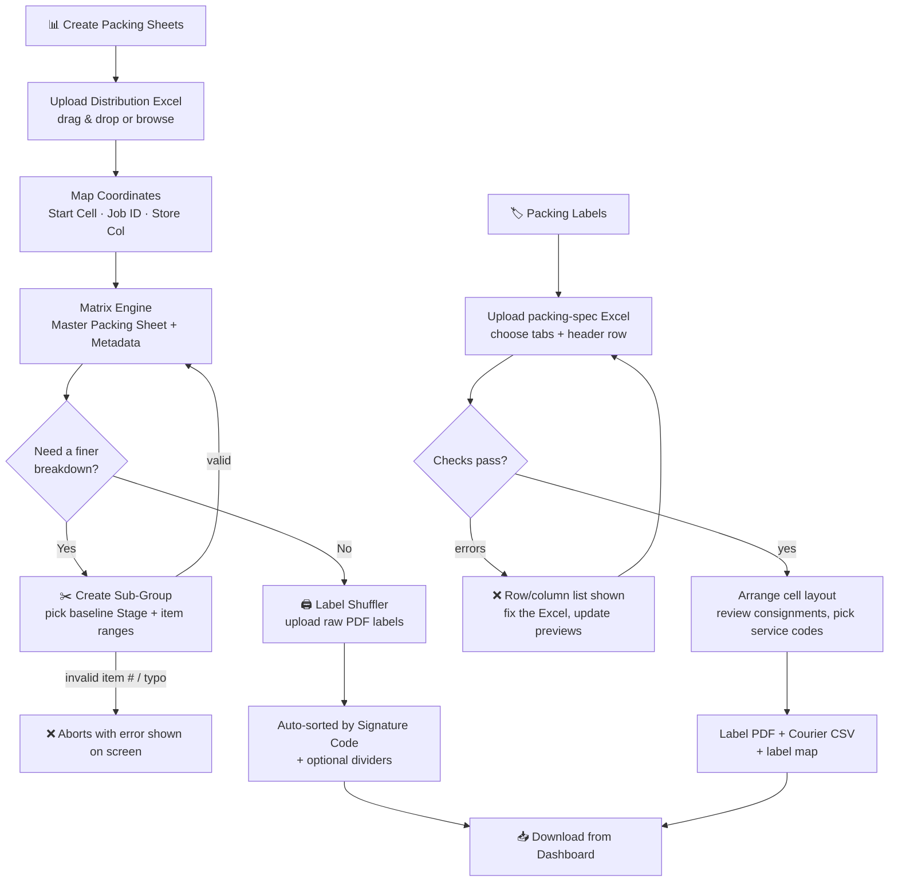

# 📦 Packaging Automation Suite

The **Warehouse Automation Suite** is a robust, local Flask-based web application designed to automate complex warehouse packaging and distribution workflows. It streamlines the process of calculating item allocations, generating iterative packing sheets, sorting PDF shipping labels based on dynamic signature codes, and producing printable packing labels with a ready-to-import courier consignment file.

📖 **How the code works:** see the [Code Guide](docs/CODE_GUIDE.md) — every file explained in plain language, plus the full rules the Packing Labels tool applies.

---

## ✨ Key Features & Modules

### 1. 📊 Matrix Engine (Create Packing Sheets)
*   **Automated Allocation:** Upload raw Excel distribution lists and dynamically scan for active tabs.
*   **Custom Coordinate Mapping:** Visually map start cells, job IDs, and store columns via the frontend.
*   **Signature Generation:** Mathematically calculates unique packing signatures and outputs a clean, side-by-side Matrix layout alongside the original data.

### 2. ✂️ Sub-Group Engine (Iterative Processing)
*   **Targeted Sub-divisions:** Break down parent packing groups into smaller, specific item ranges (e.g., items 1-5, 6-10).
*   **Stackable Stages:** Fully iterative workflow. Generate `Stage 1`, and then use `Stage 1` as the baseline to seamlessly generate `Stage 2` without overwriting historical data.
*   **Smart Layouts:** Automatically handles Right-to-Left column insertions in source files and Side-by-Side matrix layouts in master packing sheets using `xlwings`.

### 3. 🖨️ PDF Label Shuffler
*   **Signature Matching:** Upload raw PDF store labels and automatically sort them to perfectly match the Excel Signature Code groups.
*   **Divider Injection:** Optional toggle to insert visual divider pages between different packing groups to assist floor workers.
*   **Installer Barcodes:** Tick "This campaign is being sent to an installer" on a tab in the Distribution Mapper, and every divider sheet for that tab carries a Code 128 barcode for each job number in that code's bag, captioned with its kind and quantity (e.g. `J476699-09 Kind 1 x 1`).
*   **Safe Duplicate Handling:** If the Signature Links file has duplicate store names, nothing is deleted — open the file, fix it, and click "Recheck File" to continue instantly, without re-uploading.
*   **Audit Report:** Every shuffled PDF starts with a report page listing any missing/unmatched stores (grouped by code, auto-laid-out into columns) and flagging any code group where a store name repeated unexpectedly, so a mis-sorted batch is never silently trusted.

### 4. 🏷️ Packing Labels & Courier CSV
*   **One Label per Box:** Each merged **Packing Spec** cell becomes one A4-landscape packing label: a 107 × 150 mm space for the courier label, the Packing Spec in a bold black panel, the store and address, `LABEL X OF Y` / `PAGE X OF Y` counters, and one rounded box per item.
*   **Drag-and-Drop Cell Layout:** Choose the order of image, description, dimensions, job number, quantity, material, install and notes inside each box. Each block keeps its own style wherever it's placed, and text wraps and shrinks so nothing ever spills outside the box.
*   **Thorough Checks Before Printing:** Missing job numbers or packing specs, a pack with mixed addresses, store names or Install flags, a store with conflicting addresses, missing images — each reported with its Excel row and column. Errors lock Generate until fixed; warnings don't. Spelling differences such as capitals, punctuation and Street/St are ignored.
*   **Messy Addresses Made Standard:** Installer addresses typed into one cell (e.g. `Steven Priestley - Wilson Storage, 68 Ricketts Road, Mount Waverley, Vic, 3149 - ATL`) are split into receiver, contact, address lines, suburb, state, postcode and Authority To Leave.
*   **Courier Consignment CSV:** Packs going to the same address — even for different stores — are combined into one consignment. Carton size, cubic, weight and item type come from the Packing Spec (`OB1370170170` → 137 × 17 × 17 cm). Ready for import into the courier portal.
*   **Review Before Generating:** A consignment table lets you fix any address (✏️), pick a courier service per consignment from a dropdown (most-used first), and filter by state to apply a service to many at once.
*   **Label Map:** A hidden JSON file records which PDF page each label is on and where it's headed, ready for a future "Stitch Labels" step that will place each courier label onto its packing label.

### 5. 🗂️ Project Dashboard & File Management
*   **Persistent Sessions:** Jobs are organized into dedicated, timestamped project folders (e.g., `ProjectName_Job-123_260803_1430`).
*   **Native Integration:** Open generated Excel, PDF or CSV files directly in their native Windows applications from the browser.
*   **Courier Projects:** Projects with a courier CSV list it in its own group and show a **Stitch Labels** button (coming soon) in place of "Create Sub-Group".
*   **Auto-Cleanup:** A built-in "Zombie Sweeper" automatically clears out empty directories and deletes projects older than 7 days to preserve disk space.
*   **No Leftover Uploads:** Leaving a page after scanning a file but before generating deletes that upload (closing it in Excel first if it's open). Anything missed is swept up the next time the app starts, once it's a day old.

---

## 🛠️ Technology Stack

*   **Backend:** Python 3, Flask, Werkzeug
*   **Data Processing:** Pandas, OpenPyxl
*   **Excel Automation:** xlwings (Runs Excel invisibly in the background for advanced formatting)
*   **PDF:** PyMuPDF (reading and re-ordering label PDFs, drawing packing labels)
*   **Frontend:** HTML5, CSS3, Vanilla JavaScript, Jinja2 Templating

---

## 🚀 Workflow Overview


```mermaid
flowchart TD
    A[📊 Create Packing Sheets] --> B[Upload Distribution Excel<br/>drag & drop or browse]
    B --> C[Map Coordinates<br/>Start Cell · Job ID · Store Col]
    C --> D[Matrix Engine<br/>Master Packing Sheet + Metadata]
    D --> E{Need a finer<br/>breakdown?}
    E -- Yes --> F[✂️ Create Sub-Group<br/>pick baseline Stage + item ranges]
    F -- invalid item # / typo --> F2[❌ Aborts with error shown on screen]
    F -- valid --> D
    E -- No --> G[🖨️ Label Shuffler<br/>upload raw PDF labels]
    G --> H[Auto-sorted by Signature Code<br/>+ optional dividers]
    H --> I[📥 Download from Dashboard]

    P[🏷️ Packing Labels] --> Q[Upload packing-spec Excel<br/>choose tabs + header row]
    Q --> R{Checks pass?}
    R -- errors --> R2[❌ Row/column list shown<br/>fix the Excel, update previews]
    R2 --> Q
    R -- yes --> S[Arrange cell layout<br/>review consignments, pick service codes]
    S --> T[Label PDF + Courier CSV<br/>+ label map]
    T --> I
```

---


## ⚠️ Important System Requirements & Best Practices

* **Microsoft Excel:** Local installation of Microsoft Excel is strictly required because `xlwings` uses Excel's native engine to render complex grid modifications.
* **Local Directory:** Run this application strictly from a local directory (e.g., `C:\Warehouse_app`). **Do not run inside cloud-synced folders** (OneDrive, SharePoint, Dropbox), as cloud engines lock newly created Excel files and crash cleanup routines.
* **Data Hygiene:** The application is built to automatically detect true sheet boundaries. However, keeping input files trimmed of unused rows/columns is recommended for maximum processing speed.
* **Save before generating:** When you click Generate (on any tool) or Recheck, the app closes every copy of that spreadsheet open in Excel — in any Excel window, including Protected View — **without saving**, so it always works from the saved file. Make sure you've saved your changes first.
* **Save before leaving:** The same applies when you leave a page without generating — the upload is closed in Excel without saving and deleted. Fix the file, save it, then scan it again.
* **Packing Labels spreadsheets:** Merge the **Packing Spec** cells across all rows that go in the same box — that merge is what defines a box. Every row needs a **Job Number**.

---


## 🚀 Installation & Setup

### Using VSCode

### 1. Clone the Repository
```bash
git clone https://github.com/nesubat/Warehouse_app.git
cd Warehouse_app 
```
### 2. Create and activate a virtual environment
```bash
python -m venv venv 
venv\Scripts\activate
```
### 3. Install dependencies
```bash
pip install -r requirements.txt
```
> Note: the PDF library is installed as `pymupdf`, not `fitz` — `fitz` on PyPI is an unrelated placeholder package. The code imports it as `import pymupdf as fitz` (`fitz` is just PyMuPDF's legacy import alias), so it still reads `fitz.` everywhere even though the installed package is `pymupdf`.

No `.env` file or secret key is needed.
### 4. Run application
```bash
python app.py 
```
The app will be available in your browser at http://127.0.0.1:5001

On start-up the app stops anything already using port 5001 (for example a copy of the app left running in another terminal), so you never get an "address already in use" error.

### Create an .exe file
```bash
pip install pyinstaller
pyinstaller --onefile --name "WarehouseApp" app.py
```
