# 🧭 Code Guide — Warehouse Automation Suite

This document explains **every file in this project, piece by piece**, in plain language. It's written for someone with only basic coding knowledge (you understand variables, loops, `if`/`else`, and functions, but you don't need to remember Flask, Excel-automation, or PDF-library details — they're explained here).

It covers all four tools — the Distribution Mapper (Matrix Engine), Sub-Groups, the Label Shuffler and Packing Labels with its courier CSV — and, for Packing Labels, also lists the rules the tool applies, so this one file is both the "how it works" and the "what it does" reference.

> **Note on diagrams:** This file uses [Mermaid](https://mermaid.js.org/) diagrams (the ` ```mermaid ` code blocks). They render automatically on GitHub/GitLab. In VS Code, install the **"Markdown Preview Mermaid Support"** extension and open Preview (`Ctrl+Shift+V`) to see them as pictures instead of code.

---

## Table of Contents

1. [The Big Picture](#1-the-big-picture)
2. [Key Vocabulary](#2-key-vocabulary)
3. [File Map & Folder Structure](#3-file-map--folder-structure)
4. [`app.py` — The Web Server](#4-apppy--the-web-server)
5. [`core_math.py` — Shared Math & Formatting](#5-core_mathpy--shared-math--formatting)
6. [`matrix_engine.py` — The Matrix Engine](#6-matrix_enginepy--the-matrix-engine)
7. [`subgroup_engine.py` — The Sub-Group Engine](#7-subgroup_enginepy--the-sub-group-engine)
8. [`pdf_engine.py` — The Label Shuffler](#8-pdf_enginepy--the-label-shuffler)
9. [`packing_label_generator.py` — Packing Labels](#9-packing_label_generatorpy--packing-labels)
10. [`courier_export.py` — Addresses, Consignments & the Courier CSV](#10-courier_exportpy--addresses-consignments--the-courier-csv)
11. [`templates/*.html` — The Web Pages](#11-templateshtml--the-web-pages)
12. [`static/script.js` — The Frontend Brain](#12-staticscriptjs--the-frontend-brain)
13. [`static/styles.css` — The Look & Feel](#13-staticstylescss--the-look--feel)
14. [End-to-End Journeys](#14-end-to-end-journeys)
15. [Quick Reference: "I Want to Change X"](#15-quick-reference-i-want-to-change-x)

---

## 1. The Big Picture

This app is a **Flask web application** — a Python program that runs a small local web server. You open a browser, go to `http://127.0.0.1:5001`, and click buttons; behind the scenes, Python code reads/writes real Excel, PDF and CSV files on your hard drive.

There is no database. Everything the app "remembers" is stored as **actual files on disk**, inside a `projects/` folder — Excel files, PDF files, courier CSVs, and small `.json` text files that act as the app's memory of what it did. One extra file, `data/service_code_usage.json`, remembers how often each courier service code has been used.

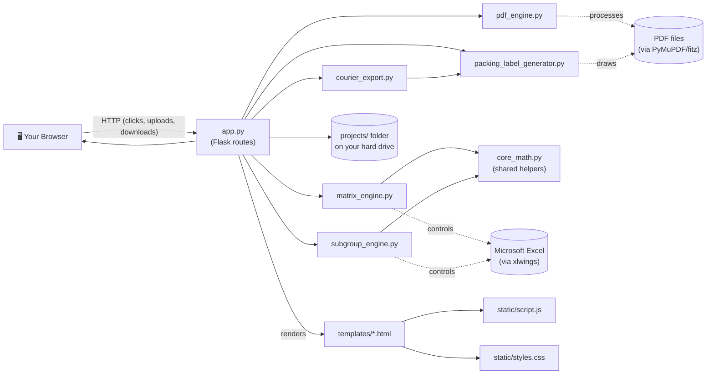

Four independent "engines" do the heavy lifting, and `app.py` is the traffic cop that receives clicks from the browser and calls the right engine at the right time:

| Engine | File | What it does |
|---|---|---|
| **Matrix Engine** | `matrix_engine.py` | Turns a raw distribution Excel file into a "Packing Sheet" with calculated signature codes. |
| **Sub-Group Engine** | `subgroup_engine.py` | Takes an existing Packing Sheet and breaks a pack into smaller item-number ranges (repeatable — Stage 1, Stage 2, Stage 3...). |
| **PDF Label Shuffler** | `pdf_engine.py` | Takes raw PDF shipping labels and re-orders/re-stacks their pages to match the signature codes calculated above. |
| **Packing Labels** | `packing_label_generator.py` + `courier_export.py` | Turns a packing-spec spreadsheet into one printable packing label per box (PDF), plus a courier consignment CSV and a label map for matching courier labels to packing labels. |

`core_math.py` is a toolbox of small functions (cleaning text, calculating "signatures", formatting Excel cells) that both the Matrix Engine and the Sub-Group Engine call, so the same logic isn't written twice. `courier_export.py` likewise borrows the text-comparison helpers from `packing_label_generator.py`.

---

## 2. Key Vocabulary

These words appear everywhere in the code. If you're ever confused reading a function, come back to this table.

**Distribution Mapper, Sub-Groups and Label Shuffler**

| Term | Meaning |
|---|---|
| **Tab** | A sheet inside an Excel workbook (e.g., "Store A", "Store B"). The app processes one or more tabs independently. |
| **Pack** | A group of columns in a tab that represents one "package type" (e.g., "Banner Pack", "Signage Pack"). Detected either from a merged header cell, or a single column with a header. |
| **Store** | A row in a tab — one retail location receiving an allocation. |
| **Signature / Signature Code** | A short letter code (`A`, `B`, ... `Z`, `AA`, `AB`...) assigned to a **unique combination of quantities** across a pack's columns. Two stores with the exact same order quantities get the same letter. This is the core trick of the whole app — instead of printing every store's exact numbers, you print one letter, and a lookup table tells the warehouse floor what that letter means. |
| **Item Number** | A number identifying one column/item inside a pack (used only by the Sub-Group Engine to slice a pack into smaller ranges, e.g. items 1–5 vs 6–10). |
| **Stage** | A version of the output Excel file. `Stage - 1 - ...xlsx` is the first sub-grouped version, `Stage - 2 - ...xlsx` the next, etc. Each stage builds on the previous one without destroying it. |
| **Blueprint** | The in-memory map the Matrix Engine builds after scanning a tab: where the stores are, where the packs are, where the Job ID is. Shown to the user as a "preview" before generating anything. |
| **Metadata (`project_metadata.json` / `Stage - N - ....json`)** | A JSON file that remembers exact column numbers for every pack/sub-group in a project, so the app can find its own past work later (e.g. when you come back to sub-group a project a second time). |

**Packing Labels and the courier CSV** — note that here a "pack" means something different: one physical box.

| Term | Meaning |
|---|---|
| **Pack group** | The rows covered by one merged **Packing Spec** cell. One pack group = one box = one packing label = one courier carton = one CSV row. |
| **Packing Spec** | The box type, e.g. `OB1370170170` (a 137 × 17 × 17 cm box), `P7 Jiffy Bag`, `A4 Box`, `Pallet…`. |
| **Installer pack** | A pack whose **Install** cell says `Y`/`Yes`/`True`: it goes to an installer, not to the store. |
| **Label X of Y** | Each store's pack groups numbered in file order. Printed on the packing label and used in the courier item reference. |
| **Consignment** | All packs going to the **same delivery address**, whichever store they belong to. The courier treats them as one shipment. |
| **Consignment reference** | The job series (e.g. `J477161`, from job numbers like `J477161-54`), written on the first CSV row of each consignment. |
| **Item reference** | `Label <X> - <Store>`, the last CSV column. Printed on the courier label; it's the key that links a courier label to its packing label. |
| **Label map** | `….labelmap.json`, saved next to the PDF: which PDF page each label is on, where it's headed, and which CSV row is its courier carton. For a future "stitch labels" tool. |
| **Comparison key** | A simplified copy of a text value (lower-case, no punctuation, Street = St…) used to decide whether two spellings mean the same thing. |
| **Service code** | The courier service for a consignment (e.g. `STEROAD · STARTRACK ROAD EXPRESS`), picked from a list. |

**Libraries and general terms**

| Term | Meaning |
|---|---|
| **Project Folder** | One folder per job, named like `CampaignName_Job-12345_260803_1430`, holding every file (Excel, PDF, CSV, JSON) generated for that job. |
| **`xlwings`** | A Python library that remote-controls a real, invisible copy of Microsoft Excel. Used because it can insert/merge columns and preserve formatting exactly like a human using Excel would — something the faster libraries (openpyxl/pandas) can't do well. |
| **`openpyxl`** | Reads `.xlsx` files directly (no Excel needed). Packing Labels uses it to read cells, merged ranges and pictures. |
| **`fitz` (PyMuPDF)** | A Python library for reading and rewriting PDF files page-by-page — used to detect text on a label, to cut/paste/reorder pages, and to draw packing labels from scratch. The PyPI/pip package is still called `PyMuPDF`, but the *import name* `fitz` is a deprecated legacy alias upstream; the code imports it as `import pymupdf as fitz` so the rest of the file can keep using the familiar `fitz.` prefix without triggering the deprecation warning. |
| **Point (pt) / EMU** | PDF drawing units: 1 pt = 1/72 inch, 1 mm = 2.83465 pt. Excel positions pictures in EMU (English Metric Units): 12,700 per point, 9,525 per pixel. |

---

## 3. File Map & Folder Structure

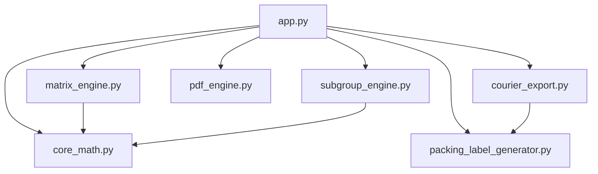

Only `app.py` talks to Flask/the browser. The engines never render a web page themselves — they take plain Python data in, and return plain Python data (or files on disk) out. This separation means you could, in theory, delete the entire website and still call `generate_all_outputs()` or `generate_packing_labels()` from a Python script.

### What's on disk after you use the app

```
Warehouse_app/
├── app.py, core_math.py, matrix_engine.py, pdf_engine.py, subgroup_engine.py
├── packing_label_generator.py, courier_export.py
├── templates/            → the 5 HTML pages Flask renders
├── static/               → script.js + styles.css (shared by all pages)
├── docs/CODE_GUIDE.md    → this guide
├── data/                  → service_code_usage.json (how often each courier service was picked)
├── temp_pdf_engine/       → scratch space, wiped after every PDF run
└── projects/              → EVERY job you've ever created lives here
    ├── MyCampaign_Job-12345_260804_1000/        ← Distribution Mapper project
    │   ├── OriginalUpload.xlsx              ← your original file (matrix flow)
    │   ├── Final OriginalUpload.xlsx        ← "File 1": working copy with signature columns
    │   ├── Packing Sheet_12345.xlsx         ← "File 2": master summary book (this is what floor staff read)
    │   ├── Signature links_12345.xlsx       ← "File 3": clean store→code lookup table (used by the PDF shuffler)
    │   ├── Final OriginalUpload.json        ← metadata memory for this project
    │   ├── Stage - 1 - Final OriginalUpload.xlsx   ← after your 1st sub-group run
    │   ├── Stage - 1 - Final OriginalUpload.json
    │   └── SomeLabelFile_Shuffled.pdf       ← output of the PDF shuffler
    └── LUX_261004_0152/                      ← Packing Labels project
        ├── PACKING_SPECS_….xlsx             ← your original file
        ├── Labels_PACKING_SPECS_….pdf       ← one packing label per box
        ├── J477161 - LUX.csv                ← courier consignment CSV
        └── J477161 - LUX.labelmap.json      ← label map (kept for stitching, never shown in the app)
```

Notice the **three-file pattern** from the Matrix Engine: **File 1** (working copy, has the new signature columns baked in), **File 2** (the human-readable Packing Sheet, columns removed/summarized), **File 3** (a clean, minimal store→code table meant to feed the PDF engine). All three are built from the same uploaded Excel, at the same time, inside `generate_all_outputs()` (see [Section 6](#6-matrix_enginepy--the-matrix-engine)).

---

## 4. `app.py` — The Web Server

**What Flask is, in one paragraph:** Flask lets you write a normal Python function and attach it to a URL with `@app.route('/some/url')`. When a browser visits that URL, Flask calls your function and sends whatever it `return`s back as the web page. `methods=['GET', 'POST']` means the function handles both "just looking at the page" (GET) and "submitting a form" (POST) — you check `request.method` inside the function to tell which one happened.

### 4.1 Startup

```python
if getattr(sys, 'frozen', False):
    BASE_DIR = os.path.dirname(sys.executable)
else:
    BASE_DIR = os.path.dirname(os.path.abspath(__file__))
```
This figures out "where am I actually running from." `sys.frozen` is `True` only when the app has been bundled into a standalone `.exe` by PyInstaller (see the README's `pyinstaller --onefile` step) — in that case, the base folder is wherever the `.exe` sits, not wherever the raw `.py` source happens to be.

```python
def clean_old_projects():
    ...
clean_old_projects()
```
Runs **once, immediately, the moment the file is imported** (note it's called at module level, not inside a route). It loops through every folder in `projects/`, checks its creation timestamp, and deletes anything older than 7 days with `shutil.rmtree`. This is the "Zombie Sweeper" mentioned in the README — it keeps old test jobs from piling up forever.

The same startup sweep now also removes **abandoned uploads**: loose `.xlsx`/`.xls` files left in the `projects/` root, and project folders that hold nothing but spreadsheets, once they're more than 1 day old (see [4.4](#44-project--file-management-delete-delete_file-open_local-open_upload) for how they're normally cleaned up straight away).

There's no secret key and no `.env` file: the app never uses Flask's `session` or `flash()`. Error messages are passed straight into the page as template variables instead (e.g. `page_error` on the Packing Labels page).

The rest of this section just creates the Flask `app` object and tells it where `templates/` and `static/` live, plus creates the `projects/` and `temp_pdf_engine/` folders if they don't exist yet.

### 4.2 The Matrix Engine routes: `/matrix` → `/preview` → `/generate` → `/download`

This is a **3-step wizard**, and each step is its own route because each one is a full page reload (the form `POST`s to the next URL).

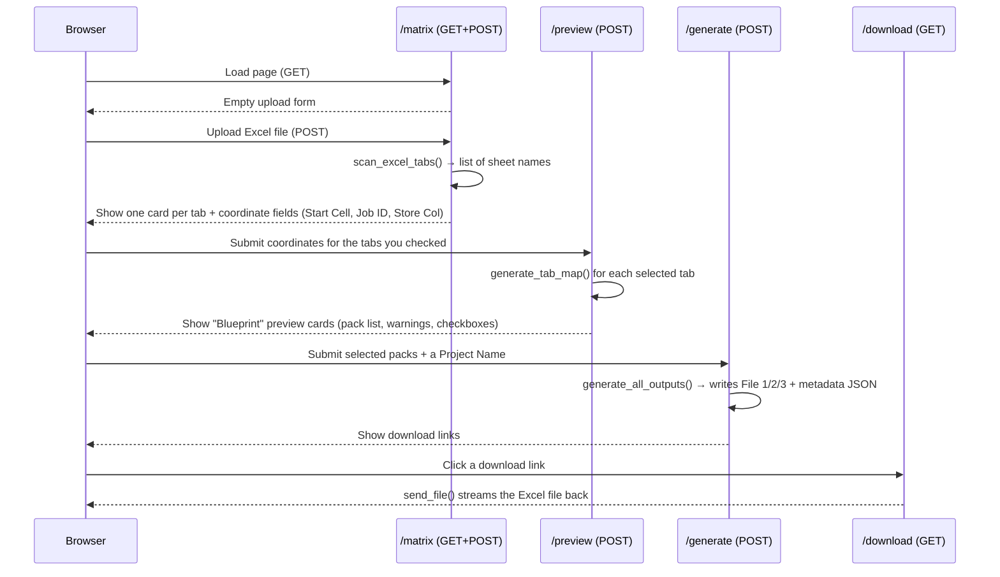

**`/matrix`.** On GET, does nothing but render the empty upload form. On POST:
```python
if 'file' not in request.files:
    return "No file part"
file = request.files['file']
if file.filename != '':
    filename = secure_filename(file.filename)
    filepath = os.path.join(app.config['UPLOAD_FOLDER'], filename)
    file.save(filepath)
    tabs = scan_excel_tabs(filepath)
return render_template('matrix.html', tabs=tabs, filename=filename)
```
`request.files['file']` is the uploaded file object (from the `<input type="file" name="file">` in `matrix.html`). `secure_filename()` strips out anything dangerous from the filename (e.g. `../../etc/passwd` style path tricks) before it's used to build a path on disk. The file is saved straight into `projects/` (not into a project sub-folder yet — that only happens at `/generate`, once we know the Job ID). `scan_excel_tabs()` (from `matrix_engine.py`) just opens the file and returns the list of sheet names, e.g. `["Store A", "Store B"]`. `render_template` hands the list of tab names to `matrix.html`, which then draws one card per tab (see [Section 11](#11-templateshtml--the-web-pages)).

**`/preview`.** The user has now typed a Start Cell / Job ID Cell / Store Column for every tab they checked. For **every** tab that exists (not just the checked ones — so unchecked tabs still remember their typed values if the user re-visits), this route:
1. Reads the 3 coordinate fields from the form, defaulting to `B8`, `E1`, `A` if blank.
2. Stores them in `user_inputs[tab]` (this dict gets round-tripped back into hidden form fields, so if the user clicks "Update Previews" again, their typed values survive).
3. **Only for checked tabs**, calls `generate_tab_map()` (see [Section 6.2](#62-generate_tab_map--reading-a-blueprint-from-a-tab)) inside a `try/except`. If the coordinates are wrong (e.g. "E1" isn't actually where the Job ID lives), `openpyxl` throws an exception, which gets caught and turned into a friendly `{"error": "..."}` dictionary instead of crashing the whole page.
4. All the successfully-mapped blueprints get serialized to JSON (`blueprints_json`) and stuffed into a **hidden form field** — this is important: Flask does not remember anything between requests by itself (no session used here), so the *entire* blueprint has to be smuggled through the HTML back to the browser and then submitted right back to the server at `/generate`.

**`/generate`.** This is where a **Project Folder actually gets created**:
```python
raw_project_name = request.form.get('project_name', 'Untitled_Project')
safe_project_name = clean_file_name(raw_project_name)
job_id = clean_file_name(blueprints[first_tab].get("raw_job_id", "UNKNOWN"))
time_stamp = datetime.now().strftime("%y%m%d_%H%M")
final_folder_name = f"{safe_project_name}_Job-{job_id}_{time_stamp}"
```
So a folder like `SummerCampaign_Job-12345_260804_1430` is born. Right before the originally-uploaded file is `shutil.move()`d from the loose `projects/` folder into this new sub-folder, `close_if_open_elsewhere(filepath)` ([Section 5](#5-core_mathpy--shared-math--formatting)) is called — if the user opened that exact file via the "Open Excel File" button in `matrix.html` to check it (or fix a duplicate store name) and never closed it, Excel's file lock would otherwise make `shutil.move()` crash with a `PermissionError`. This force-closes that copy first (discarding any unsaved edits in it — by this point the user has already saved what they meant to keep). Then `generate_all_outputs()` (the real engine, [Section 6.3](#63-generate_all_outputs--the-core-generator)) is called to build File 1/2/3. The three resulting filenames are filtered to drop any that are `None` (File 1 and File 3 are only created if at least one pack was selected for signature-code generation — see the `any_packs_selected` logic below) and shown to the user as download buttons.

**`/download/<folder_name>/<filename>`.** A very small, security-conscious route: `os.path.basename()` is applied to both URL parts so a mischievous URL like `/download/../../secrets/file.txt` can't escape the `projects/` folder. If the file exists, `send_file(..., as_attachment=True)` streams it to the browser as a download.

### 4.3 The Dashboard: `/`

This route has no form to process — it just **scans the filesystem** every time it's loaded and builds a list of "project" dictionaries to show on the homepage.

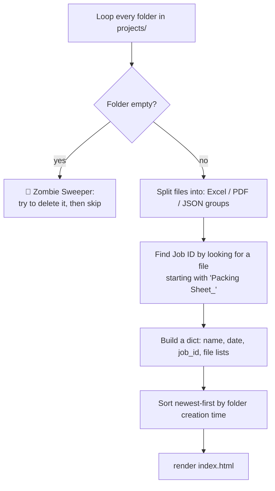

The "Zombie Sweeper" comment refers to folders that are empty because Windows/OneDrive sometimes holds a file lock a few seconds after Excel closes, so a delete attempt made moments earlier (e.g. in `/delete`) can silently fail, leaving an empty ghost folder. Every dashboard load gives it another chance to clean itself up via `shutil.rmdir`.

`json_files` are **sorted newest-first by creation time** (`os.path.getctime`) — this feeds the "Create Sub-Group" popup dropdown in `index.html`, so the most recent Stage is offered first as the baseline.

The dashboard also groups **CSV** files (the courier CSV from Packing Labels) into their own "🚚 Courier CSV" list, with the same Open / Download / Delete buttons. `.json` files are never listed, and `….labelmap.json` files are also kept **out** of `json_files`, so they never show up as a Sub-Group baseline. A project that contains a CSV shows a **🧵 Stitch Labels** button (a placeholder until stitching is built) instead of "Create Sub-Group".

### 4.4 Project & File Management: `/delete`, `/delete_file`, `/open_local`, `/open_upload`

- **`/delete/<folder_name>`** — deletes an entire project. Before calling `shutil.rmtree`, it manually walks every file with `os.walk` and calls `os.chmod(file_path, stat.S_IWRITE)` to strip any read-only flag first. This matters because files that were just closed by Excel/xlwings can briefly retain a read-only attribute that would otherwise make `rmtree` fail.
- **`/delete_file/<folder_name>/<filename>`** — same idea, but for a single file (used by the little 🗑️ Delete button next to each file row in the dashboard).
- **`/open_local/<folder_name>/<filename>`** — calls Windows' own `os.startfile(file_path)`, which is the exact same as double-clicking the file in File Explorer — it opens in whatever program Windows has associated with that extension (Excel, Adobe Reader, etc.). Returns an empty `204 No Content` response so the browser's JavaScript `fetch()` call (see [Section 12.2.D](#12-staticscriptjs--the-frontend-brain)) doesn't navigate away from the dashboard.
- **`/open_upload/<filename>`** — the exact same `os.startfile()` trick, but for a file that's still sitting loose in the `projects/` root rather than inside a project sub-folder yet. This exists because `matrix.html` lets the user open the raw distribution file (to inspect it, or fix a duplicate store name) at a point in the wizard — right after upload, before "Generate" — when no project folder has been created yet, so `/open_local`'s `folder_name` segment doesn't apply. Once "Generate" actually runs, the file moves into its project folder and `/open_local` takes over for anything after that point.
- **`/discard_upload` and `/discard_project`** — called by the browser, not by a link, when you **leave a page without generating** (see [Section 12.2](#122-section-by-section-walkthrough), section 0). `/discard_upload` deletes a scanned-but-unused `.xlsx`/`.xls` sitting loose in `projects/`. `/discard_project` deletes a Label Shuffler project folder, but **only if it holds nothing but spreadsheets** (`is_abandoned_project()`): every real project has a generated `.pdf` or `.json`, so picking an existing project and then leaving never deletes it. Both use `os.path.basename()` and reject `.`/`..`, so they can't reach outside `projects/`.
- **`force_delete_upload(file_path)`** — the deletion helper behind both: it calls `close_if_open_elsewhere()` ([Section 5](#5-core_mathpy--shared-math--formatting)) to close the file in Excel **without saving**, retries the delete up to 10 times 0.3 s apart while Windows releases its lock, then removes Excel's `~$` lock file.

| Tool | Left behind before Generate | Discarded on leave |
|---|---|---|
| Packing Labels | the scanned Excel file in `projects/` | the file |
| Distribution Mapper (Packing Sheet) | the scanned Excel file in `projects/` | the file |
| Label Shuffler | a project folder holding the Signature links file (created at step 1) | the whole folder, only if it holds nothing but spreadsheets |

Submitting the page's own forms (Preview, Generate, Recheck) and "Open Excel File" don't count as leaving; pressing Back keeps the file. The startup sweep in [4.1](#41-startup) catches anything the browser couldn't report (a crash, a power cut).

### 4.5 The Sub-Group route: `/subgroup/<project_name>`

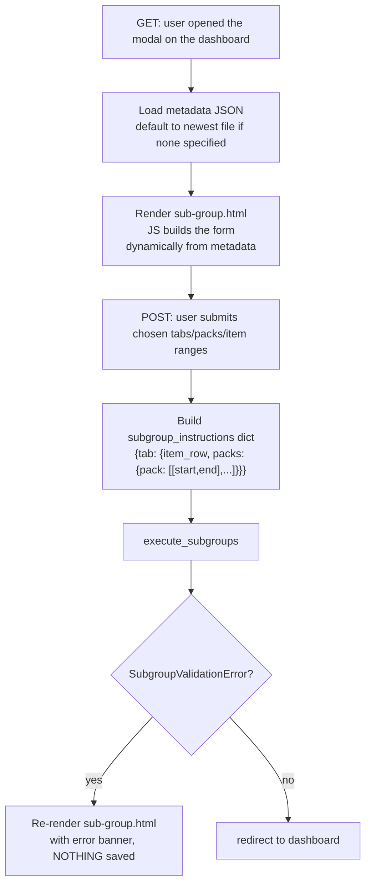

The `target_json` query parameter (set by the dropdown in the dashboard's "Create Sub-Group" modal — see `index.html`) tells this route **which metadata file to treat as the baseline** — e.g. the original `project_metadata.json`, or an existing `Stage - 1 - ...json` if you're layering a second round of sub-grouping on top of the first. If none is specified, it just grabs the first `.json` file it finds in the folder.

On POST, the form data is parsed into a nested dictionary shaped exactly like what `subgroup_engine.execute_subgroups()` expects:
```python
subgroup_instructions = {
    "Store A": {
        "item_row": 9,
        "packs": {
            "Banner Pack": [[1, 5], [6, 10]]   # two sub-groups: items 1-5, and 6-10
        }
    }
}
```
This is exactly the *very same shape* used inside `subgroup_engine.py` — worth remembering if you ever need to trace a bug between the two files.

```python
try:
    execute_subgroups(project_dir, metadata, subgroup_instructions)
except SubgroupValidationError as e:
    return render_template('sub-group.html', ..., error=str(e))
return redirect(url_for('dashboard'))
```
This `try/except` is the fix we added recently: if the item numbers the user typed don't actually exist in the sheet (a typo, or duplicate item numbers), `execute_subgroups` raises `SubgroupValidationError` **before saving anything**, and the route shows the error message right there on the page instead of silently redirecting to the dashboard as if it had worked. See [Section 7](#7-subgroup_enginepy--the-sub-group-engine) for the full mechanics.

### 4.6 The PDF Label Shuffler route: `/pdf`

This is the biggest single route in the file because it handles **three different steps of one wizard inside one function**, distinguished by a hidden `step` form field.

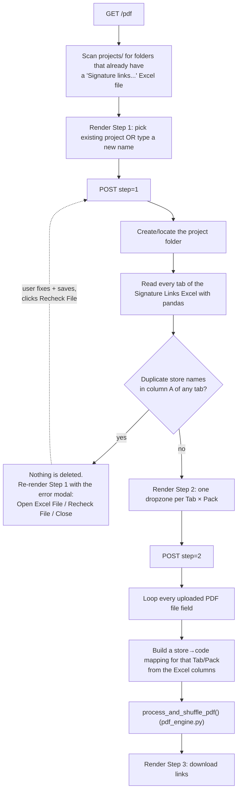

**Step 1.** Two ways to pick a project: the `existing_project` dropdown, or typing a `new_project` name (a timestamp gets appended to new names to keep them unique). Whichever Excel file is in play — either freshly uploaded, or an existing `"Signature Links..."` file already sitting in that project's folder (found by `.startswith("signature links")`, case-insensitive) — gets opened with `pd.ExcelFile`. For **every sheet**, `df.columns[1:]` (everything except the first column, which holds store names) becomes the list of "Packs" shown in Step 2.

The duplicate-store check here matters a lot for the PDF engine: `process_and_shuffle_pdf` matches a label to a store purely by **searching for the store's name inside the label's text** — if two stores in the same tab share a name, the shuffler can't reliably tell them apart, so this route refuses to continue.

**Nothing gets deleted on a duplicate.** Earlier versions of this route `shutil.rmtree`'d the project folder the moment a duplicate was found — which, for an *existing* project, meant a bad re-upload could wipe out everything already generated for that job. Now the folder and the uploaded Excel are left exactly where they are, and the duplicate modal (`⚠️ Duplicate Store Names Found` — see [Section 11.3](#113-pdfhtml)) gives the user two extra buttons instead of just a dead end:
- **"Open Excel File"** — an `<a>` styled with `class="btn-file open"` pointing at `/open_local/<project>/<filename>`, intercepted by the same generic fetch-based opener described in [Section 12.2.D](#12-staticscriptjs--the-frontend-brain) — no page navigation, the file just pops open in Excel.
- **"Recheck File"** — a tiny second `<form>` inside the modal that resubmits `step=1` with the *same* `existing_project` and a `resume_filename` hidden field carrying the exact filename that was flagged. On the server side, Scenario B of Step 1 checks `resume_filename` first (an exact match against a file already in that project folder) before falling back to its usual `"signature links"`-prefix search — so recheck works even for a brand-new project whose file was never named that way. If the duplicates are gone, Step 1 falls straight through to Step 2 with zero extra clicks; if not, the same modal reappears.

This only catches *exact* duplicate names, though. Two *different but similar* names (e.g. `"Northlands"` and `"Northlands NZ"`) pass this check fine, but can still confuse the substring matcher at PDF-processing time — see the collision detection described in [Section 8.4](#84-build_audit_report-and-build_divider_sheet), and the separate same-store-matched-twice detection in [Section 8.2](#82-process_standard_layout).

**Step 2.** The form field names carry structured information inside their *name attribute itself*, using `---` as a separator (chosen specifically because pack/tab names might contain underscores):
```html
<input type="file" name="pdf---{{ tab }}---{{ pack }}">
<input type="checkbox" name="divider---{{ tab }}---{{ pack }}">
```
So the Python side loops `request.files.items()`, and for every key that starts with `pdf---`, splits it back apart:
```python
parts = key.split('---')            # ["pdf", "Store A", "Banner Pack"]
tab_name, pack_name = parts[1], parts[2]
```
For that Tab/Pack, it rebuilds a `store_mapping` dict (`{"Store 12": "A", "Store 47": "B", ...}`) straight from the Excel columns using `df.iterrows()`, then calls `process_and_shuffle_pdf()` — the actual PDF engine ([Section 8](#8-pdf_enginepy--the-label-shuffler)) — once per uploaded PDF. Every processed file is renamed with a `_Shuffled` suffix and saved directly into the project folder.

**Step 3** is just a static "success" screen listing the generated filenames as download links.

**GET (no step)** is what runs when you first land on `/pdf` (or click "Reset") — it rebuilds the `existing_projects` dropdown by scanning `projects/` for folders that already contain a Signature Links file.

### 4.7 The Packing Labels route: `/packing-labels`

One route, like `/pdf`, handling several steps of a wizard inside one function — here distinguished by which **submit button** was pressed (`'preview' in request.form` / `'generate' in request.form`) rather than a hidden `step` field.

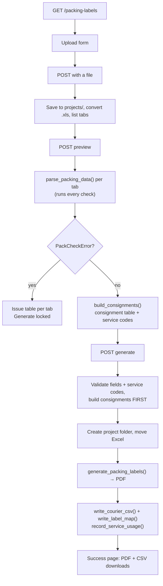

- **Preview** parses each selected tab. A `PackCheckError` becomes that tab's issue table ([Section 9.5](#95-checks-errors-and-warnings)); any other exception becomes a one-line issue. Only when every tab is clean are the tabs combined (keys prefixed with the tab name) and passed to `build_consignments()` for the consignment table ([Section 10.6](#106-the-consignment-table-service-codes-and-edits)).
- **Generate** follows "validate first, write last": required fields, edits and service codes are all checked **before** a project folder is created. If anything fails after that, the Excel file is moved back and the folder removed ([Section 10.8](#108-order-of-work-in-generate)).
- If a reload arrives after the upload was already discarded, the route answers "The uploaded file is no longer available. Scan it again." instead of crashing.
- `_consignment_edits(form)` safely decodes the hidden `consignment_edits` JSON; anything that isn't a dictionary is ignored.

---

## 5. `core_math.py` — Shared Math & Formatting

This file has **no Flask, no Excel-opening code, no file I/O for the workbooks themselves** — it's pure logic, which is exactly why both `matrix_engine.py` and `subgroup_engine.py` import from it instead of duplicating this code.

### `clean_file_name(raw_string)`
Turns messy free-text (a Job ID cell value, a user-typed project name) into something safe to use as a filename or folder name: collapses repeated whitespace, then strips out every character except letters, digits, spaces, underscores and hyphens.
```python
clean_file_name("Job #12345 / Campaign!!") → "Job 12345  Campaign"
```

### `sanitize_cell(val)`
Reads one raw Excel cell value and decides what it "really" means for signature-matching purposes:
- `None` → `0`
- already a number → returned as-is
- text like `"-"`, `"."`, `"0"`, `""` → treated as `0` (these are common "nothing ordered" placeholders in warehouse spreadsheets)
- text that *looks* like a number (`"12.0"`) → converted to `int`/`float`
- anything else (e.g. `"J468791-01"`) → kept as the raw text string

This function is the reason the README says *"Dashes (-) and periods (.) are safely ignored as zero."*

### `sort_key(sig)`
A **signature** is a tuple of cell values across one store's row, e.g. `(5, 0, "Banners")`. To sort a list of these consistently (numbers before text, zeros last) without Python crashing on "can't compare `int` to `str`," every value is converted into a 3-part tuple:
```python
0        → (3, 0, "")            # zeros always sort last
5        → (1, 5, "")            # numbers sort by their value
"Banner" → (2, 0, "banner")      # text sorts alphabetically, after numbers
```
`unique_sigs.sort(key=sort_key)` then works because Python can always compare tuples of the same shape.

### `generate_pack_signatures(raw_values, store_rows, p_start, p_end)` — the heart of the whole app
This is what turns raw quantities into letter codes. Given a 2D grid of cell values (`raw_values`, straight from Excel), a range of rows (`store_rows`), and a column range (`p_start` to `p_end`):

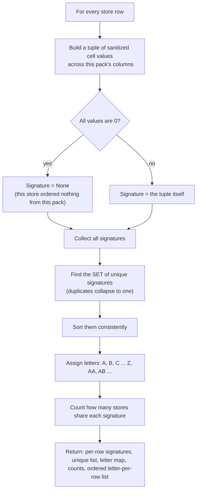

The letter-assignment line is worth reading closely:
```python
letter = chr(65 + index) if index < 26 else chr(65 + (index // 26) - 1) + chr(65 + (index % 26))
```
`chr(65)` is `'A'`. For the first 26 unique signatures (`index` 0–25) it's a single letter `A`...`Z`. Past that, it builds a two-letter code the same way spreadsheet columns go `Z, AA, AB, ...` — `index=26` gives `AA`, `index=27` gives `AB`, and so on.

The function returns **five things at once** (Python lets a function return a tuple and the caller unpacks it):
1. `row_signatures` — `[(row_number, signature_or_None), ...]` for every store
2. `unique_sigs` — the sorted list of distinct signatures found
3. `sig_to_letter` — `{signature: "A", ...}`
4. `summary_counts` — `{signature: how_many_stores_have_it, ...}`
5. `ordered_codes` — just the letters, in store order (`""` where a store ordered nothing) — this list is exactly what later gets exported into "File 3" for the PDF engine to consume.

### `format_file1(...)` / `format_file2(...)`
Pure Excel-styling helpers using `xlwings` range objects. They don't calculate anything — they set colors, borders, fonts, and alignment on cells that have *already* been written. `format_file1` styles the single newly-inserted signature column inside the working copy; `format_file2` styles the whole summary block (quantities + count + letter) with alternating row-band colors (`r_offset % 2 == 1` → light blue) in the Packing Sheet. `-4108` is not a typo — it's the literal integer value of Excel's `xlCenter` constant, used because `xlwings` calls straight into Excel's underlying COM API, which doesn't know Python's friendlier constant names.

### `build_initial_metadata(...)`
Builds the **very first** metadata block for one tab, right after the Matrix Engine runs. Its trickiest part is tracking column shift as it scans packs left-to-right:
```python
current_shift = 0
for pack in tab_info["pack_ranges"]:
    if any_packs_selected and is_selected:
        final_start = pack["start"] + current_shift + 1   # +1 for the new code column about to be inserted
        current_shift += 1
    else:
        final_start = pack["start"] + current_shift        # unaffected packs still drift right if an earlier pack got a column inserted
```
Every time a pack to the *left* gets a new signature column inserted, every pack to its *right* shifts one column further right in the real spreadsheet — this loop keeps the metadata's column numbers in sync with that shift so future code (like the Sub-Group Engine) can trust the numbers.

### `update_metadata_for_subgroup(...)`
The same shifting idea, but triggered by the *Sub-Group Engine* inserting a column. It walks every existing pack (and every sub-group already nested inside a pack) and nudges anything that sits at-or-after the insertion point one column to the right, then registers the brand-new sub-group's own coordinates under its parent pack's `"sub_groups"` dictionary. This is what makes sub-grouping **infinitely repeatable** — the metadata always reflects the spreadsheet's true current shape.

### `get_next_stage_filenames(...)` / `get_available_project_files(...)`
Small filesystem helpers. The first parses a filename like `"Stage - 2 - Final Book1.xlsx"` with a regex to produce `"Stage - 3 - Final Book1.xlsx"` — note that `subgroup_engine.py` actually contains its own (near-identical) inline version of this numbering logic and doesn't end up calling this particular function; it's kept here as a small reusable utility. The second just lists `.json` files in a project folder, sorted alphabetically (which conveniently also sorts them "Stage 1, Stage 2, Stage 3..." since that's how the filenames are constructed).

### `close_if_open_elsewhere(file_path)`
Shared by both `matrix_engine.py`'s `/generate` (via `app.py`) and `subgroup_engine.py` — anywhere the app is about to grab exclusive `xlwings` control of a file, or move/rename it, that could collide with the user having the exact same file open for a look (e.g. via one of the "Open Excel File" buttons added to `matrix.html`/`pdf.html`).
```python
target = os.path.normcase(os.path.normpath(file_path))
for running_app in list(xw.apps):
    for book in list(running_app.books):
        if os.path.normcase(os.path.normpath(book.fullname)) == target:
            book.api.Close(SaveChanges=False)
```
It loops through every **currently running** Excel application instance (`xw.apps` — there can be more than one if the user has separate Excel windows open) and every workbook open in each one, comparing normalized full paths. If it finds the exact file already open somewhere, it force-closes *that specific copy* — discarding any unsaved edits in it — before the app's own automation proceeds. This is deliberately blunt: by the point this runs, the user has either already saved what they meant to keep, or is about to have the app write fresh content over the same file anyway, so a silently-discarded stray edit is a smaller risk than the alternative (Excel's file lock making the whole operation crash with a `PermissionError`, or silently handing the app a stale read-only view). If no Excel instance has the file open at all, the loops simply find nothing and the function is a no-op.

---

## 6. `matrix_engine.py` — The Matrix Engine

### 6.1 `scan_excel_tabs(file_path)`
Three lines. Opens the file with pandas just long enough to read `.sheet_names`, then closes it immediately. This is deliberately the *cheapest possible* way to answer "what tabs does this file have?" — no cell data is read at all.

### 6.2 `generate_tab_map(...)` — reading a "Blueprint" from a tab

This function is what the `/preview` route calls. Given a tab and the 3 coordinates the user typed (Start Cell, Job ID Cell, Store Column), it has to **reverse-engineer the entire layout** of a spreadsheet it's never seen before, using only those 3 anchor points.

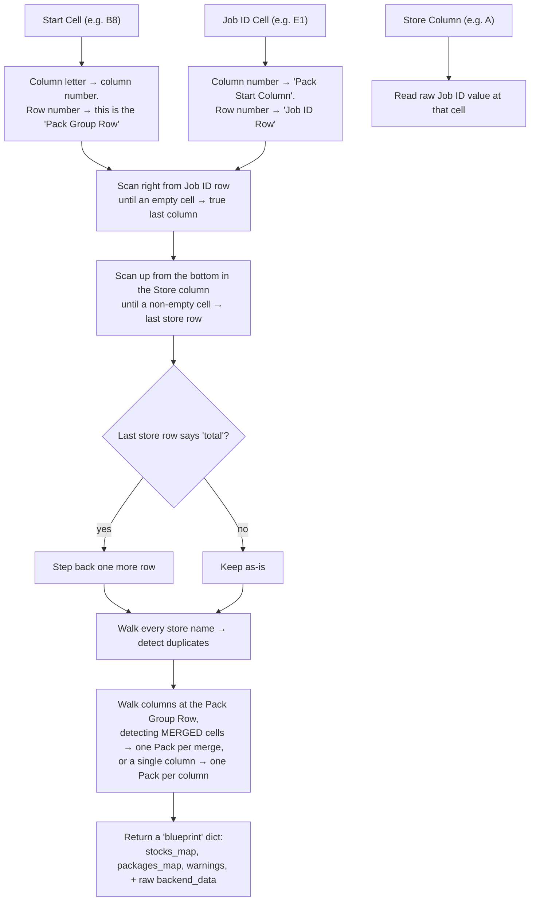

A few specific tricks worth calling out:
- **Finding the true last column** doesn't trust `sheet.max_column` (Excel/openpyxl can report phantom extra columns from old formatting) — it walks backward from the reported max column until it finds one with an actual value in the Job ID row.
- **Detecting "Total" rows:** if the very last non-blank cell in the Store column contains the word "total" (case-insensitive), that row is excluded from the store count — it's a summary row, not a real store.
- **Detecting packs** checks `sheet.merged_cells.ranges` first. If the current column falls inside a merged range at the pack-group row, that whole merged block becomes one pack (its name comes from the merge's top-left cell) and the scan jumps past it. If it's *not* merged, it falls back to treating a single non-empty header cell as a one-column pack.
- **Duplicate store detection** here is purely informational (shown as a yellow warning banner in `matrix.html`) — unlike the harder duplicate check in the `/pdf` route (Step 1), it does **not** block generation. It's a heads-up, not a hard stop.

### 6.3 `generate_all_outputs(...)` — the core generator

This is the single most important function in the Matrix Engine — the one that actually writes files to disk. It happens in three phases.

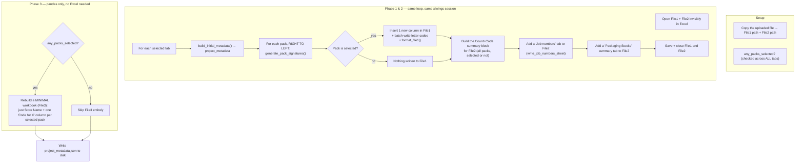

**Why right-to-left?** (`for pack in reversed(tab_info["pack_ranges"])`) Inserting a new column shifts every column *after* it one position to the right. If you inserted left-to-right, every subsequent pack's remembered column numbers would instantly go stale. Processing packs from the rightmost one backward means each insertion only ever affects columns you've *already finished with* — nothing still-to-be-processed ever moves.

**File 1's store names get cleaned too, not just File 3's.** Right after `sheet1_xw` is opened for a tab (before any pack-column insertions happen), the store-name column is read as a batch, run through `clean_store_name()` (`core_math.py` — strips a trailing period, collapses double-spaces), and written straight back:
```python
raw_store_values = store_range.value
store_range.value = [[clean_store_name(v)] for v in raw_store_values]
```
Historically only Phase 3 (File 3) applied this cleaning, since it rebuilds its "Store Name" column from scratch anyway — File 1 just carried over whatever raw text was in the original spreadsheet untouched. That meant the same store could read differently between the two output files (e.g. a trailing "." surviving in File 1 but not File 3). Cleaning happens over the identical row range/column File 3 later uses, so both stay in sync. This write happens safely *before* any pack columns are inserted for that tab, since insertions only ever happen to columns at-or-right-of a pack's start — never left of the store column — so `store_col_idx` is still valid at this point.

**Why `any_packs_selected` matters so much:** if the user didn't check *any* pack checkboxes in the preview screen, there's nothing to calculate signatures for — File 1 (the working copy with new signature columns) and File 3 (the signature lookup table) become pointless, so both are skipped (`file1_name = None`, `file3_path = None`). Only File 2, the plain Packing Sheet, still gets produced in that case — that's a legitimate use case (someone who just wants a cleaned-up copy of their distribution list).

**The "batch write" pattern**, seen here and repeated in `subgroup_engine.py`, is a deliberate performance choice:
```python
batch_data = []
for r, sig in row_signatures:
    batch_data.append([sig_to_letter[sig]] if sig is not None else [None])
sheet1_xw.range(f"{col_letter_start}{start_r}").value = batch_data
```
Writing to Excel cell-by-cell through `xlwings` is slow (each write is a round-trip to the real Excel application). Building the whole column as a Python list first, then writing it in **one** `.value = batch_data` assignment, can turn thousands of slow round-trips into a single fast one.

**The "Job numbers" tab.** While each tab's `raw_values` is read (before File 2's rows/columns are touched), every pack's columns are scanned along the **Job ID row**, and the job numbers found are kept in first-seen order with repeats inside that same pack dropped. Each pack becomes one entry in `master_job_data` (`{"header": "Tab | Pack X", "jobs": [...]}`). After all tabs are done, `write_job_numbers_sheet()` writes one block per pack (bold header, then the job numbers centered underneath), with a thin black divider row between blocks, the same idea as Packaging Stocks. Inside each block, job numbers are grouped by **series**: a job number is `series-index` (e.g. `J476523-01` → series `J476523`, index `01`), split on the first `-` by `split_job_number()`. A job number with no `-` is series-only. `group_jobs_by_series()` keeps the series in the order they first appear and sorts each series' jobs by index: series-only first, then numeric indexes in number order. Each series gets a grey, italic `Series J476523` sub-heading. The full job number stays in its own cell on each row so that cell can carry a link later. It also builds `job_to_groups` (`{job_number: [every pack header it appears in]}`). Any job number that appears in **more than one** pack group, whether in the same tab or a different one, is filled light red, and column B next to it lists the other group(s): `⚠ Shared with: Other Tab | Pack 2`. The same check, `find_shared_job_numbers()`, is also returned as the 4th value of `generate_all_outputs()` so `/generate` can list those job numbers in a warning on the results page. Generation still goes ahead.

**Installer tabs and the "Divider Barcodes" tab (File 3).** A tab ticked as "sent to an installer" (`user_inputs[tab]["installer"]`, set in `/generate`, which also selects every pack in that tab) gets one row per job number per code in an extra `Divider Barcodes` tab of the Signature Links file: `Tab | Pack | Code | Job Number | Kind | Qty | Barcode`. `tab_column_jobs` records which job number sits in each pack column. `assign_job_kinds()` numbers the kinds: a job number found in more than one column (same pack, another pack or another tab) gets Kind 1, 2, 3... in reading order, first tab to last and left to right within each tab. A job number in only one column has no kind. Kinds are counted across every selected tab, installer or not. `build_divider_barcode_rows()` then walks each code's signature: every column with a quantity and a job number becomes a row, and `Qty` is that store's quantity. `Barcode` is the exact text the divider's barcode encodes: the job number, plus ` Kind N` when it has more than one kind (e.g. `J476699-17 Kind 1`), so a scan tells kinds apart. The tab is only written when at least one tab is an installer tab, so File 3 is otherwise unchanged.

**File 2's "delete rows below the data" step** (`sheet2.range(f"{start_del}:1048576").api.EntireRow.Delete()`) clears out anything left below the actual store list (old totals, stray notes) before the new Count/Code summary columns get written — otherwise leftover junk rows could visually collide with the new summary block.

**Phase 3's "reversed" pack summaries** — `for p_sum in reversed(tab_summaries.get(tab_name, []))` — exists purely so the resulting Signature Links columns appear in the same left-to-right pack order as the original sheet (since the summaries list itself was built during the reversed right-to-left insertion loop in Phase 1/2, reversing it a second time un-does that and restores original order).

Finally, `project_metadata` — built up tab-by-tab across this whole function — gets written once at the very end as `<File1 name>.json` inside the project folder. This is the file that `subgroup_engine.py` will later read back in.

---

## 7. `subgroup_engine.py` — The Sub-Group Engine

**Purpose:** take an *existing* Packing Sheet + working file (already produced by the Matrix Engine, or by a previous sub-group run) and slice one pack into smaller **item-number ranges**, e.g. turn "Banner Pack (items 1–20)" into "items 1–5" and "items 6–20" as two separately-coded sub-groups — without destroying the original file (it always writes a **new** `Stage - N -` file).

### 7.1 The validation guard (this is the bug fix from earlier in this project)

Before this existed, the code silently trusted whatever "Item Number Row" and Start/End item numbers the user typed. If a typo meant an item number didn't exist in that row, the old code just printed a `[WARNING]` to the terminal and quietly skipped that sub-group — the tool would report success even though part of the work never happened. Two small pieces fix that:

```python
class SubgroupValidationError(Exception):
    """Raised when the user-provided item row/numbers can't be safely resolved against the sheet."""
```
A **custom exception type**. This matters because `app.py` needs to tell the difference between *"the user's input was bad, show a friendly message"* and *"something genuinely broke, let it crash with a real error."* Catching a specific class (`except SubgroupValidationError`) instead of a generic `Exception` means only the deliberate validation failures get the friendly treatment.

```python
def _map_item_columns(row_data, tab_name, item_row):
    col_map = {}
    duplicates = {}
    for c_idx, val in enumerate(row_data):
        ...
        if item_num in col_map:
            duplicates.setdefault(item_num, [col_map[item_num]]).append(col)
        else:
            col_map[item_num] = col
    if not col_map:
        raise SubgroupValidationError(f"...no item numbers were found in row {item_row}...")
    if duplicates:
        raise SubgroupValidationError(f"...duplicate item numbers found...")
    return col_map
```
This function replaces the old plain dictionary-building loop. Two things now stop the whole process cold, with a message that reaches the browser:
1. **The row has zero item numbers at all** — almost certainly means the user pointed at the wrong row entirely.
2. **The same item number appears twice** in that row — item numbers are supposed to be unique per column, so a duplicate is a strong signal of a typo somewhere in the sheet. `duplicates.setdefault(item_num, [first_col]).append(second_col)` is a compact way to build `{105: [col_3, col_7]}` the first time a repeat is spotted.

### 7.2 The three stages

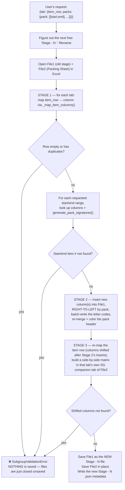

**Why re-map the item row a second time in Stage 3?** Stage 2 just inserted brand-new columns into File1 (the sub-group's code columns). Every item number that used to sit at, say, column 10 might now be at column 12 if two new columns were inserted to its left. The Stage-1 `item_col_map` is now stale, so Stage 3 re-reads the item row fresh off the *already-modified* worksheet before it can correctly locate where each sub-group's data actually lives for building the File 2 matrix.

**Why nothing gets corrupted when validation fails:** look at the very end of the function —
```python
try:
    ...all three stages...
    wb1.save(new_file1_path)   # ← the ONLY place File1 is saved
    wb2.save()                  # ← the ONLY place File2 is saved
except Exception as e:
    ...
    raise e
finally:
    app.quit()   # closes Excel WITHOUT saving whatever's still open
```
Both `.save()` calls sit at the very bottom of the `try` block, *after* every stage of every tab has finished successfully. If a `SubgroupValidationError` (or anything else) is raised partway through — even mid-way through tab 3 of 5 — execution jumps straight to `except`, which re-raises, and `finally` quits the invisible Excel instance **without ever calling `.save()`**. Whatever partial edits existed only in that temporary Excel session simply vanish; the real files on disk are untouched. This is exactly what makes it safe for `app.py` to say "abort the whole thing" on any validation error.

---

## 8. `pdf_engine.py` — The Label Shuffler

**Purpose:** take a raw PDF full of shipping labels (one per store, in whatever random order they were printed) and rebuild it so labels are grouped by their **signature code**, in the same letter-order the Packing Sheet uses — so a warehouse worker holding the printed stack for "Code C" can hand out labels in the exact sequence the packing sheet lists them.

### 8.1 Layout detection — the entry point

```python
first_page = doc[0]
is_split_layout = page_width < page_height  # taller than wide?
```
The whole engine branches on one measurement: is the PDF page **portrait** (taller than wide)? If yes, it assumes this is a "2 labels stacked on one sheet, meant to be cut in half" layout (`process_split_layout`). If the page is wider than tall, it assumes **one full label per page** (`process_standard_layout`).

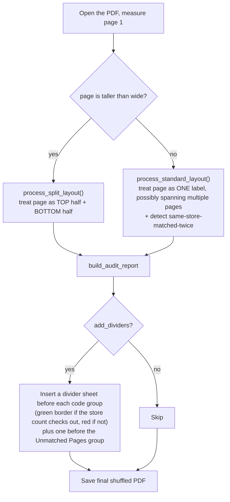

### 8.2 `process_standard_layout(...)`
For each page, it reads the text inside a specific rectangle (`fitz.Rect(0, 0, 317.5, page_height)` — roughly the left portion of the page, where a store name typically sits) and checks whether **any** known store name appears inside that text (case-insensitive substring search). If a page has *no* text at all, it's filed as "blank." If it has text but no store name matched, it's "unmatched."

The trickiest bit handles **multi-page labels** — a single shipping label that spans, say, "Page 2 / 3":
```python
page_info = re.search(r"page\s+(\d+)\s*/\s*(\d+)", text)
if page_info:
    expected_extra_pages = int(page_info.group(2)) - int(page_info.group(1))
elif expected_extra_pages > 0 and current_store:
    expected_extra_pages -= 1   # this page belongs to the store from the previous page
```
When a matched page also contains text like `"Page 1/3"`, the code knows 2 more pages are coming that *won't* have the store name printed on them again, but should still count as belonging to that same store — so it keeps assigning the current store to pages until that countdown reaches zero.

**Same store matched twice = a real problem, and this is where it's caught.** Every store should have exactly one label instance. A store's label can legitimately span several physical pages (the "Page 1/3, 2/3, 3/3" case above), and its header may even repeat on each of those pages — that's still *one* instance. But a match on the same store **outside** that continuation window is a second, separate instance, and a sign something's wrong (a genuine duplicate print, or a label that actually belongs to a similarly-named store getting mis-attributed):
```python
is_continuation = (match == current_store and expected_extra_pages > 0)
...
if not is_continuation:
    store_instance_count[match] += 1
```
Pages aren't committed to a code bucket as they're read — they're staged first into `store_pages[store]`, and only sorted into `code_buckets` (kept) vs. `unmatched_pages` (discarded) in a second pass, once the full instance count for every store is known:
```python
for store, page_nums in store_pages.items():
    if store_instance_count[store] > 1:
        for p_num in page_nums:
            unmatched_pages.append(doc[p_num])   # ALL of that store's pages, not just the extras
    else:
        confirmed_stores.add(store)
        code_buckets.setdefault(store_mapping[store], []).extend(page_nums)
        code_final_store_counts[store_mapping[store]] += 1
```
If a store shows up as 2+ separate instances, **every** page ever attributed to it is pulled into the normal `unmatched_pages` pile — the exact same pile (and divider) used for pages that never matched anything at all, deliberately, so there's no separate "needs review" concept to learn. Since none of that store's pages can be trusted to be the single "true" copy, `confirmed_stores` (not the raw `found_stores` set) is what feeds the missing-stores list and the collision check below — so a duplicated-and-removed store correctly shows up as missing too, exactly as if it had never been found at all, instead of quietly still counting as "matched" while all its actual pages sit in Unmatched.

Pages are bucketed by their signature code, sorted `by (length of code, code)` — this ordering, `sorted(code_buckets.keys(), key=lambda x: (len(x), x))`, is what makes single letters come before double letters (`A, B, ... Z, AA, AB...`) instead of plain alphabetical sort putting `AA` before `B`. Finally everything is stitched together in this fixed order: **audit report → matched pages (grouped by code, dividers optional) → unmatched pages (with their own divider, if enabled) → blank pages.**

`code_buckets` still holds raw **page numbers**, not stores — a store's legitimate multi-page label contributes several entries to the same bucket. `code_final_store_counts` (a separate `Counter`, built alongside `code_buckets` in the loop above) is the accurate "how many *distinct*, non-duplicated stores actually matched here" figure fed to `build_divider_sheet` — deliberately **not** `analyze_matches`'s own `matched_count`, which is blind to the duplicate-removal step and would still count a since-removed store as matched.

**This entire same-store-twice check is deliberately standard-layout-only.** `process_split_layout` does *not* have any of this logic — a repeat match there is left completely alone, matched normally, same as before this feature existed.

### 8.3 `process_split_layout(...)`
Same idea, but every physical page is treated as **two independent halves** (top/bottom), each matched against store names independently, since two different stores' labels might be stacked on one printed sheet. The stitching step at the end is the more complex part: it builds a `master_stack` of "halves" (some real, some from the audit report, some blank divider pages) and then re-pairs them two-at-a-time into brand new output pages:
```python
halfway_point = math.ceil(total_halves / 2)
top_stack = master_stack[:halfway_point]
bottom_stack = master_stack[halfway_point:]
```
i.e. the first half of the master list becomes everyone's *top* half, the second half of the list becomes everyone's *bottom* half — so pairing `top_stack[i]` with `bottom_stack[i]` for each new page reconstitutes full sheets, but now filled with re-ordered content instead of the original random order. `new_page.show_pdf_page(top_rect, doc, ..., clip=src_clip)` is the actual "paste this rectangle of content from the source PDF onto this rectangle of the new page" operation — the workhorse of the whole rebuilding process.

### 8.4 `build_audit_report(...)` and `build_divider_sheet(...)`
A handful of small "report generator" functions that draw brand-new PDF pages from scratch using `fitz`'s drawing primitives (`draw_rect`, `insert_text`, `insert_textbox`, `draw_line`, `draw_circle`) — no source PDF involved. `build_audit_report` is always inserted as the very first page(s) of the output, and turns red if any stores were missing/unmatched/blank, or green if everything matched perfectly — a floor worker can glance at just page 1 to know if the batch is trustworthy. Its sections, in order, are: header/metadata → Unmatched & Blank counts → **Missing Stores** (always last, described below).

**`group_missing_stores_by_code(store_mapping, found_stores)`** builds the Missing Stores data: every store not in `found_stores` (or, from `process_standard_layout`, not in `confirmed_stores` — see [8.2](#82-process_standard_layout)), bucketed by signature code and ordered with the same `(len(code), code)` key used everywhere else, with stores **within** a code group kept in their original spreadsheet row order (since `store_mapping` is a plain dict and dict iteration order in Python 3.7+ is insertion order, which is the order `app.py`'s `/pdf` Step 2 built it in via `df.iterrows()`).

**Missing Stores is rendered as auto-width columns, not a single vertical list.** With enough missing stores this used to spread confusingly across the "cut & stack" split-layout pagination, interleaved with unrelated divider content. Now it flows like a newspaper: each code group gets its own sub-header (`"CODE A - 19 missing"`) followed by its store names; when a column runs out of vertical room, a new column starts immediately to its right on the *same* page (only spilling to a genuinely new page once no more columns fit the page's width); each column's width is sized independently from only the text actually inside it (measured with `fitz.get_text_length`); and if a code group gets cut off mid-list by a column or page break, its header repeats at the top of the next column as `"CODE A (continued)"` so it's never ambiguous whether a name belongs to the group above or is a fresh one. A small guard (`page_top_y != 40 and ... > bottom_limit`) specifically prevents a pathological case where a page is so full already that a column would fit a header but not even one store name under it — rather than drawing an endless chain of empty "(continued)" headers, it jumps straight to a fresh page.

**Catching the "two similarly-named stores collapse into one" bug.** Because matching is plain substring search, a store like `"Northlands"` can silently swallow labels that actually belong to `"Northlands NZ"` if the printed text doesn't include the distinguishing suffix — both labels get matched to `"Northlands"`, and `"Northlands NZ"` shows up as a false "missing store." Two helper functions guard against this:
- `find_name_collisions(store_names)` — scans every pair of store names in the signature-links mapping and flags any pair where one name is fully contained inside another (case-insensitive), e.g. `"Northlands"` inside `"Northlands NZ"`.
- `analyze_matches(store_mapping, sorted_stores, found_stores)` — for each such colliding pair, checks whether *one* was matched while the *other* was not (both-found or both-missing isn't suspicious). When that happens it just marks both codes' `collision_note` flag `True` — **no store names or explanation reach the audit report at all anymore.** The reasoning: the missing store already shows up on the Missing Stores list, and any mis-attributed labels already show up in Unmatched, so a named callout would just repeat information that's already there in more detail, and risked confusing warehouse floor staff who might see the printed page (name-redundancy checking is the tool operator's job). The only visible effect of a collision now is that affected code's divider sheet flipping to a red border with a generic disclaimer. This same function also computes, per code, how many *distinct stores* actually matched versus how many the signature links say should be there.

`build_divider_sheet(page_width, page_height, signature_code, matched_count, expected_count, collision_note)` draws the separator sheet inserted before each code group when `add_dividers=True` is checked in the UI. `matched_count`/`expected_count` are **store** counts (for `process_standard_layout`, the accurate post-dedup `code_final_store_counts`, not `analyze_matches`'s own figure — see [8.2](#82-process_standard_layout)); `collision_note` is just a bool now, not text:
- **Green border** — `matched_count == expected_count` and `collision_note` is falsy. One line, no fraction: `"Matched Labels: {matched_count}"`.
- **Red border** — counts don't match (adds `"matched/expected"` to the same line, plus a "Short by N store(s)" / "N extra store(s)" disclaimer), **or** `collision_note` is `True` (generic "Possible mismatch - please verify" disclaimer, no names) — even if the count happens to check out, because the "extra" label absorbed into this bucket might be hiding behind an otherwise-correct-looking number. No missing-store names or collision reasoning are ever drawn on a divider — that detail lives only on the audit report (or, for the same-store-twice case in standard layout, isn't shown as text anywhere at all — see [8.2](#82-process_standard_layout)).

**Installer barcodes.** When `/pdf` Step 2 finds a `Divider Barcodes` tab in the Signature Links file (read by `core_math.read_divider_barcodes()`), it passes that pack's `{code: [entries]}` to `process_and_shuffle_pdf(divider_barcodes=...)`. `build_divider_sheet(..., barcode_entries=...)` then hands off to `_build_barcode_divider_sheet()`: same border, code and matched count, with a Code 128 barcode per job number underneath, captioned `J476699-09 Kind 1 x 1` (`barcode_caption()`). `code128_modules()` is a small built-in Code 128 (code set B) encoder, so no extra package is needed, and `_draw_code128()` draws the bars as vector rectangles. `_plan_barcode_grid()` picks the column count that keeps the bars widest, and `_paginate_barcodes()` moves barcodes onto extra divider pages rather than shrinking them below a scannable size (`BARCODE_MIN_MODULE`). The split layout adds one half per divider page. With no barcode entries, `build_divider_sheet()` is exactly as before.

A sibling function, `build_unmatched_divider_sheet(page_width, page_height, count)`, draws the same style of separator (always red) right before the unmatched-pages group, headed `"UNMATCHED PAGES / Total Pages: {count}"`.

Since `add_dividers` pages can be as short as half a physical page (split layout) or as narrow as a small label, all of the text above is drawn through a shared `_fit_textbox()` helper that shrinks the font until it actually fits the box — PyMuPDF silently draws *nothing* if a fixed font size doesn't fit, so this is what keeps a divider page from ever rendering blank on an unusually small page size.

### 8.5 `process_and_shuffle_pdf(...)` — the master orchestrator
The only function `app.py` actually calls. It measures the page, decides which of the two engines above to run, then does a final cleanup: `final_shuffled_doc.set_page_labels([])` strips any leftover page-numbering metadata from the source PDF (so the new document doesn't confusingly display the *original* file's page numbers), then saves to `output_pdf_path`.

---

## 9. `packing_label_generator.py` — Packing Labels

**Purpose:** read a packing-spec spreadsheet, check it thoroughly, and draw one A4-landscape packing label per box. Each label has a space for the courier label, the box's Packing Spec, the store and address, and one rounded box per item (image, description, job number, quantity…).

### 9.1 What the user does

1. **Scan File** — upload an `.xlsx` or `.xls` file. The tool lists its tabs.
2. **Auto-Map & Update Previews** — choose tabs and each tab's header row. The tool reads the data and runs every check in [9.5](#95-checks-errors-and-warnings). Errors lock generation; warnings are shown but don't block it. If everything is clean, the consignment table ([10.6](#106-the-consignment-table-service-codes-and-edits)) appears.
3. **Customise Cell Layout** — drag blocks to set their order inside each item box. Blocks for columns the file doesn't have show as empty slots and take no space on the label.
4. **Create Project & Generate PDF** — saves the Excel file, the PDF, the courier CSV and the label map into a new project folder.

### 9.2 Columns it recognises

Header cells in the chosen row are lower-cased and tested against keywords **in this order**; the first match wins:

| Data | Header contains | Required |
|---|---|---|
| Packing Spec | `packing spec` | **Yes**, on every row |
| Store Name | `store` or `retailer` | No |
| Job Number | `job` | **Yes**, on every row |
| Quantity | `qty` or `quantity` | No (defaults to 1) |
| Description | `desc` | No |
| Thumbnail | `thumb`, `image`, `picture` or `art` | No |
| Dimensions | `dimension`, or `width` / `height` (`w` / `h`) | No |
| Address info | `address` / `address line 1` / `street address`, `address line 2`, `suburb`, `state`, `postcode`, `country` | No |
| Material | `material` | No |
| Notes | `note` | No |
| Install | `install` | No |

Dimensions: a `Dimension` column wins; otherwise `Width x Height`; otherwise whichever exists.

### 9.3 Pack groups and merged cells

`parse_packing_data(excel_path, header_row, sheet_name)` walks down from `header_row + 1` until the first empty Packing Spec.

- **Merged cells.** `get_cell_info(row, col)` looks for a merged range covering the cell. If one exists it returns the **top-left value** plus the range's first and last rows; otherwise the cell's own value. So a merged cell counts as its value on **every row it covers** — the fact the address checks rely on.
- **Packing Spec defines the pack group.** The pack id is `ROW_<first row of the Packing Spec merge>_<spec>`, so all rows under one merged Packing Spec land in the same group, and an unmerged cell is a pack on its own, even when the next row has the same text. Several pack groups may share the same Packing Spec text.
- **Install** is a yes/no flag: `Y`, `Yes`, `True` (any capitals) = installer. Anything else, including blank, = store delivery.
- **Address info** is every available address column joined in order (Address Line 1, Line 2, Suburb, State, Postcode, Country). Some files put the whole address in one Address column; that works the same way.

A pack group looks like this:

```python
{
  'pack_spec_name': 'OB1370170170', 'store_name': 'Provision Clayton', 'install': True,
  'address_1': 'Steven Priestley - Wilson Storage, 68 Ricketts Road, ...', 'suburb': '', 'state': '', 'postcode': '',
  'excel_rows': [3], 'items': [{'job_no': 'J477161-54', 'qty': '2', 'thumbnail_bytes': ..., ...}],
  'label_no': 1, 'label_total': 1,          # added by assign_label_numbers()
}
```

### 9.4 Comparing text: the two keys

Spreadsheets spell the same thing many ways. Instead of comparing raw text, the code compares a **key**: a function that maps every spelling of the same thing to the same string. Two values are "the same" exactly when their keys are equal. This makes grouping a simple dictionary lookup (one pass, no pairwise comparison).

**`_norm(text)` — the basic key**, used for store names, packing specs and receivers:

```python
" ".join(re.sub(r"[^0-9a-z]+", " ", text.lower()).split())
```

1. lower-case everything,
2. replace every run of characters that isn't a letter or digit with one space,
3. split and re-join, which collapses spaces and trims the ends.

```
"12 Bourke Rd."           → "12 bourke rd"
"12  BOURKE RD"           → "12 bourke rd"      (same key → same address)
"Spectacle Hub Curlewis " → "spectacle hub curlewis"
```

**`_address_key(text)` — addresses only.** `_norm` plus street-type equivalence: Street/St, Road/Rd, Avenue/Ave, Boulevard/Blvd, Highway/Hwy, Drive/Dr, Parade/Pde, Place/Pl, Court/Ct, Crescent/Cres, Lane/Ln, Terrace/Tce, Arcade/Arc (`STREET_TYPES`). The mapping is applied to a word **only if the word before it is alphabetic** — i.e. it follows a *name*:

```
"49 Church Street" → words [49, church, street]   "street" follows "church" → st   → "49 church st"
"12 St Kilda Rd"   → words [12, st, kilda, rd]    "st" follows "12" (a number) → unchanged
```

That one-word look-behind is what keeps "Saint" in St Kilda while still treating Street and St as equal.

**`_row_ranges(rows)` — compact row lists** for messages (run-length compression): `[5, 6, 7, 10, 11, 14] → "5-7, 10-11, 14"`.

### 9.5 Checks: errors and warnings

Checks collect **all** problems before reporting, then raise one `PackCheckError` (a `ValueError` subclass, same idea as `SubgroupValidationError` in [Section 7.1](#71-the-validation-guard-this-is-the-bug-fix-from-earlier-in-this-project)) carrying a list of issues:

```python
{'rows': '37-40', 'col': 'N · Install', 'text': 'Install mixed in pack OB1170170170', 'detail': 'Y on 37, 39-40'}
```

`col_ref` turns a column number into `letter · Header` (`N · Install`); the address columns become a range (`F–I · Address`). The preview shows the list as a compact table (rows · column · problem, with a grey detail line). Errors lock Generate; warnings don't.

**Errors — block generation until fixed**

| # | Situation |
|---|---|
| — | No Packing Spec column, or no Job Number column |
| — | A row has a Job Number but no Packing Spec (rows after the first blank Packing Spec would otherwise be skipped silently) |
| — | A row has no Job Number |
| 2 | Rows in one pack have different addresses |
| 3 | Some rows in a pack have an address and others are blank (with no merged cell covering them) |
| 5 | Rows in one pack have different store names, or some are blank |
| 6 | Install is Y on some rows of a pack and not others — one box can't go to both the store and an installer |
| 7 | An installer pack has different addresses inside it (Install doesn't excuse differences within a pack) |
| 10 | The same store has store packs (Install not Y) with different addresses |

**Warnings — shown on the preview, generation allowed**

| # | Situation |
|---|---|
| 8 | A merged address cell runs past the edge of a pack, so neighbouring packs share it |
| 9 | A pack has no address at all (for example Sample rows) |
| 12 | The same store has several installer packs with different addresses (could be different installers) |
| 15 | Neighbouring packs have the same Packing Spec and store but aren't merged (possibly a missed merge) |
| — | A row has no thumbnail image |
| — | More than one image sits in a row's thumbnail area |

**Always fine:** (1) the address merged across some rows of a pack and typed identically in the rest; (11) a store's installer pack having a different address from its store packs. Addresses are compared with `_address_key`, so capitals, spacing, punctuation and Street/St differences never trigger an error.

**How `_check_pack_consistency` decides.** For each pack it collects every row's store key, address key and install flag, then counts distinct non-blank values (more than one → "differs") and checks for a mix of blank and filled (→ "blank"). A merged address range that starts above or ends below the pack's own rows → "shared with next pack". Across packs of the same store it compares each pack's first row. Neighbouring packs with the same spec and store → "missed merge" warning.

**Showing where two addresses differ (`_variants`).** Long addresses are cut to 40 characters, which would hide the difference if it's at the end. So for each variant the code finds the **common word prefix** with the first variant and shows only what follows, keeping one word of context:

```
62-64: Shop 2 Woolworths Curlewis Town Centre, 90 Centennial Blvd, Curlewis, VIC, 3064
65:    Shop 2 Woolworths Curlewis Town Centre, 90 Centennial Blvd, Curlewis, VIC, 3222
→ "62-64: …VIC, 3064 · 65: …VIC, 3222"
```

### 9.6 Finding each row's image

Excel stores pictures two ways, and both are mapped to a `(row, column)` cell.

**In-cell pictures ("Place in Cell")** live in Excel's newer *rich value* parts of the `.xlsx` zip. `extract_rich_value_images()` follows a chain of references, so these positions are exact:

```
sheet XML: <c r="A88" vm="5">           cell A88 points to value-metadata entry 5
  → xl/metadata.xml                    → rich value block number
  → xl/richData/richValueRel.xml       → relationship id (e.g. rId7)
  → xl/richData/_rels/...rels          → xl/media/image12.png
```

**Floating pictures** are anchored by their corners, measured in EMU. `_floating_image_cell()` converts the anchor to an absolute position and takes the **centre**:

```
row heights:   points × 12,700                    (default 15 pt)
column widths: (width_in_chars × 7 + 5) pixels × 9,525
               (Excel's rule: 7 px per character of the default font, plus 5 px padding)

top    = sum of heights of rows above the anchor row + offset inside that row
bottom = same for the "to" corner (or top + picture height)
centre = (top + bottom) / 2
row    = walk the rows, adding heights, until the running total passes the centre
```

The column is found the same way. Using the centre means a picture whose top edge pokes into the row above still belongs to its own row.

**Matching a row to its picture.** Only the row's own thumbnail cell and the cells one column either side are searched — never the rows above or below (that used to let an image-less row borrow its neighbour's picture). No match → "No image" warning; two matches, or two pictures stacked in one cell → "More than one image" warning. Rows with no image simply print without one.

### 9.7 Drawing the labels: page and cell math

All drawing uses PyMuPDF in **points** (1 mm = 2.83465 pt). A4 landscape is 841.9 × 595.3 pt.

**One box size on every page.**

| Constant | Value |
|---|---|
| margin | 4 mm = 11.34 pt |
| gap between boxes | 2.5 mm = 7.09 pt |
| courier label region | 107 × 150 mm = 303.3 × 425.2 pt, top-left of page 1 |
| footer chip height | 11 pt × 1.2 + 8 = 21.2 pt |

Width comes from page 1, where 4 columns sit beside the courier region; height from the later pages, which lose a footer strip:

```
CELL_W = (page_w − 2·margin − courier_w − gap − 3·gap) / 4
       = (841.9 − 22.7 − 303.3 − 7.1 − 21.3) / 4 = 121.9 pt ≈ 43 mm
CELL_H = (page_h − 2·margin − footer − gap − 2·gap) / 3
       = (595.3 − 22.7 − 21.2 − 7.1 − 14.2) / 3 = 176.7 pt ≈ 62 mm
NEXT_COLS = floor((page_w − 2·margin + gap) / (CELL_W + gap)) = floor(826.3 / 129.0) = 6
```

(The `+ gap` on top accounts for n boxes having only n − 1 gaps.) Page 1 holds 4 × 3 = 12 boxes, later pages 6 × 3 = 18:

```
pages = 1                              if items ≤ 12
pages = 1 + ceil((items − 12) / 18)    otherwise        e.g. 32 items → 1 + ceil(20/18) = 3
```

**What's on each page.**

- **First page of a label:** the courier label region (dashed placeholder), and under it the **Packing Spec** in a black rounded panel with large white text (starts at 22 pt and shrinks 1 pt at a time until it fits on two lines, minimum 11 pt), the store name and address, and `LABEL X OF Y` / `PAGE X OF Y` chips at the bottom-left.
- **Later pages:** no Packing Spec; the store name and the two chips sit in the bottom-left, and the boxes start at the top margin.
- **Label X of Y** (`assign_label_numbers`): a `Counter` of `_norm(store_name)` gives each store's total; a second counter increments as packs are visited in file order. Using `_norm` means `Spectacle Hub Curlewis` and `Spectacle Hub Curlewis ` are one store. When several tabs are generated together, a store is counted across all of them. The PDF and the CSV both call this one function, so their numbers always agree. **Page X of Y** counts pages within one label.
- **Rounded corners:** PyMuPDF takes radius as a fraction of the shorter side, so `radius = r ÷ min(width, height)`, capped at 0.5.

**Inside an item box.** `_layout_cell()` walks the chosen block order top to bottom. Each block's style belongs to its header, wherever it's placed:

| Block | Style | Height (s = text scale, t = thumbnail scale) |
|---|---|---|
| Thumbnail | 35% of the box height, centred | 0.35 × box height × t |
| Description | regular text, wrapped | lines × 9s × 1.2 |
| Dimensions | bold text, wrapped | lines × 9s × 1.2 |
| Material, Notes | regular text, value only (no header name) | lines × 9s × 1.2 |
| Install | bold red `INSTALLER` on installer packs | lines × 9s × 1.2 |
| Job Number | bold white text on a black rounded bar | lines × 14s × 1.2 + 6s |
| Quantity | large bold number in a heavy box, no unit | lines × 20s × 1.2 + 6s |
| between blocks | | 3s |

The `× 1.2` is line spacing (120% of the font size). Blocks with no value are skipped, which is how a missing column frees its space.

**Wrapping** (`_wrap`) is greedy: add words to the line while its measured width (`fitz.get_text_length`, real font metrics) fits; otherwise start a new line. A single word wider than the box is cut character by character. Text wraps onto extra lines rather than being cut off.

**Making everything fit** (`_draw_cell`). The cell is measured first and drawn only once a size fits. It tries `s` from 1.00 down in steps of 0.01:

```
text_scale  = max(s, 0.65)                 # text shrinks first, never below 65%
thumb_scale = 1        if s ≥ 0.65
              s / 0.65 otherwise           # only then does the image shrink
```

Every block's height grows with `s`, so the total height only gets smaller as `s` falls — the first `s` that fits is the largest that fits. Nothing is ever drawn outside the box. PyMuPDF silently draws *nothing* when text doesn't fit a text box, which is why everything is measured first (the same lesson as `_fit_textbox()` in the Label Shuffler).

`generate_packing_labels()` returns which PDF pages each pack used, plus the page size and courier region in mm, for the label map ([10.9](#109-the-label-map-json)).

---

## 10. `courier_export.py` — Addresses, Consignments & the Courier CSV

**Purpose:** turn each pack group's address — however messy — into the courier's standard fields, group packs going to the same address into consignments, and write the courier CSV and the label map.

### 10.1 From rubbish addresses to a standard format

`resolve_destination()` turns whatever is in the address columns into the courier's fixed fields:

`receiver · contact · line1 · line2 · suburb · state · postcode · country · authority_to_leave`

There's no machine learning here. The method is: **peel off the parts you can recognise with certainty, from the outside in, and whatever is left is the street.** Each step removes something, so later steps work on a smaller, cleaner string.

**The patterns it has to handle** (from the real Lux file):

| Kind | Example |
|---|---|
| Store, split across columns | `49 Church Street` · `Brighton` · `VIC` · `3186` |
| Installer, all in one cell | `Steven Priestley - Wilson Storage, 68 Ricketts Road, Mount Waverley, Vic, 3149 - ATL` |
| Attention in brackets | `Digi Master Signs - 109A Almond Avenue, Mildura, VIC, 3500 (Attn Allen ATL)` |
| Misspelt "Attn" | `Sign Online - 117 Firebrace St, HORSHAM, VIC, 3400 - Atnn Adam ATL` |
| Two-part street | `Shop T11-14 The Strand Melbourne, 250 Elizabeth St ` |
| Numeric postcode cell | `3149.0` (Excel stored it as a number) |

The installer shape is the general one:

```
[Name] - [Company,] Street, Suburb, State, Postcode [- Attn X] [ATL]
```

**The steps, with a worked example.** Input: `Sign Online - 117 Firebrace St, HORSHAM, VIC, 3400 - Atnn Adam ATL`

**Step 0 — gather the raw text.** Address Line 1 and Line 2 are joined; Suburb, State and Postcode columns are kept aside as a fallback.

**Step 1 — collapse whitespace** (`re.sub(r'\s+', ' ', ...)`). Double spaces, tabs and line breaks inside a cell become one space, so later patterns can assume single spaces.

**Step 2 — Authority To Leave.** `\bATL\b` (case-insensitive) is searched for anywhere. `\b` is a *word boundary*, so it matches `ATL` as a whole word but not inside `ATLANTIC`. If found: `authority_to_leave = True`, and the word is removed.

```
before: Sign Online - 117 Firebrace St, HORSHAM, VIC, 3400 - Atnn Adam ATL
after:  Sign Online - 117 Firebrace St, HORSHAM, VIC, 3400 - Atnn Adam
```

**Step 3 — Attention name, at the end only.**

```
\(?\b(?:attn|atnn|attention|att)\b[:.]?\s*([^()]*?)\s*\)?\s*$
```

Read it as: *optional "(" · one of the attention words · optional ":" or "." · the name (anything except brackets) · optional ")" · end of text*. The `$` anchors it to the **end**, so a street like `Attwood St` in the middle is never mistaken for "Att". `atnn` is there because it really appears in the data. The name becomes `contact` = `Adam`, and the matched part is cut off.

**Step 4 — trim trailing junk.** `[\s\-–,()]+$` removes leftover spaces, dashes, commas and brackets from the end.

```
after: Sign Online - 117 Firebrace St, HORSHAM, VIC, 3400
```

**Step 5 — the name in front ("head").**

```
^([^\d]+?)\s+[-–]\s+(.*)$
```

*From the start: some text **with no digits**, then a dash with spaces around it, then the rest.* Two details make this safe:

- `[^\d]` — the head may not contain digits. Street addresses almost always do, so `Shop T11-14 The Strand` is never split (it has digits, and its dash has no spaces).
- `\s+[-–]\s+` — the dash must have spaces on both sides. Hyphens inside names and unit numbers (`24-26`) don't count.

```
head = "Sign Online"      text = "117 Firebrace St, HORSHAM, VIC, 3400"
```

**Step 6 — split on commas into tokens:** `["117 Firebrace St", "HORSHAM", "VIC", "3400"]`

**Step 7 — read the tail from right to left.** Australian addresses end in a predictable order — *suburb, state, postcode* — so the code pops tokens off the end while they match:

| Last token is… | Becomes |
|---|---|
| exactly 4 digits | postcode |
| then one of `VIC NSW QLD SA WA TAS NT ACT` | state |
| then anything, if more than one token remains | suburb |

A second pattern handles the case without commas between them: `Mount Waverley VIC 3149` as one token → `(suburb)? (STATE) (dddd)`. If the tail doesn't look like this (a normal store address), the Suburb/State/Postcode **columns** from Step 0 are used instead.

```
postcode = 3400   state = VIC   suburb = HORSHAM   tokens left = ["117 Firebrace St"]
```

**Step 8 — a company hiding at the front of the street.** If there was a head, more than one token remains, and the first token has **no digits**, that token is a company:

```
Steven Priestley - Wilson Storage, 68 Ricketts Road, ...
head = Steven Priestley    tokens = ["Wilson Storage", "68 Ricketts Road"]
                           → company = "Wilson Storage", street = "68 Ricketts Road"
```

**Step 9 — is the head a person or a company?** `_is_company()` answers with three cheap tests; any one makes it a company: (1) more than 3 words (people's names are usually 2–3), (2) a word from `COMPANY_WORDS` (`sign`, `signage`, `storage`, `pty`, `ltd`, `print`, `display`, `&`, …), (3) any digit. `Sign Online` contains `sign` → company. `Steven Priestley` passes none → person.

**Step 10 — the receiver rule.**

| Name found | Receiver Name | Receiver Contact Name |
|---|---|---|
| Company only | company | attention name, if any |
| Person only | person | attention name, if any |
| Person **and** company | company | person (plus attention name) |
| Neither (store's own address) | store name | attention name, if any |

```
receiver = "Sign Online"   contact = "Adam"
```

**Step 11 — split long streets into two lines.** Couriers limit line length, so street text over `LINE_LIMIT` (30) characters is cut at its **last** separator (`, `, `; ` or `. `), because the building/shop part comes first and the street last:

```
"Shop T11-14 The Strand Melbourne, 250 Elizabeth St"   (50 chars)
→ line1 = "Shop T11-14 The Strand Melbourne"     line2 = "250 Elizabeth St"
```

**Step 12 — tidy each field.** `_tidy()` trims spaces and stray `, ; . -` from both ends; state is upper-cased; `\.0$` is removed from the postcode (Excel's `3149.0`); country is `AU`.

Final result:

```python
{'receiver': 'Sign Online', 'contact': 'Adam', 'line1': '117 Firebrace St', 'line2': '',
 'suburb': 'HORSHAM', 'state': 'VIC', 'postcode': '3400', 'country': 'AU', 'authority_to_leave': True}
```

**A second example (person + company):** `Steven Priestley - Wilson Storage, 68 Ricketts Road, Mount Waverley, Vic, 3149 - ATL`

| Step | Result |
|---|---|
| 2 | ATL → `True` |
| 3 | no attention name |
| 5 | head `Steven Priestley` |
| 7 | postcode `3149`, state `Vic` → `VIC`, suburb `Mount Waverley` |
| 8 | first token `Wilson Storage` has no digits → company |
| 9 | `Steven Priestley` → person |
| 10 | receiver `Wilson Storage`, contact `Steven Priestley` |

**Why rules and not guessing.** Every rule is either **anchored** (to the start, the end, or a word boundary) or **gated by a fact that is almost always true** (streets have digits; names don't; postcodes are 4 digits). That keeps false matches rare, and when a rule doesn't fire, the value falls back to the column it came from rather than being invented. Anything still odd shows up in the consignment table, where the ✏️ button lets a person correct it ([10.6](#106-the-consignment-table-service-codes-and-edits)).

### 10.2 Grouping packs into consignments (`build_consignments`)

```
for each pack:
    dest      = resolve_destination(pack)                 # 10.1
    source_id = _address_key(one_line(dest))              # id of the address as read from Excel
    final     = dest with the user's edits applied        # 10.6
    key       = _address_key(one_line(final))             # what decides the consignment
    consignments[key].cartons.append(pack)                # first pack at this key creates it
```

Because the key is the address alone, packs for **different stores going to the same installer** fall into one consignment automatically, and a retailer with a shop pack and an installer pack gets two. Consignments are numbered in order of first appearance. `one_line()` joins `line1, line2, suburb, state, postcode` with `", "`. Packs with no postcode (e.g. Sample rows) are left out, with a warning.

### 10.3 Carton facts from the Packing Spec

**Size.** `OB` codes spell out millimetres:

```
OB 1370 170 170   regex OB(\d+)(\d{3})(\d{3})
   │     │   └── height 170 mm
   │     └────── width  170 mm
   └──────────── length: whatever digits remain → 1370 mm
÷ 10 → 137 × 17 × 17 cm
```

The last two numbers are always 3 digits, so everything before them is the length, however long. Other specs come from `KNOWN_SIZES` (`P7 Jiffy Bag` 48 × 36 × 3, `A4 Box` 31 × 22 × 18); unknown specs leave the size blank, with a warning.

| Field | Rule |
|---|---|
| Total Cubic (m³) | L × W × H ÷ 1,000,000, rounded to 3 places: `137 × 17 × 17 = 39,593 cm³ → 0.04` |
| Total Weight | 1 kg if the spec starts with `P1`, `P5` or `P7` (bags); 2 kg for everything else |
| Item Type | `Pallet` if the spec starts with "pallet"; otherwise `Carton` |
| No Items | always 1 (one row per pack) |

### 10.4 The CSV row

One CSV row per pack, 44 columns matching the courier's import format (UTF-8 with a BOM, like the sample the courier provided):

| Column | Value |
|---|---|
| Dispatch Date | today, as `4-Oct` |
| Reference (column 2) | the consignment reference — **only on the first row of each consignment**; later rows leave it blank and repeat the exact same address text so the courier joins them |
| Receiver Name … Country, Contact | from 10.1 (after any edits) |
| Authority To Leave Flag | `Y` when the address contained `ATL` |
| Who Pays, Charge Account | from the page (Who Pays defaults to `S`) |
| Service Code | the consignment's own pick, or the main Service Code |
| Weight, Cubic, Item Type, L/W/H | from 10.3 |
| Reference (last column) | the **item reference**, `Label <X> - <Store>` |

The **consignment reference** comes from matching `^J\d+` in every job number and taking the most common (`J477161-54` → `J477161`); it's pre-filled and editable. The files are named `<reference> - <project>.csv` and `.labelmap.json`.

### 10.5 Address warnings

- a receiver appearing at more than one address when installer packs are involved,
- the same street (`_address_key` of line1 + line2) with a different suburb/postcode,
- incomplete addresses, unknown carton sizes, packs left out for having no postcode,
- job numbers using more than one series.

### 10.6 The consignment table: service codes and edits

After a clean preview, "3. Courier Consignments" lists each consignment's receiver, address, service code and cartons, and asks for **Consignment Reference**, **Who Pays** and the main **Service Code** (required) and **Charge Account** (optional).

- **Service codes per consignment.** Each row has its own dropdown; "Same as main (CODE)" uses the main Service Code. Filter the table by **State** or by text (receiver, suburb, postcode, store), then **Apply to shown** copies the main code into every visible row.
- **Editing an address.** The ✏️ next to a consignment number opens its receiver, contact, address lines, suburb, state, postcode and Authority to Leave for editing, with the original Excel text underneath. **Save** marks the row "Edited"; **Reset to Excel** puts the original values back. Enter saves, Escape closes.
- Edits change only the courier CSV and label map, never the Excel file. They're kept while you refresh the preview, and lost if you scan the file again.

**How edits travel.** The browser keeps them in a hidden JSON field, `consignment_edits`, sent with Preview and Generate:

```json
{"68 ricketts rd mount waverley vic 3149": {"service_code": "IPECY"},
 "shop 1 604 glenhuntly rd elsternwick vic 3185": {"receiver": "...", "line1": "...", "postcode": "3088"}}
```

- The keys are **source ids** (the address as read from Excel), not consignment numbers. Numbers change when consignments merge; the source address doesn't, so edits survive any number of preview refreshes.
- Edits are applied **before** grouping (`_apply_edit`). If an edited address produces the same key as another consignment, the two merge after "Update Previews" — the same thing the courier would do.

### 10.7 Service code order

`SERVICE_CODES` is the list of codes and descriptions. Each Generate adds 1 per consignment to `data/service_code_usage.json` (`record_service_usage`). The dropdowns sort by the tuple

```
(−usage_count, position_in_SERVICE_CODES)
```

Sorting by a tuple compares the first value, and only on a tie the second — so the most used come first, and unused codes keep the catalogue order. The most used code is pre-selected as the main Service Code; with no history yet the dropdown starts on "Choose a service…". Generate refuses any code not in the list.

### 10.8 Order of work in Generate

All courier checks (required fields, known service codes) run **before** the project folder is created or the Excel file moved. If anything still fails afterwards, the Excel file is moved back and the half-made folder removed, so Generate can simply be retried. (Same "validate first, write last" idea as the Sub-Group Engine in [Section 7.2](#72-the-three-stages).)

### 10.9 The label map JSON

`<reference> - <project>.labelmap.json`, saved in the project folder for the future **Stitch Labels** tool and never shown in the app:

```json
{
  "consignment_reference": "J477161",
  "courier_label_region_mm": {"x": 4.0, "y": 4.0, "width": 107.0, "height": 150.0},
  "consignments": [{"number": 2, "destination": {...}, "service_code": "STEROAD", "cartons": ["Label 1 - Provision Clayton", "..."]}],
  "stores": {
    "Provision Clayton": [{
      "item_reference": "Label 1 - Provision Clayton", "label": 1, "of": 1,
      "pdf_pages": [2], "courier_label_page": 2, "consignment": 2,
      "headed_to": {"receiver": "Wilson Storage", "address": "68 Ricketts Road, ...", "installer": true},
      "csv_row": 3, "excel_rows": [5, 6], "job_numbers": ["J477161-03", "J477161-04"]
    }]
  }
}
```

The **item reference** is the join key: it's printed on the courier label (the CSV's last column) and it's the key here, which leads to the PDF page and the courier region's position on it (x, y, width, height in mm from the top-left).

---

## 11. `templates/*.html` — The Web Pages

**Jinja2 primer, in three rules**, since every template leans on this:
- `{{ some_python_variable }}` prints a value.
- ` ... ` / ` ... ` are control structures — indistinguishable in spirit from Python's own `if`/`for`, just wrapped in `` instead of a colon+indent.
- `{{ url_for('route_function_name', arg=value) }}` asks Flask to build the correct URL for a given route function — so if a route's URL pattern ever changes in `app.py`, every template using `url_for` updates automatically; nothing is hard-coded.

### 11.1 `index.html` — the Dashboard
Renders the `projects` list built in `app.py`'s `/` route as a list of collapsible "accordion" cards (the actual expand/collapse behavior lives in JS, [Section 12.2.B](#12-staticscriptjs--the-frontend-brain) — this template just marks up the structure with `.accordion-header` / `.accordion-content` classes and lets CSS start them hidden `style="display: none;"`).

The most interesting piece is the **Create Sub-Group modal**, one per project, using the native HTML `<dialog>` element:
```html
<a onclick="event.preventDefault(); document.getElementById('modal-{{ project.name }}').showModal()">✂️ Create Sub-Group</a>
<dialog id="modal-{{ project.name }}">
    <form action="{{ url_for('setup_subgroup', project_name=project.name) }}" method="GET">
        <select name="target_json">
            
                <option value="{{ j_file }}">{{ j_file | replace('.json', '.xlsx') }}</option>
            
        </select>
        ...
```
`<dialog>.showModal()` is a **built-in browser API** — no JavaScript library needed to pop up a proper modal dialog with its own backdrop. The dropdown lets the user choose *which* metadata JSON to treat as the sub-grouping baseline (displayed with a `.xlsx` extension via the `replace` filter purely for readability, even though the actual value sent to the server is the real `.json` filename) — this becomes the `target_json` GET parameter that `app.py`'s `/subgroup` route reads.

Projects that contain a courier CSV show a **🚚 Courier CSV** file group and a disabled **🧵 Stitch Labels** button (`.btn-stitch`, tooltip "Coming soon") **in place of** the Create Sub-Group button and its modal.

### 11.2 `matrix.html`
One template, four possible states, controlled entirely by which Jinja variables `app.py` decided to pass in:

| Passed in from `app.py` | What's shown |
|---|---|
| nothing (`tabs` is `None`) | The instructions box + upload dropzone |
| `tabs` (list of sheet names) | One card per tab with 3 coordinate inputs |
| `previews` (blueprint list) | The blueprint cards + pack checkboxes + "Generate" button |
| `generation_complete=True` | Download links |

The upload dropzone (added when we made drag-and-drop work) is worth re-reading here since it's a pattern reused three times across the app:
```html
<div class="dropzone">
    <div class="dropzone-content"> ...icon, text, a blank <p class="dropzone-filename"> ... </div>
    <input type="file" name="file" class="dropzone-input" accept=".xlsx, .xls" required>
</div>
```
The `<input>` is positioned (via CSS, see [Section 13](#13-staticstylescss--the-look--feel)) as an **invisible layer covering the entire box**. That's the whole trick — there's no custom drag-and-drop JavaScript logic needed at all, because the browser already knows how to drag-and-drop a file directly onto a file input; making that input physically as big as the box just makes the *whole box* a valid drop target. `script.js` only adds the cosmetic touches (border highlight while dragging, showing the chosen filename) — see [Section 12.2.H](#12-staticscriptjs--the-frontend-brain).

**Two "Open Excel File" links, both reusing the exact same open-locally mechanism as the dashboard.** Once a file is scanned (`filename` is set), a small `<a class="btn-file open" href="{{ url_for('open_upload_file', filename=filename) }}">` sits right next to the "✅ File Detected" heading — always visible, so the user can glance at the raw spreadsheet before typing any coordinates. A second, identical link appears specifically inside the duplicate-store hard-lock warning (below), so the fix-and-recheck path doesn't require scrolling back up to the header. Both hit `/open_upload/<filename>` rather than `/open_local/<folder>/<filename>` because at this point in the wizard the file is still loose in `projects/` — no project folder exists yet (see [Section 4.4](#44-project--file-management-delete-delete_file-open_local-open_upload)). Being plain `<a class="btn-file open">` links, `script.js`'s generic fetch-interceptor (Section 12.2.D) picks them up automatically, with zero page-specific JavaScript needed.

The **hard-block logic** near the bottom is worth understanding since it silently disables the biggest button on the page:
```jinja


    


    <button disabled>Cannot Generate</button>

    <button type="submit">Generate Packing Sheet</button>

```
Plain Jinja variables set inside a `` loop don't survive past the loop (a Jinja quirk, similar to variable scoping oddities in some templating languages) — `namespace()` is Jinja's workaround: it creates a small mutable object whose attributes *do* persist outside the loop, which is why `lock.has_dupes` can be read correctly afterward.

The "Cannot Generate" lock is deliberately just a soft speed bump, not a dead end: the file is still sitting right there under `filename`, so the fix is "open it, fix the duplicate, save, click **Update Previews**" — that button resubmits `/preview` with the same `filename`, which re-reads the file fresh off disk (`generate_tab_map()` opens a brand-new `openpyxl.load_workbook`, no caching anywhere) and recomputes `duplicate_warning` from scratch. No dedicated "recheck" endpoint was needed here the way `/pdf` needed one — resubmitting the *existing* form already happens to do exactly the right thing.

### 11.3 `pdf.html`
Three step blocks, gated the same way (``). The `duplicate-modal` `<dialog>` in Step 1 is auto-opened without any click, purely by `script.js`'s Section 9 (`dupeModal.showModal()` fires automatically on page load if the element exists) — because the server only renders that `<dialog>` into the page at all when `duplicate_errors` is non-empty, its mere *presence* in the HTML is the signal to pop it open immediately.

**The modal's footer holds three small buttons, all sharing the `.btn-file` sizing convention** (see [Section 13](#13-staticstylescss--the-look--feel)) so they read as one coherent group instead of three mismatched controls:
```html
<button class="btn-file ghost" onclick="...close()">Close</button>
<a class="btn-file open" href="{{ url_for('open_local_file', ...) }}">📂 Open Excel File</a>
<form method="POST" style="display: contents;">
    <input type="hidden" name="existing_project" value="{{ duplicate_project_name }}">
    <input type="hidden" name="resume_filename" value="{{ duplicate_excel_filename }}">
    <button type="submit" class="btn-file primary">🔄 Recheck File</button>
</form>
```
Ordered left-to-right from least to most important, matching the usual modal-footer convention (dismiss on the left, primary action on the far right where the eye lands last): **Close** (neutral, `.btn-file.ghost` — dismisses without doing anything), **Open Excel File** (`.btn-file.open`, the same class/route/fetch-interception as everywhere else in the app — see [Section 11.2](#112-matrixhtml)), **Recheck File** (`.btn-file.primary`, solid green — the actual call to action). The `<form style="display: contents;">` wrapper is a small CSS trick: it makes the form's own box "disappear" from the flex layout while its child `<button>` still participates directly in the parent `.modal-actions-end` flex row, so the button lines up and gets the same `gap` spacing as its siblings, as if the form tag weren't there at all. `duplicate_project_name` / `duplicate_excel_filename` (only present when the failed upload/recheck happened against a real project folder) are what let "Recheck File" resubmit Step 1 pointing at the *exact* file that was just flagged, via the `resume_filename` mechanism described in [Section 4.6](#46-the-pdf-label-shuffler-route-pdf).

Step 2's per-pack layout is the "2-column grid, grouped per tab" structure:
```html

<div class="tab-card">
    <div class="pack-grid">
        
        <div class="project-name-group"> ...one compact dropzone per pack... </div>
        
    </div>
</div>

```
The **outer loop** (`tab_card`) keeps packs visually grouped under their own tab; the **`pack-grid`** CSS class (a `display: grid; grid-template-columns: repeat(2, 1fr)`) only affects layout *inside* that group, so packs from different tabs are never mixed into the same row.

### 11.4 `sub-group.html`
The shortest template by far — because almost the entire form is **built dynamically by JavaScript**, not by Jinja. The template only renders:
1. A checkbox per tab (from `metadata.tabs.keys()`).
2. An empty `<div id="tab-blocks-container">` — JS fills this in the moment a tab checkbox is checked.
3. A hidden `<script id="meta-data" type="application/json">{{ metadata_json | safe }}</script>` — this is how the *entire* metadata dictionary (which packs exist, which were previously selected, etc.) gets from Python into JavaScript's hands: it's dumped as a JSON string and just sits inertly in the page's HTML until `script.js` reads and `JSON.parse()`s it.

The `error` banner at the top (added for the item-number validation fix) is the one piece of genuinely server-rendered feedback on this page — everything else here is either static structure or JS-generated.

### 11.5 `packing_labels.html`

One template, gated by which variables `app.py` passes — the same idea as `matrix.html`:

| Passed in from `app.py` | What's shown |
|---|---|
| nothing | Requirements box + upload dropzone |
| `tabs` | One card per tab with a Header Row Number input |
| `previews` | Per-tab result: metrics and warnings, or the issue table (rendered by the `issue_table` macro at the top of the file) |
| `previews` with no errors | The two-column layout editor (1. Mapped Headers / 2. Customize Cell Layout) |
| `courier` | 3. Courier Consignments: reference, Who Pays, Charge Account, Service Code dropdown + "Apply to shown", State and text filters, and the consignment table with ✏️ edit rows and a service-code dropdown per row |
| `generation_complete=True` | Download buttons for the label PDF and the courier CSV |
| `page_error` | A red "Could Not Process File" card |

Things worth knowing:

- **The layout editor** draws each block exactly as it will print (black job-number bar, boxed quantity…). Every block carries two looks: a short `.badge-text` name shown in the left "available" list, and a `.cell-only-styling` preview shown once dragged into the cell; CSS switches between them depending on which list the block is in. The final order travels in the hidden `attribute_order` field.
- **No styles inside the template.** Every style lives in `styles.css` under `.pl-page` ([Section 13](#13-staticstylescss--the-look--feel)).
- **No Jinja inside `<script>` tags.** Values JavaScript needs are written into HTML instead: `data-` attributes (`data-id`, `data-state`, `data-original` on each consignment row) and hidden inputs (`consignment_edits`). The page-leave cleanup reads `<div id="discard-on-leave" hidden data-url data-field data-value>`.
- Every edit-row input has a stable `id` (`edit-<n>-<field>`) and a `<label for>`, and the per-row dropdowns have `aria-label`s, so the table works with a keyboard and screen readers.

---

## 12. `static/script.js` — The Frontend Brain

### 12.1 The pattern used almost everywhere: **event delegation**

Instead of finding a specific button and attaching a listener to it directly, nearly every handler in this file is attached once to `document.body`, and then checks *what was actually clicked* using `e.target.matches(...)`:
```js
document.body.addEventListener('click', function(e) {
    const header = e.target.closest('.accordion-header');
    if (header) { /* ...do the accordion toggle... */ }
});
```
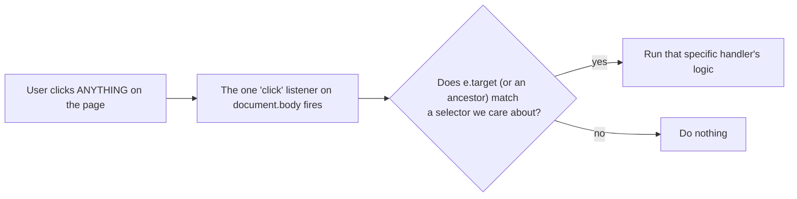
**Why this matters:** many elements on these pages (pack checkboxes, "Remove" buttons, tab cards) don't exist yet when the page first loads — they're created later by JavaScript itself (e.g. when a tab checkbox is checked in `sub-group.html`). A listener attached directly to an element that doesn't exist yet would simply never fire. A listener on `document.body` is always there from page-load, and `e.target.closest(...)` / `.matches(...)` correctly catches clicks on elements added at any point afterward — no need to re-attach listeners every time new HTML is injected.

### 12.2 Section-by-section walkthrough

**0. Discard Ungenerated Uploads on Leave.** Runs on any page containing `#discard-on-leave`. It listens for `pagehide` (the page is being left). If the page is left **without** one of its own forms being submitted, and the browser isn't keeping it in the back/forward cache (`e.persisted`), it sends the `data-field`/`data-value` pair to the `data-url` with `navigator.sendBeacon()` — a small request the browser delivers even while the page is closing. This is how scanned-but-never-generated uploads get deleted ([Section 4.4](#44-project--file-management-delete-delete_file-open_local-open_upload)).

**1. Global Utilities.** Intercepts clicks on any `<a href="#something">` link and smooth-scrolls to that element instead of the browser's default instant jump.

**2. Dashboard Logic (`index.html`).**
- **A. Scroll Spy** — toggles the `.active` class between the "Home" and "Dashboard" nav links based on scroll position, so the nav bar reflects which section you're currently looking at.
- **B. Accordion Toggle** — the project-card expand/collapse. Reads the clicked header's very-next-sibling element (`header.nextElementSibling`) and flips its `display` between `none` and `block`, also flipping the ▼/▲ icon.
- **C. Preserve State After Deletions** — a UX nicety: normally, deleting a file causes a full page reload, which would snap the scroll position back to the top and collapse whichever project card you had open. Just before a delete form submits, the current scroll position and the currently-open project's ID are written into `sessionStorage` (a small key-value store the browser keeps per-tab, surviving a page reload but not a tab close). On the *next* page load, this saved state is read back and the page immediately re-scrolls and re-opens that same card, and then the saved values are deleted — so the illusion is "the delete happened in place."
- **D. "Open Locally" Fetch Requests** — clicking "📂 Open" doesn't navigate the browser at all; it fires a background `fetch()` to `/open_local/...` (which just tells *your Windows machine* to open the file) and shows an `alert()` only if that request failed. The selector is `a.btn-file.open` generically (not tied to the dashboard specifically), which is exactly why the newer "Open Excel File" links added to `matrix.html` and the duplicate modal in `pdf.html` (pointing at `/open_upload/...` or `/open_local/...` respectively) get this same no-navigation behavior automatically, with no extra JavaScript written for either page.

**3. Sub-Group Engine (Dynamic UI).** The most complex section — it manually builds HTML strings and injects them with `insertAdjacentHTML` in response to checkbox changes, mirroring what a template engine would normally do, but at runtime in the browser instead of on the server:
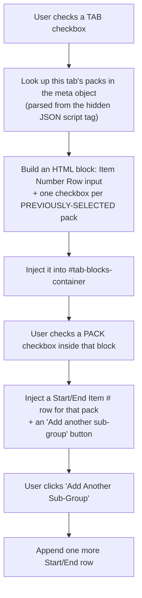
Only packs where `packData.is_selected` is `true` are offered here — i.e., only packs that already have a signature code column from the original Matrix Engine run can be sub-grouped; a pack nobody selected the first time around has nothing to slice further.

**4. Upload Form (Step 1 of `pdf.html`).** A `validateForm()` function re-run on every relevant keystroke/change, encoding these rules:
- Typing in the "new project" text box **disables** the dropdown (and vice-versa) — you can't do both at once.
- If an existing project is picked and it already has a Signature Links file on disk (`projectData[dropdown.value]` truthy — this data came from the `projects_json` script tag, same trick as the sub-group metadata), uploading a new file becomes optional and the submit button enables immediately.
- Otherwise (new project, or existing project with no file yet), a file **must** be attached before the button enables.

**5. PDF Label Shuffler (Step 2).** Two small independent-but-linked behaviors: each per-pack file input shows/hides its own "add divider sheets" checkbox the moment a PDF is attached (and un-checks it if the file is removed), while a single master checkbox at the bottom can check/uncheck every *currently visible* per-pack checkbox at once (only ones whose container is actually showing, i.e. only packs that have a PDF attached).

**6. Matrix Anchor Points Memory.** Pure convenience: every tab's Start Cell / Job ID Cell / Store Column values are saved to `localStorage` under `anchor_points_by_tab` each time the `/preview` form is submitted. `localStorage` persists across browser restarts, unlike `sessionStorage`. The saved values replace the hard-coded defaults (`B8`, `E1`, `A`) the *next* time you upload a file, so you stop retyping the same coordinates every job. Each tab is filled from its own memory: first **by tab name** (`byName`, the same file uploaded again, up to 200 tab names kept), then **by position** (`byIndex`, the last upload's tabs in order, for a new campaign file whose tab names changed), then the last upload's first tab. Browsers that only have the older single-value keys (`anchor_start` / `anchor_job` / `anchor_store`) fall back to those. Only fields still showing a built-in default are filled, so values the server re-rendered after "Update Previews" are never overwritten.

**7. Auto-Scroll to Previews.** After generating blueprint previews, a `setTimeout(..., 150)` waits briefly for the page to finish rendering, then smooth-scrolls down to the `#preview-section` anchor — otherwise the user would submit the coordinate form and land back at the top of a long page, with no visual cue that anything happened below the fold.

**8b. Drag & Drop File Inputs.** As explained in [Section 11.2](#112-matrixhtml), the actual drop behavior is native/free. This code only adds:
```js
input.addEventListener('dragenter', () => zone.classList.add('dropzone-active'));
input.addEventListener('dragleave', () => zone.classList.remove('dropzone-active'));
```
...for the blue-highlight-while-dragging effect, and a `change` listener that writes the selected file's name into the little `<p class="dropzone-filename">` placeholder — run once immediately (`showFilename()` called right after being defined) in case a browser ever pre-fills a file input on page restore.

**8. Loading Overlays.** A catch-all: any form submission on the page shows the full-screen spinner overlay, **except** deletions and the `/preview` submission (both of those are meant to feel instant, not like a long background job — showing a spinner would be misleading since they usually resolve in well under a second).

**9. Duplicate Store Name Alert.** Notably declared **outside** the main `DOMContentLoaded` listener that wraps sections 1–8 — a small inconsistency in the file's history, but harmless since `DOMContentLoaded` listeners can be registered as many times as you like and all of them still fire. Its only job is calling `.showModal()` on the duplicate-store dialog the instant the page loads, if that dialog exists in the HTML at all.

**10. Label Maker Drag and Drop Configurator** (`packing_labels.html`). Native HTML drag events on every `.sortable-item`. While dragging over a list, `getDragAfterElement()` finds the block whose vertical middle is just below the mouse and inserts the dragged block before it. When a drag ends, the order of `data-id`s in the right-hand list is written into the hidden `attribute_order` field (e.g. `thumbnail,desc,job_no,qty`); empty slots are filtered out on the server.

**11. Courier Consignments** (`packing_labels.html`). Keeps every change in one object, `edits`, keyed by consignment id, and writes it as JSON into the hidden `consignment_edits` field after every change:
- **✏️** toggles the row's edit form; **Save** compares the form with the row's `data-original` values and stores only real changes (keeping any service code already chosen), updates the visible text, and shows the "Edited" tag. **Reset to Excel** refills the form with the original values. Enter saves and Escape closes, so pressing Enter never submits the whole page.
- **Service codes:** a row dropdown's `change` stores or clears its code; changing the main dropdown relabels every row's "Same as main (CODE)" option; **Apply to shown** copies the main code into every row not hidden by the filters.
- **Filters:** the State dropdown and text box hide non-matching rows (and their open edit forms), update the "Showing N of M" count, and relabel the button "Apply to N shown".

---

## 13. `static/styles.css` — The Look & Feel

Rather than walking every single CSS rule (CSS has no "logic" to trace — it's declarative styling, one selector at a time), here's what each named block of the stylesheet is *for*, grouped by the UI component it styles:

| CSS section | Powers |
|---|---|
| **Global Styles** | Base font, page background, the white rounded `.container` card every page sits inside. |
| **Navigation** | The dark sticky top bar (`.sticky-nav`) present on every page, and its active-link underline. |
| **Index/Dashboard** | The two big home-page "portal" cards (Create Packing Sheets / Label Shuffler). |
| **Projects List** | The dashboard's project cards, the auto-wrapping button grid (`.actions-grid` — `repeat(auto-fit, minmax(180px, 1fr))` means "as many equal-width columns as fit, each at least 180px, wrapping automatically on narrow screens"), and the color-coded action buttons (blue=download, red=delete, green=PDF). |
| **Matrix Engine Styles** | `.dropzone` / `.dropzone-compact` / `.dropzone-active` (the drag-and-drop boxes), `.pack-grid` (the 2-column PDF-pack layout), `.tab-card`, `.input-field`, `.blueprint-card` / `.blueprint-error` (preview cards, green vs. red left border), `.metrics-bar`, `.project-name-group`. |
| **Loading Overlay** | The full-screen dark spinner shown during long operations; `@keyframes spin` is what makes the spinner ring actually rotate. |
| **Tooltips** | The `.tooltip-btn::before`/`::after` pair — pure-CSS hover tooltips (a little triangle + a label bubble) with no JavaScript at all, using the `content: attr(data-title)` trick to pull the tooltip text straight from an HTML attribute. |
| **Instructions & Info Boxes** | The blue "Required Spreadsheet Formatting" box on `matrix.html`, and the red `.warning-box` used for duplicate-store warnings. |
| **Accordion & File List** | The dashboard's expandable project sections and the individual file rows (with their Open/Download/Delete button trio, `.btn-file` + `.open`/`.download`/`.delete`). |
| **Sub-group Tab Selection** | The responsive checkbox grid (`.tab-checkbox-grid`) in `sub-group.html`. |
| **Duplicate Store Error Modal** | Styles the `<dialog>` popup shown in `pdf.html` Step 1, and `matrix.html`'s hard-lock warning. `.modal-actions-end` (`display: flex; justify-content: flex-end; gap: 10px;`) is the shared footer-row layout for modal buttons. |
| **Packing Labels page** (end of the file) | Everything for `packing_labels.html`: the layout editor, fixed badges, the issue tables, the consignment table, filters, edit rows, service-code dropdowns. All rules are written as `.pl-page .pl-…`. |

**A pattern worth noticing:** almost every "card" component in this app (`.tab-card`, `.blueprint-card`, `.project-card`) shares the same visual recipe — white/light background, `border-radius: 6-8px`, and a thick colored **left border** (`border-left: 5px solid <color>`) used as a quick color-coded status signal (blue = neutral/info, green = success, red = error) — rather than one shared CSS class, this recipe is just repeated per-component, so if you ever want to change "the card look" everywhere, you'd currently need to update several rules instead of one.

**The `.btn-file` family** is the small-button system reused across the dashboard, `matrix.html`, and `pdf.html`'s duplicate modal — one base class (`padding: 6px 12px; font-size: 13px; border-radius: 4px;`) plus a color modifier: `.open` (light blue — opening a file), `.download` (neutral gray), `.delete` (light red), `.primary` (solid green — the modal's main call-to-action, e.g. "Recheck File"), `.ghost` (white/gray outline — a modal's dismiss action, e.g. "Close"). Before `.primary`/`.ghost` existed, "Recheck File" borrowed `.btn-generate` (a *different*, much bigger full-width CTA class meant for standalone buttons like "Scan File") and "Close" had no matching class at all, so it fell back to the page's generic `button { background: #3498db; }` rule — that mismatch (an oversized green button next to a plain-blue one, on two separate stacked rows) is what made the modal look inconsistent before these two modifiers were added specifically to let every modal button share one small, consistent size and differ only by role color.

**Why `.pl-page .pl-…` (two classes)?** The Packing Labels styles used to be inline `style="…"` attributes, which beat every stylesheet rule. When they moved into `styles.css`, some older rules — e.g. `.blueprint-card h4` (a class plus an element) — were *more specific* than a single new class and would have won, changing the look. Prefixing every rule with the page wrapper's `.pl-page` class gives it enough weight. The move was checked by recording every element's computed style in headless Chrome before and after: zero differences. One more rule, `.pl-page [hidden] { display: none !important; }`, makes the HTML `hidden` attribute beat any `display` rule (otherwise a tag styled `display: inline-block` stays visible even when hidden).

**`.btn-stitch`** styles the dashboard's purple Stitch Labels placeholder; `:disabled` greys it out.

---

## 14. End-to-End Journeys

### Journey A: Creating a Packing Sheet from scratch

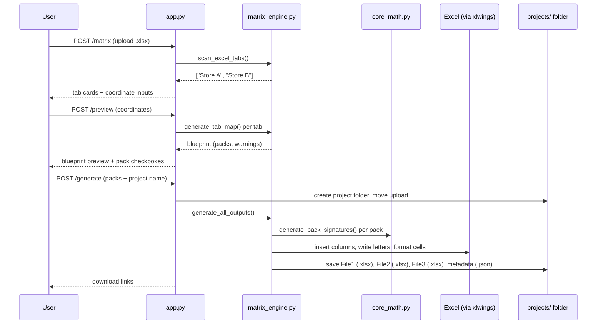

### Journey B: Sub-grouping an existing project

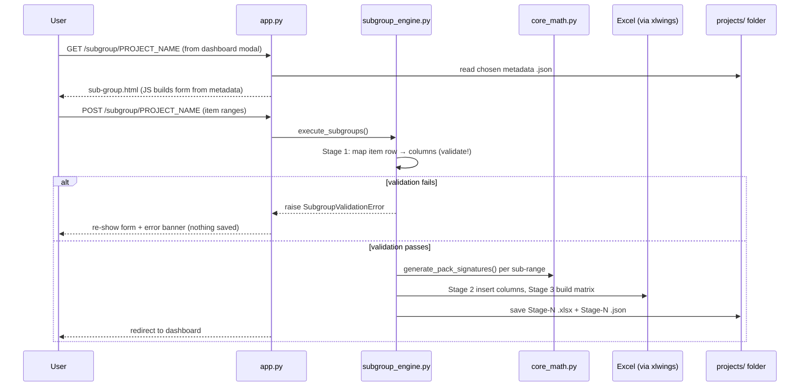

### Journey C: Shuffling PDF labels

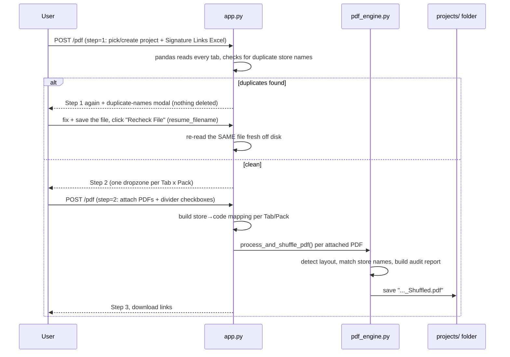

### Journey D: Packing labels and the courier CSV

```mermaid
sequenceDiagram
    participant U as User
    participant App as app.py
    participant PL as packing_label_generator.py
    participant CE as courier_export.py
    participant FS as projects/ folder

    U->>App: POST /packing-labels (upload .xlsx)
    App-->>U: tab cards + Header Row inputs
    U->>App: POST preview
    App->>PL: parse_packing_data() per tab
    alt PackCheckError
        App-->>U: issue table, Generate locked
    else clean
        App->>CE: build_consignments(edits)
        App-->>U: layout editor + consignment table
        U->>U: drag blocks, ✏️ fix addresses, pick service codes
        U->>App: POST generate
        App->>CE: validate + build consignments
        App->>FS: create project folder, move Excel
        App->>PL: generate_packing_labels() → PDF + page map
        App->>CE: write_courier_csv(), write_label_map()
        App->>FS: PDF, CSV, labelmap.json; usage counts in data/
        App-->>U: PDF + CSV download buttons
    end
```

---

## 15. Quick Reference: "I Want to Change X"

| I want to... | Look here |
|---|---|
| Change what counts as "zero" in a quantity cell | `core_math.py` → `sanitize_cell()` |
| Change how signature letters are assigned (e.g. numbers instead of letters) | `core_math.py` → `generate_pack_signatures()` |
| Change the default Start Cell / Job ID / Store Column | `templates/matrix.html` (the `value="B8"` etc. defaults) and `static/script.js` Section 6 (localStorage memory) |
| Change how packs are detected (merged cells vs single column) | `matrix_engine.py` → `generate_tab_map()` |
| Change what makes File 1 / File 3 skip generation | `matrix_engine.py` → the `any_packs_selected` flag in `generate_all_outputs()` |
| Change the sub-group item-number validation messages | `subgroup_engine.py` → `_map_item_columns()` and the two `raise SubgroupValidationError(...)` call sites |
| Change how long until old projects auto-delete | `app.py` → `clean_old_projects()` (`seven_days_in_seconds`) |
| Change the duplicate-store-name check for the PDF shuffler | `app.py` → `/pdf` route, Step 1 (`dupes = store_col[store_col.duplicated()]...`) — note it no longer deletes anything on a duplicate; see [Section 4.6](#46-the-pdf-label-shuffler-route-pdf) |
| Change the "Open Excel File" / "Recheck File" duplicate-fix flow | `app.py` → `/pdf` Step 1's `resume_filename` handling, and `templates/pdf.html`'s duplicate modal footer |
| Change how a PDF page is matched to a store (the text region it reads) | `pdf_engine.py` → the `fitz.Rect(...)` clip rectangles in `process_standard_layout` / `process_split_layout` |
| Change whether/how divider sheets look, or the green/red match logic | `pdf_engine.py` → `build_divider_sheet()` |
| Change the "Unmatched Pages" divider sheet | `pdf_engine.py` → `build_unmatched_divider_sheet()` |
| Change what an installer divider's barcode encodes (currently the job number, plus " Kind N" for multi-kind jobs) | `matrix_engine.py` → `build_divider_barcode_rows()` (the last value of each row is the `Barcode` column) |
| Change how kinds are numbered | `matrix_engine.py` → `assign_job_kinds()` |
| Change barcode size limits, caption text, or the barcode divider layout | `pdf_engine.py` → the `BARCODE_*` constants, `barcode_caption()` and `_build_barcode_divider_sheet()` |
| Change the audit report's colors/text, or the Missing Stores column layout | `pdf_engine.py` → `build_audit_report()` and `group_missing_stores_by_code()` |
| Change the near-duplicate store-name collision detection (only flips a divider red now, no audit-report text) | `pdf_engine.py` → `find_name_collisions()` and `analyze_matches()` |
| Change the same-store-matched-more-than-once detection (standard layout only) | `pdf_engine.py` → `process_standard_layout()`'s `store_instance_count` / `is_continuation` logic |
| Change when the app force-closes a file the user has open in Excel | `core_math.py` → `close_if_open_elsewhere()` (called from `app.py`'s `/generate` and `subgroup_engine.py`) |
| Change any button/card color or spacing | `static/styles.css` (grouped by component — see [Section 13](#13-staticstylescss--the-look--feel) table) |
| Change what happens when a form is submitted (spinner, validation) | `static/script.js` (find the relevant numbered section — see [Section 12](#12-staticscriptjs--the-frontend-brain)) |
| Add a brand-new page/route | Add a `@app.route(...)` function in `app.py`, a matching file in `templates/`, and link to it from `templates/index.html`'s nav bar |
| Change the street-type equivalences (Street = St …) | `packing_label_generator.py` → `STREET_TYPES` |
| Change which words mark a name as a company | `courier_export.py` → `COMPANY_WORDS` |
| Change when a street splits into Address Line 1 / Line 2 | `courier_export.py` → `LINE_LIMIT` |
| Change how a messy address is read | `courier_export.py` → `_split_name_address()` and `resolve_destination()` |
| Change sizes of non-OB packing specs | `courier_export.py` → `KNOWN_SIZES` |
| Change carton weights or Item Type | `courier_export.py` → `LIGHT_SPEC_PREFIXES` / `package_weight()` / `item_type()` |
| Add or rename a courier service code | `courier_export.py` → `SERVICE_CODES` |
| Change the courier CSV columns | `courier_export.py` → `CSV_HEADER` and `write_courier_csv()` |
| Change the packing-label checks (errors vs warnings) | `packing_label_generator.py` → `_check_pack_consistency()` and the end of `parse_packing_data()` |
| Change the packing-label header keywords | `packing_label_generator.py` → the header loop in `parse_packing_data()` |
| Change packing-label margins, gaps or the courier region size | `packing_label_generator.py` → constants at the top of `generate_packing_labels()` |
| Change how blocks look inside a packing-label box | `packing_label_generator.py` → `TEXT_STYLES` and `_layout_cell()` (and the matching preview in `packing_labels.html`) |
| Change how old abandoned uploads must be before cleanup | `app.py` → `clean_old_projects()` (`24 * 60 * 60`) |
| Change what counts as an abandoned Label Shuffler folder | `app.py` → `is_abandoned_project()` |
